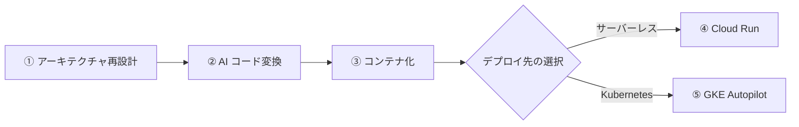
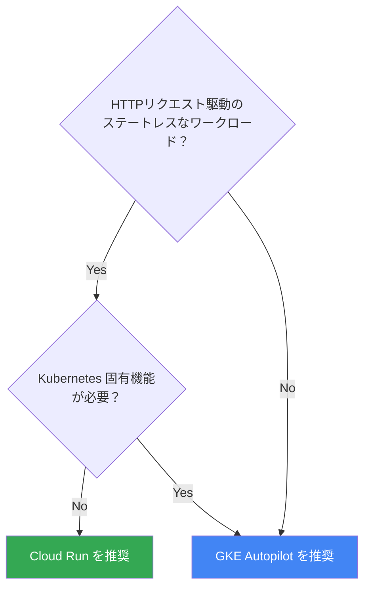

# 3. アプリのモダナイズ (App Modernization)

## フェーズ概要
本フェーズでは、SFDC などのレガシー環境で稼働しているビジネスロジックを、AI アプローチ（Gemini）を用いてモダンなアーキテクチャやプログラミング言語（Go、Python、TypeScript など）へと変換・モダナイズする体験を行います。

## 到達目標
- SFDC の各コンポーネント（Apex, Trigger, Batch, Visualforce 等）が Google Cloud 上でどのサービスに対応するかを理解する。
- モダナイゼーションにおける「ステートレス化」と「クリーンアーキテクチャ」の重要性を理解する。
- 既存のレガシーコード（Apex 等）を、Gemini を活用して新しい言語に書き直す手法を体験する。
- 作成したモダンアプリケーションを Docker コンテナ化する手法を学ぶ。
- Google Cloud のコンテナ基盤（**Cloud Run** / **GKE Autopilot**）へアプリケーションをデプロイし、正しく動作することを確認する。

## 全体フロー

## Cloud Run vs GKE Autopilot 選定フロー

以下のフローチャートに沿って、ワークロードに最適なデプロイ先を選定します。

**GKE Autopilot を選ぶべきケース:**
- Pod 間通信・サービスメッシュが必要
- GPU / TPU ワークロード
- Stateful なワークロード（StatefulSet）
- カスタムスケーリングポリシー（HPA/VPA の細かい設定）
- gRPC や TCP/UDP プロトコルのサービス
- 複数コンテナの密結合（Sidecar パターン）

**Cloud Run を選ぶべきケース:**
- HTTP(S) ベースのステートレスな Web API / BFF
- イベント駆動のバッチ処理（Cloud Run Jobs）
- 最小限のインフラ管理でスピーディにデプロイしたい
- トラフィックが不定期でゼロスケールが有効

## 手順
本フェーズは以下のステップで進めます。

| Step | ドキュメント | アウトプット |
|------|-------------|-------------|
| 1 | [アーキテクチャの再設計](./01_architecture_redesign.md) | SFDC→GCPコンポーネントマッピング表、アーキテクチャ方針 |
| 2 | [AI 駆動でのコード変換](./02_ai_code_conversion.md) | Gemini で変換されたモダン言語のソースコード |
| 3 | [コンテナ化 (Docker)](./03_containerization.md) | Dockerfile、コンテナイメージ |
| 4 | [Cloud Run へのデプロイと検証](./04_cloud_run_deployment.md) | 稼働する Cloud Run サービス |
| 5 | [GKE Autopilot へのデプロイと検証](./05_gke_autopilot_deployment.md) | 稼働する GKE Autopilot ワークロード |

> **Note:** Step 4 と Step 5 は選択式です。ワークロードの特性に応じてどちらか一方、または両方を実施してください。

## 事前準備
- [1-onboarding](../1-onboarding/README.md) のフェーズで Google Cloud プロジェクトと基本 API が有効化されていること。
- [2-database-migration](../2-database-migration/README.md) のフェーズでクラウドデータベース環境が準備されていること（任意項目ですが、連携テストを行う場合に必要です）。
- お客様の手元に IDE（VS Code 等）および Cloud Code, Gemini Code Assist がセットアップされていること。
