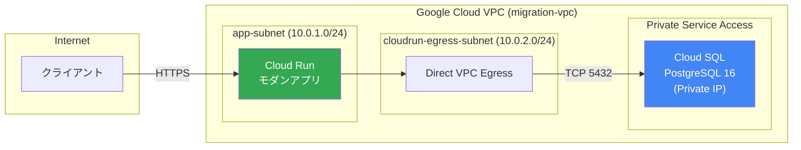

# Terraform によるインフラ基盤構築

Salesforce から Google Cloud への移行において、インフラストラクチャをコードとして管理 (IaC) することは、再現性、運用効率、およびガバナンスの観点から非常に重要です。このドキュメントでは、Google Cloud における Terraform のベストプラクティスを概説します。

## 1. なぜ Terraform を使うのか？

- **再現性と一貫性:** 開発、ステージング、本番環境を同じコードから構築でき、環境間の差異を防ぎます。
- **バージョン管理:** インフラの変更履歴を Git で管理し、いつ、誰が、何を変更したかを追跡可能にします。（Rollbackも容易）
- **レビュープロセス:** インフラの変更を Pull Request (Merge Request) として扱い、チームでのレビューと承認を組み込めます。

## 2. 推奨されるディレクトリ構造 (Standard Module Structure)

モノリスな `main.tf` を避け、環境ごとの分離とリソースのモジュール化を推奨します。

```text
infrastructure/
├── environments/
│   ├── dev/               # 開発環境用設定
│   │   ├── main.tf
│   │   ├── variables.tf
│   │   └── outputs.tf
│   ├── staging/           # ステージング環境用設定
│   └── prod/              # 本番環境用設定
└── modules/               # 再利用可能なモジュール群
    ├── network/           # VPC, サブネット等
    ├── database/          # Cloud SQL, AlloyDB等
    └── compute/           # Cloud Run, GKE等
```

## 3. Terraform 状態管理 (tfstate) のベストプラクティス

`tfstate` ファイルは、インフラの現在の状態を保持する非常に重要なファイルであり、平文のシークレットが含まれる可能性があります。

**Google Cloud Storage (GCS) をバックエンドとして使用する:**
ローカルでの管理は避け、必ず GCS バケットをバックエンドに設定してチームで共有・保護します。

```hcl
# versions.tf の例
terraform {
  backend "gcs" {
    bucket  = "my-project-tfstate-bucket"
    prefix  = "terraform/state/prod"
  }
}
```

- **バケットの保護設定:** GCS バケットにはバージョニングを有効にし、予期せぬ削除からの復旧を可能にします。また、権限管理 (IAM) を厳格に行い、Terraform 実行用サービスアカウントのみにアクセスを許可します。

## 4. Google Cloud 特有のデザインパターン

### 4.1 ネットワーク (VPC)
- デフォルトネットワークは使用せず、要件に応じたカスタムモード VPC を作成します。
- Cloud Run 等のサーバーレス環境から VPC 内のリソース（DBなど）にアクセスする場合は、**Direct VPC Egress** を構成します（旧来の Serverless VPC Access コネクタよりもシンプルかつ高性能）。

#### SFDC 移行基盤のネットワーク構成図



**サンプルコード:** [`sample/terraform/network.tf`](sample/terraform/network.tf) に VPC、サブネット、Private Service Access、ファイアウォール、Cloud NAT の構成例を収録しています。

### 4.2 権限管理 (IAM) および Workload Identity
- 個人アカウントで Terraform を実行するのではなく、専用の**サービスアカウント**を借用 (Impersonation) して実行することを推奨します。
- アプリケーションが Google Cloud API を呼び出す際は、サービスアカウントのキー（JSONファイル）を発行せず、**Workload Identity** を使用して権限を付与します。

### 4.3 データベース構成 (Cloud SQL for PostgreSQL)

SFDCからの移行先として Cloud SQL for PostgreSQL を構築する際の主要な設計項目です。

| 設計項目 | 推奨設定 | 備考 |
| :--- | :--- | :--- |
| **DB バージョン** | `POSTGRES_16` | 最新の安定バージョンを推奨 |
| **可用性** | 本番: `REGIONAL` / 開発: `ZONAL` | HA 構成で自動フェイルオーバー |
| **ネットワーク** | Private IP (パブリック IP 無効) | Private Service Access 経由 |
| **バックアップ** | 自動バックアップ + PITR 有効 | 14 世代保持 / PITR 7 日間 |
| **メンテナンス** | 日曜 UTC 18:00 (JST 月曜 3:00) | `stable` トラック |
| **監査ログ** | `pgaudit` 有効 | Cloud Audit Logs 連携 |
| **クエリ分析** | Query Insights 有効 | スロークエリの検出 |
| **タイムゾーン** | `Asia/Tokyo` | SFDC のデータとの整合性 |
| **照合順序** | `ja_JP.utf8` | 日本語ソート順の正しい処理 |
| **削除保護** | 本番: `true` / 開発: `false` | 誤操作防止 |
| **クレデンシャル** | `random_password` → Secret Manager | コード内にパスワードを記述しない |

**サンプルコード:** [`sample/terraform/cloudsql.tf`](sample/terraform/cloudsql.tf) に上記設定を反映した Cloud SQL インスタンス、データベース、ユーザー、Secret Manager 連携のフル構成を収録しています。

## 5. 次のステップ
基盤の構成コード化方針が定まったら、次はこのコードをどのように自動適用していくかというパイプライン (CI/CD) の設計に進みます。
詳しくは [02_ci_cd_architecture.md](./02_ci_cd_architecture.md) を参照してください。
