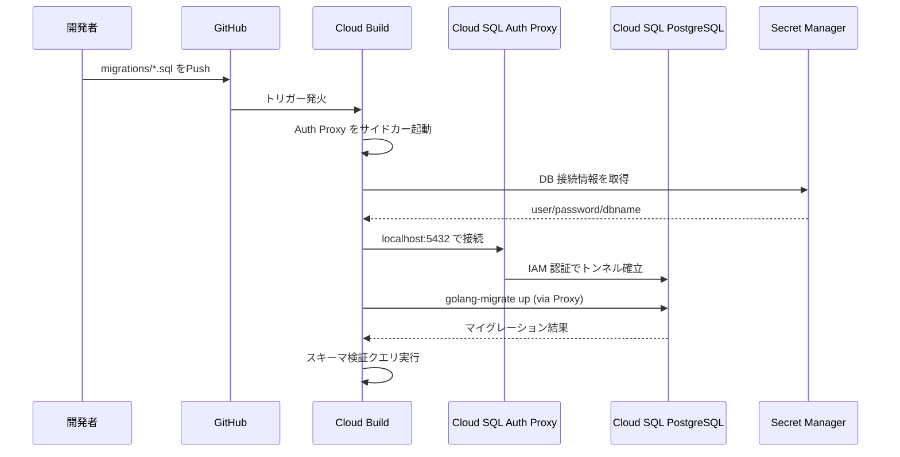

# CI/CD アーキテクチャ設計

インフラをコード化 (IaC) し、アプリケーションをコンテナ化したら、それらを継続的に統合・デプロイするためのサイクル (CI/CD) を構築することがモダンな開発には不可欠です。

Google Cloud 環境においては、**Cloud Build** を主軸にパイプラインを構築することが一般的です。

## 1. 理想的な CI/CD パイプラインの流れ

Salesforce エコシステムから、GitOps パラダイムへの移行を目指します。ソースコードリポジトリへの Push や Merge がパイプラインのトリガーとなります。

### Continuous Integration (CI: 継続的インテグレーション)
開発者がフィーチャーブランチで行う作業に対する自動検証を指します。

1. **コードのコミット & Push:** 開発者が GitHub / GitLab / Cloud Source Repositories などに Push。
2. **静的解析・テスト:**
   - ユニットテストの実行 (例: Go, Python のテストフレームワーク)
   - Linter によるコードフォーマットチェック
   - Terraform の場合: `terraform fmt -check`, `terraform validate`, `tflint`
3. **セキュリティスキャン (Shift Left):**
   - ソースコードへの静的セキュリティ解析 (SAST)
   - コンテナイメージのビルドと、OSパッケージ層の脆弱性スキャン (Artifact Registry / Container Analysis)
4. **アーティファクトの保存:**
   - ビルド成功したコンテナイメージを Artifact Registry に Push。

### Continuous Deployment (CD: 継続的デプロイメント)
メインブランチへのマージをトリガーとした、実環境へのデプロイ作業を指します。

1. **環境への反映:**
   - Terraform の場合: `terraform plan` を実行し、承認 (Approval) ステップを経て `terraform apply` を実行。
   - アプリケーションの場合: Cloud Deploy や Cloud Build を介して Cloud Run リビジョンの更新、または GKE クラスタへのマニフェスト適用 (Kustomize / Helm)。
2. **データベース・マイグレーションの実行:**
   - アプリケーションのデプロイ前に、CI/CD パイプラインからデータベースのスキーママイグレーションツール (golang-migrate 等) を実行し、PostgreSQL データベースのスキーマを最新の状態に更新します。Cloud Build から Cloud SQL Auth Proxy を経由して安全に接続します。
3. **インテグレーションテスト:** デプロイされたエンドポイントに対する疎通やE2Eテスト。
4. **切り替えとロールバック:** 問題がないことを確認しトラフィックを切り替え。問題があれば、古いリビジョンへトラフィックを戻す。

### DB マイグレーションパイプラインの詳細

SFDC→PostgreSQL 移行ではスキーマ変更の頻度が高くなるため、専用のマイグレーションパイプラインを構築します。

#### 移行フェーズ別のパイプライン設計

| フェーズ | トリガー | 処理内容 | ツール |
| :--- | :--- | :--- | :--- |
| **① 初期スキーマ構築** | 手動 / 初回のみ | SFDC オブジェクトから変換した DDL の一括適用 | golang-migrate `up` |
| **② データ初期ロード** | 手動 / バッチ | SFDC エクスポート CSV → PostgreSQL への COPY | `psql \copy` / Cloud SQL Import |
| **③ 差分スキーマ変更** | `migrations/` への Push | マイグレーションファイルの追加適用 | golang-migrate `up` |
| **④ カットオーバー検証** | 手動トリガー | SFDC↔PostgreSQL のデータ整合性チェック | カスタムスクリプト |

#### Cloud Build + Cloud SQL Auth Proxy の構成



**サンプル:** [`sample/cloudbuild/cloudbuild-db-migration.yaml`](sample/cloudbuild/cloudbuild-db-migration.yaml) に Cloud SQL Auth Proxy + golang-migrate を組み合わせた完全なパイプライン定義を収録しています。

#### マイグレーションファイルの命名規則

```text
migrations/
├── 000001_create_accounts_table.up.sql     # accounts テーブル作成
├── 000001_create_accounts_table.down.sql   # ロールバック
├── 000002_create_contacts_table.up.sql     # contacts テーブル作成
├── 000002_create_contacts_table.down.sql
├── 000003_add_indexes.up.sql               # インデックス追加
└── 000003_add_indexes.down.sql
```

各マイグレーションには必ず `up` (適用) と `down` (ロールバック) の両方を用意し、冪等性を確保します。

## 2. ツール要件と Google Cloud による実現

| 要件 | Google Cloud マネージド・サービス | OSS/サードパーティの代替・併用例 |
| --- | --- | --- |
| **ソースコード管理** | Cloud Source Repositories | GitHub, GitLab, Bitbucket |
| **CI / 汎用パイプライン** | Cloud Build | GitHub Actions, GitLab CI |
| **アーティファクト管理** | Artifact Registry | Docker Hub, Nexus |
| **脆弱性スキャン** | Container Analysis, Security Command Center | Trivy, Snyk |
| **CD (アプリケーション)** | Cloud Deploy | ArgoCD, Flux (GKE の場合) |
| **シークレット管理** | Secret Manager | HashiCorp Vault |

## 3. Terraform 用 CI/CD アーキテクチャの留意点

インフラ (Terraform) 用のパイプラインと、アプリケーションのパイプラインはリポジトリの粒度等により分けることを検討します。

### Terraform パイプラインにおける「承認」プロセス
インフラの変更は影響範囲が大きいため、完全に自動適用するのではなく、`plan` 結果を人間が確認するステップを挟むのが定石です。

- **PR / MR モデル:** Pull Request が作成されると、CI で `terraform plan` が走り、結果を PR のコメントとして出力します。レビュアーが Plan の結果を確認・承認し Main ブランチにマージされたタイミングで、`terraform apply` を実行します。

## 4. セキュリティ・ベストプラクティス

1. **専用サービスアカウントの利用:** Cloud Build や Cloud Deploy には、強い権限を持つデフォルトサービスアカウントではなく、タスクごとに必要最小限の権限 (Least Privilege) を付与したカスタムサービスアカウントをアタッチします。
2. **VPC Service Controls の考慮:** セキュリティ要件が厳しい環境では、Cloud Build を Private Pool (顧客所有のVPC内で実行されるワーカー) で構成することを検討します。
