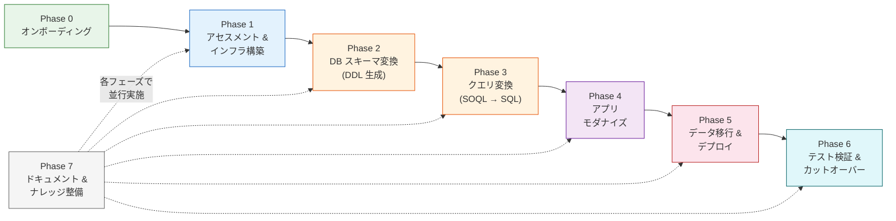
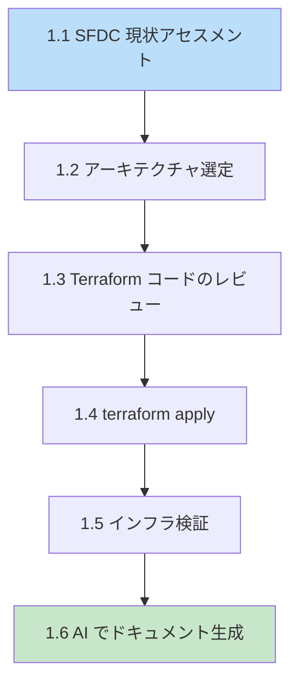
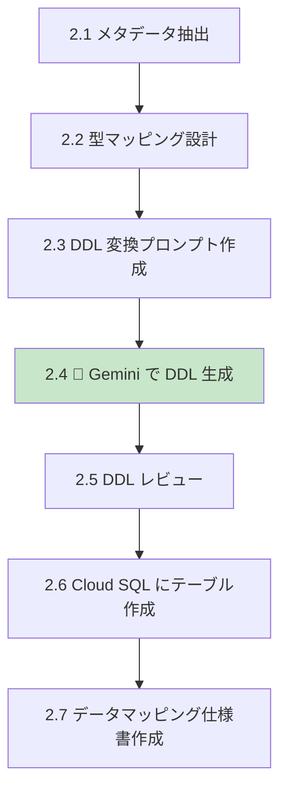
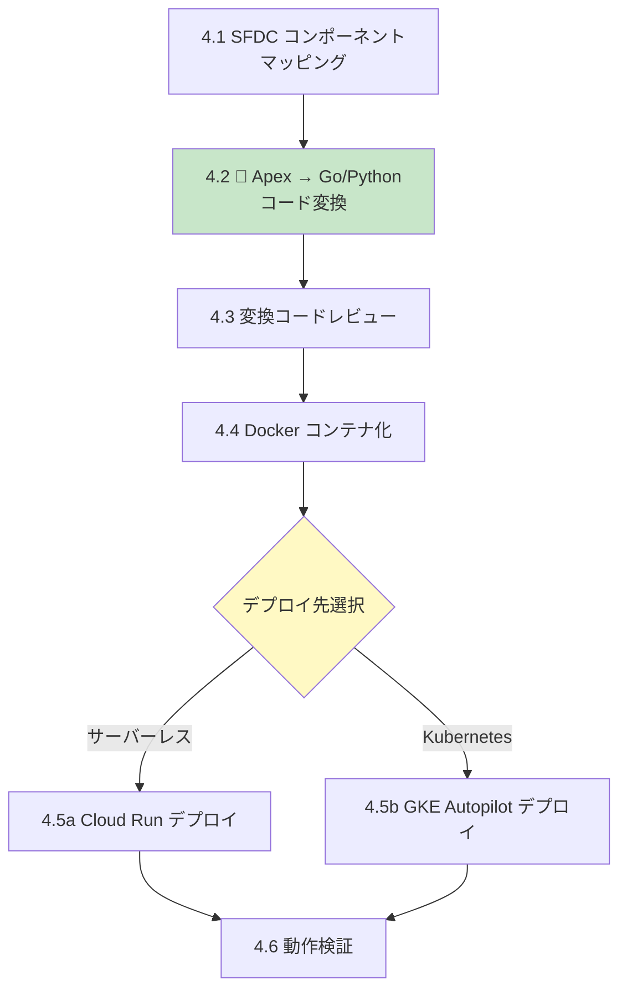
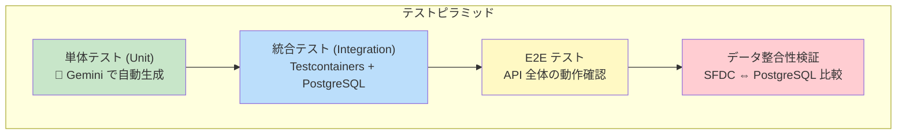
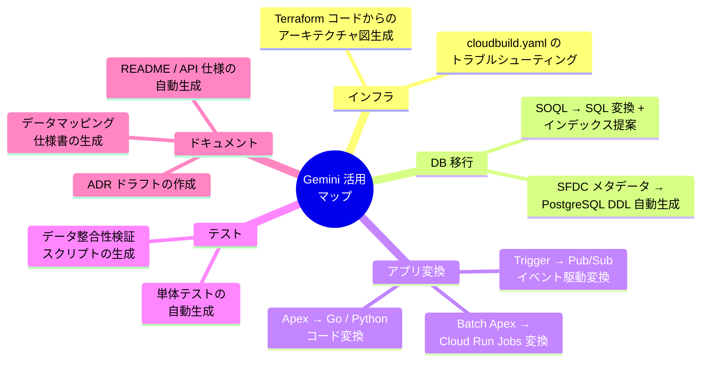

# SFDC → Google Cloud マイグレーション 完全タスクリスト

> **本ドキュメントの目的:** AI（Gemini）を最大限活用し、SFDC から Google Cloud へマイグレーションするために必要な**すべての作業**を、実行可能な粒度で網羅的にリストアップしたものです。各タスクには担当ロール、AI 活用ポイント、完了条件（DoD）、参照ドキュメントを明記しています。

---

## 全体フロー

---

## 凡例

| 記号 | 意味 |
|------|------|
| `- [ ]` | 未着手タスク |
| `- [/]` | 作業中タスク |
| `- [x]` | 完了タスク |
| 🤖 | **AI（Gemini）活用ポイント** |
| 📄 | 参照ドキュメント |
| ✅ | 完了条件 (Definition of Done) |
| ⚠️ | 人間が判断すべき意思決定ポイント |

---

## Phase 0: オンボーディング（環境準備）

> **ゴール:** 参加者全員が Google Cloud 上で自信を持って作業を開始できる状態にする
> 📄 [`1-onboarding/`](./references/1-onboarding/README.md)

### 0.1 Google Cloud 基礎知識の習得
- [ ] 0.1.1 Google Cloud のリソース階層（組織 > フォルダ > プロジェクト）を理解する
- [ ] 0.1.2 IAM の基本概念（ロール、サービスアカウント、最小権限の原則）を理解する
- [ ] 0.1.3 ワークショップで利用する主要サービスの概要を把握する
  - Cloud Run / GKE Autopilot（コンピュート）
  - Cloud SQL / AlloyDB（データベース）
  - Gemini for Google Cloud / Vertex AI（AI）
  - Cloud Build（CI/CD）
  - 📄 [`01_gcp_fundamentals.md`](./references/1-onboarding/01_gcp_fundamentals.md)

### 0.2 ローカル環境のセットアップ
- [ ] 0.2.1 必要ツールのインストールと確認
  - `gcloud` CLI / `terraform` / `git` / VS Code / Docker
  - 📄 [`02_prerequisites.md`](./references/1-onboarding/02_prerequisites.md)
- [ ] 0.2.2 `check_env.sh` を実行し、環境が正常であることを確認する
  - ✅ スクリプトが全チェック項目で `PASS` を返すこと

### 0.3 Google Cloud プロジェクトと API の準備
- [ ] 0.3.1 検証用プロジェクトを作成し、課金アカウントを紐付ける
- [ ] 0.3.2 必要な API を有効化する（`sqladmin`, `run`, `cloudbuild`, `aiplatform` 等）
- [ ] 0.3.3 基本的な VPC ネットワークを作成する
  - 📄 [`03_environment_setup.md`](./references/1-onboarding/03_environment_setup.md)
  - ✅ `gcloud services list --enabled` で対象 API が表示されること

### 0.4 Gemini の利用準備
- [ ] 0.4.1 Cloud コンソール上の Gemini チャットの動作を確認する
- [ ] 0.4.2 VS Code に Gemini Code Assist 拡張機能をインストールし、動作を確認する
- [ ] 0.4.3 移行作業向けの効果的なプロンプトテンプレートを把握する
  - 📄 [`04_gemini_usage_guide.md`](./references/1-onboarding/04_gemini_usage_guide.md)
  - ✅ Gemini にサンプルプロンプトを投げて応答が返ること

---

## Phase 1: アセスメントとインフラ基盤の構築

> **ゴール:** SFDC の現状を正確に把握し、移行先の Google Cloud インフラを IaC で構築する
> 📄 [`4-infra-pipeline/`](./references/4-infra-pipeline/README.md)

### フェーズ内フロー

### 1.1 SFDC 現状アセスメント
- [ ] 1.1.1 SFDC の標準オブジェクトのうち移行対象を特定する
  - 対象例: `Account`, `Contact`, `Opportunity`, `Lead`, `Case`
- [ ] 1.1.2 カスタムオブジェクト (`__c`) の一覧を作成する
- [ ] 1.1.3 各オブジェクトの**レコード件数**を取得する（Data Loader Export）
- [ ] 1.1.4 各オブジェクトの**カスタム項目数**・数式項目・積み上げ集計項目を棚卸しする
- [ ] 1.1.5 オブジェクト間のリレーション（Lookup / Master-Detail）をマッピングする
- [ ] 1.1.6 API コール数・バッチ処理頻度・ピーク時のデータ更新頻度などを計測する
- [ ] 1.1.7 セキュリティ要件・コンプライアンス要件を確認する
  - ⚠️ PII の取り扱い、データレジデンシー、暗号化要件 等
- [ ] 1.1.8 添付ファイル・ContentDocument の有無と容量を確認する
  - ✅ 移行対象オブジェクト一覧表（レコード件数・項目数・リレーション付き）が完成

### 1.2 移行先アーキテクチャの選定
- [ ] 1.2.1 移行パターンを比較検討する
  - ⚠️ リフト＆シフト / モダナイズ / 段階的移行のメリット・デメリットを評価
- [ ] 1.2.2 データベースエンジンを選定する（Cloud SQL vs AlloyDB）
  - 📄 [`2-database-migration/01_migration_strategy.md`](./references/2-database-migration/01_migration_strategy.md)
  - 📄 [`5-documentation/docs/architecture/adr-001-database-engine-selection.md`](./references/5-documentation/docs/architecture/adr-001-database-engine-selection.md)
- [ ] 1.2.3 コンピュート基盤を選定する（Cloud Run vs GKE Autopilot）
  - 📄 [`3-app-modernization/README.md`](./references/3-app-modernization/README.md) の選定フローチャートを参照
- [ ] 1.2.4 データ移行方式を選定する
  - ⚠️ 一括ロード（ビッグバン）vs 継続的レプリケーション（CDC）
  - ✅ ADR（Architecture Decision Record）が起票され、選定理由が記録されている

### 1.3 Terraform IaC のレビューとカスタマイズ
- [ ] 1.3.1 `network.tf` をレビューする（VPC / サブネット / Private Service Connect）
- [ ] 1.3.2 `cloudsql.tf` をレビューする（インスタンスサイズ / HA / バックアップ設定）
- [ ] 1.3.3 `variables.tf` をお客様環境に合わせてカスタマイズする
  - リージョン / プロジェクト ID / マシンタイプ 等
- [ ] 1.3.4 tfstate のリモートバックエンド（GCS バケット）を構成する
  - 📄 [`01_terraform_foundation.md`](./references/4-infra-pipeline/01_terraform_foundation.md)
  - 📄 サンプル: [`sample/terraform/`](./references/4-infra-pipeline/sample/terraform/)

### 1.4 インフラリソースの構築
- [ ] 1.4.1 `terraform init` で初期化する
- [ ] 1.4.2 `terraform plan` で実行計画を確認し、意図したリソースが含まれていることを確認する
- [ ] 1.4.3 `terraform apply` を実行し、リソースを構築する
- [ ] 1.4.4 実行ログを確認し、エラーが発生していないことを確認する
  - ✅ `terraform apply` が正常終了し、全リソースが `created` 状態

### 1.5 インフラの検証
- [ ] 1.5.1 Cloud SQL インスタンスに Private IP でアクセスできることを確認する
- [ ] 1.5.2 VPC / サブネット / ファイアウォールルールが設計どおりであることを確認する
- [ ] 1.5.3 Cloud Run のデプロイ先となるサービスアカウントに適切な権限が付与されていることを確認する
  - ✅ 全リソースへのアクセスが確認完了

### 1.6 🤖 AI によるインフラドキュメントの自動生成
- [ ] 1.6.1 Terraform コードを Gemini に入力し、Mermaid 形式のアーキテクチャ図を生成する
- [ ] 1.6.2 生成された図が実際のリソースと一致しているかレビューする
- [ ] 1.6.3 インフラ構成概要ドキュメントとして確定する
  - 📄 [`5-documentation/01_ai_doc_generation.md`](./references/5-documentation/01_ai_doc_generation.md)
  - ✅ Mermaid アーキテクチャ図 + 構成概要ドキュメントがリポジトリにコミットされている

---

## Phase 2: AI によるデータベーススキーマ（DDL）の自動変換

> **ゴール:** SFDC のオブジェクトメタデータから、PostgreSQL 用の DDL を AI で生成し、Cloud SQL 上にテーブルを作成する
> 📄 [`2-database-migration/`](./references/2-database-migration/README.md)

### フェーズ内フロー

### 2.1 SFDC メタデータの抽出
- [ ] 2.1.1 SFDC の Metadata API / Describe API を使用し、対象オブジェクトのスキーマ情報を JSON で取得する
- [ ] 2.1.2 取得した JSON を `2-database-migration/scripts/` 配下に保存する
  - 参考: [`sample_sfdc_schema.json`](./references/2-database-migration/scripts/sample_sfdc_schema.json)
  - ✅ 全移行対象オブジェクトの JSON メタデータが取得済み

### 2.2 型マッピングと命名規則の設計
- [ ] 2.2.1 SFDC データ型 → PostgreSQL データ型の対応表を定義する

  | SFDC 型 | PostgreSQL 型 | 備考 |
  |---------|---------------|------|
  | Id (18文字) | `VARCHAR(18) PRIMARY KEY` | |
  | Text | `VARCHAR(N)` | N = maxLength |
  | Checkbox | `BOOLEAN` | |
  | Number / Currency | `NUMERIC` | |
  | Date | `DATE` | |
  | DateTime | `TIMESTAMPTZ` | タイムゾーン付き |
  | Email | `VARCHAR(254)` | |
  | Lookup | `VARCHAR(18) REFERENCES ... ON DELETE SET NULL` | |
  | Master-Detail | `VARCHAR(18) REFERENCES ... ON DELETE CASCADE` | |

- [ ] 2.2.2 命名規則を決定する（CamelCase → snake_case、`__c` サフィックスの除去）
- [ ] 2.2.3 インデックス戦略を定義する（外部キー列、検索頻度の高い列）
  - 📄 [`02_schema_design.md`](./references/2-database-migration/02_schema_design.md)
  - ✅ 型マッピング表と命名規則ドキュメントが確定

### 2.3 DDL 生成プロンプトの作成
- [ ] 2.3.1 DDL 変換ルール（2.2 で定義）をプロンプトに反映する
- [ ] 2.3.2 Few-Shot 例として、期待する DDL 出力のサンプルをプロンプトに含める
- [ ] 2.3.3 COMMENT 文の自動付与ルールをプロンプトに含める
  - 📄 [`03_ai_conversion_guide.md`](./references/2-database-migration/03_ai_conversion_guide.md) のプロンプトテンプレート参照

### 2.4 🤖 Gemini による DDL 自動生成
- [ ] 2.4.1 手動確認: Gemini チャットにプロンプト + JSON メタデータを渡し、DDL を生成する
- [ ] 2.4.2 一括処理: `gemini_ddl_generator.py` スクリプトで Google Gen AI SDK 経由で全オブジェクトの DDL を一括生成する
  - 📄 [`scripts/README.md`](./references/2-database-migration/scripts/README.md)
  - ✅ `output_generated.sql` が生成されている

### 2.5 生成された DDL のレビュー
- [ ] 2.5.1 テーブル名・カラム名が命名規則に準拠しているか確認する
- [ ] 2.5.2 データ型が 2.2 のマッピング表と一致しているか確認する
- [ ] 2.5.3 PRIMARY KEY / FOREIGN KEY 制約が正しいか確認する
- [ ] 2.5.4 `ON DELETE SET NULL`（Lookup）/ `ON DELETE CASCADE`（Master-Detail）が正しいか確認する
- [ ] 2.5.5 NOT NULL 制約が SFDC の「必須」項目に対して設定されているか確認する
- [ ] 2.5.6 インデックスが主要な検索パターンをカバーしているか確認する
  - ✅ レビューチェックリスト全項目に ☑ が付いている

### 2.6 Cloud SQL へのテーブル作成
- [ ] 2.6.1 Cloud SQL Auth Proxy または `gcloud sql connect` で接続する
- [ ] 2.6.2 レビュー済み DDL を実行してテーブルを作成する
- [ ] 2.6.3 `\dt` / `\d <table>` でテーブル定義を検証する
  - ✅ 全テーブルが Cloud SQL 上に作成されている

### 2.7 データマッピング仕様書の作成
- [ ] 2.7.1 🤖 Gemini にメタデータと DDL を渡し、データマッピング仕様書のドラフトを生成する
  - 📄 テンプレート: [`data-mapping-template.md`](./references/5-documentation/docs/templates/data-mapping-template.md)
- [ ] 2.7.2 生成されたドラフトをレビューし、確定版としてコミットする
  - ✅ データマッピング仕様書がリポジトリにコミットされている

---

## Phase 3: AI によるクエリ変換（SOQL → SQL）

> **ゴール:** SFDC アプリ内の SOQL を、PostgreSQL 用の標準 SQL + インデックスに変換する
> 📄 [`2-database-migration/03_ai_conversion_guide.md`](./references/2-database-migration/03_ai_conversion_guide.md)

### 3.1 SOQL の棚卸し
- [ ] 3.1.1 SFDC アプリのソースコード（Apex クラス / Trigger / Batch）から全 SOQL を抽出する
- [ ] 3.1.2 抽出した SOQL を一覧化し、複雑度（リレーション参照数、集計関数の有無等）で分類する
  - ✅ SOQL 一覧表（クエリ文 + 利用箇所 + 複雑度）が完成

### 3.2 SOQL → SQL 変換ルールの理解
- [ ] 3.2.1 SOQL 固有構文と PostgreSQL SQL の対応を把握する

  | SOQL 構文 | PostgreSQL 対応 |
  |-----------|-----------------|
  | ドット記法 (`Account.Name`) | `JOIN` + `ON` |
  | `TODAY` | `CURRENT_DATE` |
  | `THIS_YEAR` | `date_trunc('year', CURRENT_DATE)` |
  | `LAST_N_DAYS:30` | `CURRENT_DATE - INTERVAL '30 days'` |
  | `COUNT()` | `COUNT(*)` |

### 3.3 🤖 Gemini による SQL 変換
- [ ] 3.3.1 リレーション参照を含む SOQL を Gemini で SQL + JOIN 句に変換する
- [ ] 3.3.2 集計クエリ（GROUP BY / HAVING）を含む SOQL を変換する
- [ ] 3.3.3 日付リテラルを含む SOQL を変換する
- [ ] 3.3.4 各変換時に、Gemini にインデックス提案も依頼する
  - ✅ 全 SOQL に対応する SQL が生成されている

### 3.4 変換結果のレビューと検証
- [ ] 3.4.1 変換された SQL が SOQL と**同等の結果**を返すか確認する（テストデータで検証）
- [ ] 3.4.2 提案されたインデックスが検索パターンに対して妥当か確認する
- [ ] 3.4.3 `EXPLAIN ANALYZE` で実行計画を確認し、パフォーマンスに問題がないか検証する
  - ✅ 全 SQL が正しい結果を返し、EXPLAIN で妥当な実行計画であることを確認

### 3.5 SOQL → SQL 対応表ドキュメントの作成
- [ ] 3.5.1 🤖 SOQL と SQL の 1:1 対応表を Gemini でドラフト生成する
- [ ] 3.5.2 インデックス設計書（対象列 / 種別 / 期待効果）をまとめる
  - ✅ SOQL → SQL 対応表 + インデックス設計書がリポジトリにコミット

---

## Phase 4: アプリケーションのモダナイズ

> **ゴール:** SFDC 上のビジネスロジック（Apex 等）をモダンな言語に AI で変換し、コンテナとしてデプロイ可能な状態にする
> 📄 [`3-app-modernization/`](./references/3-app-modernization/README.md)

### フェーズ内フロー

### 4.1 SFDC → GCP コンポーネントマッピング
- [ ] 4.1.1 SFDC のコンポーネントと GCP サービスの対応関係を整理する

  | SFDC コンポーネント | GCP 対応サービス |
  |---------------------|------------------|
  | Apex Class (REST) | Cloud Run (Web API) |
  | Apex Trigger | Pub/Sub + Cloud Run |
  | Batch Apex | Cloud Run Jobs |
  | Visualforce | 静的ホスティング / Next.js on Cloud Run |
  | Workflow / Flow | Workflows / Eventarc |

  - 📄 [`01_architecture_redesign.md`](./references/3-app-modernization/01_architecture_redesign.md)
  - ✅ コンポーネントマッピング表が確定

### 4.2 🤖 Gemini による Apex → モダン言語のコード変換
- [ ] 4.2.1 **パターン 1: Apex Class（REST / ビジネスロジック）** を Go に変換する
  - クリーンアーキテクチャ（Handler / UseCase / Repository）に分離させるプロンプトを使用
- [ ] 4.2.2 **パターン 2: Apex Trigger** を Pub/Sub + Cloud Run ワーカーに変換する
  - イベント駆動設計のプロンプトを使用
- [ ] 4.2.3 **パターン 3: Batch Apex** を Cloud Run Jobs 向けの CLIアプリに変換する
  - 📄 [`02_ai_code_conversion.md`](./references/3-app-modernization/02_ai_code_conversion.md)
  - ✅ 全対象 Apex のモダン言語への変換コードが生成されている

### 4.3 変換コードのレビュー
- [ ] 4.3.1 DB アクセスが `database/sql` + PostgreSQL ドライバで実装されているか確認する
- [ ] 4.3.2 トランザクション管理（`sql.Tx`）が適切にマッピングされているか確認する
- [ ] 4.3.3 環境変数による設定注入（`os.Getenv`）が使われているか確認する
- [ ] 4.3.4 構造化ロギング（`slog` 等）が使われているか確認する
- [ ] 4.3.5 外部依存がインターフェースで抽象化され、DI 可能な設計か確認する
- [ ] 4.3.6 冪等性要件（UPSERT 設計等）を満たしているか確認する
  - ✅ レビューチェック全項目に ☑

### 4.4 Docker コンテナ化
- [ ] 4.4.1 マルチステージビルドの `Dockerfile` を作成する
- [ ] 4.4.2 非 root ユーザーで実行される設定にする
- [ ] 4.4.3 `docker build` + `docker run` でローカル動作を確認する
  - 📄 [`03_containerization.md`](./references/3-app-modernization/03_containerization.md)
  - ✅ ローカルでコンテナが起動しヘルスチェックに応答する

### 4.5 Google Cloud へのデプロイ
- [ ] 4.5.1 Artifact Registry にコンテナイメージを Push する
- [ ] 4.5.2 **[Cloud Run の場合]** `gcloud run deploy` でサービスをデプロイする
  - 📄 [`04_cloud_run_deployment.md`](./references/3-app-modernization/04_cloud_run_deployment.md)
- [ ] 4.5.3 **[GKE Autopilot の場合]** Kubernetes マニフェストを作成し、`kubectl apply` でデプロイする
  - 📄 [`05_gke_autopilot_deployment.md`](./references/3-app-modernization/05_gke_autopilot_deployment.md)
- [ ] 4.5.4 Cloud SQL Auth Proxy / Private IP 経由でのDB接続を設定する
  - ✅ サービスがデプロイされ、外部からのリクエストにレスポンスを返す

### 4.6 デプロイ後の動作検証
- [ ] 4.6.1 API エンドポイントにリクエストを送り、正常なレスポンスが返ることを確認する
- [ ] 4.6.2 Cloud SQL からデータの CRUD ができることを確認する
- [ ] 4.6.3 Cloud Logging でアプリケーションログを確認する
  - ✅ API の正常系 / 異常系がともに期待どおりに動作する

---

## Phase 5: データ移行とデプロイパイプライン

> **ゴール:** SFDC の実データを Cloud SQL にロードし、CI/CD パイプラインを整備する
> 📄 [`2-database-migration/04_data_export_and_load.md`](./references/2-database-migration/04_data_export_and_load.md), [`4-infra-pipeline/02_ci_cd_architecture.md`](./references/4-infra-pipeline/02_ci_cd_architecture.md)

### 5.1 データエクスポート
- [ ] 5.1.1 SFDC Data Loader / Bulk API で対象オブジェクトのデータを CSV でエクスポートする
- [ ] 5.1.2 エクスポートデータの文字コード（UTF-8）と行数を確認する
- [ ] 5.1.3 CSV を GCS バケットにアップロードする
  - ✅ GCS 上に全対象オブジェクトの CSV が配置されている

### 5.2 データロード（初期ロード）
- [ ] 5.2.1 `\COPY` / `gcloud sql import csv` 等でデータを Cloud SQL にインポートする
- [ ] 5.2.2 外部キー制約の一時無効化 → ロード → 再有効化の手順を検討する（大量データの場合）
- [ ] 5.2.3 ロード後のレコード件数をカウントし、SFDC 側と一致することを確認する
  - ✅ 全テーブルのレコード件数が一致

### 5.3 CI/CD パイプラインの構築
- [ ] 5.3.1 Cloud Build トリガーを設定する（GitHub / Cloud Source Repositories 連携）
- [ ] 5.3.2 `cloudbuild.yaml` にテスト → ビルド → デプロイのステップを定義する
- [ ] 5.3.3 DB マイグレーション用 Cloud Build パイプラインを整備する
  - 📄 [`cloudbuild-db-migration.yaml`](./references/4-infra-pipeline/sample/cloudbuild/cloudbuild-db-migration.yaml)
- [ ] 5.3.4 🤖 Gemini を使って `cloudbuild.yaml` のトラブルシューティングや最適化を行う
  - 📄 [`03_gemini_assisted_iac.md`](./references/4-infra-pipeline/03_gemini_assisted_iac.md)
  - ✅ `git push` をトリガーに自動ビルド・デプロイが実行される

---

## Phase 6: テスト検証とカットオーバー判定

> **ゴール:** データ整合性・アプリ動作を検証し、カットオーバーの Go / No-Go 判定を行う
> 📄 [`6-testing/`](./references/6-testing/README.md)

### テスト戦略の全体像

### 6.1 🤖 AI による単体テストの自動生成
- [ ] 6.1.1 変換後の各ハンドラー / ユースケースに対して、Gemini にテストコードを生成させる
  - テーブルドリブンテスト形式 / gomock によるモック / 正常系・異常系を指示
- [ ] 6.1.2 生成されたテストをプロジェクトに配置し、`go test ./... -v` で実行する
- [ ] 6.1.3 テストカバレッジを確認する（目標: 主要ロジックの 80% 以上）
  - 📄 サンプル: [`sample/account_handler_test.go`](./references/6-testing/sample/account_handler_test.go)
  - ✅ 全テストが PASS、カバレッジ目標をクリア

### 6.2 統合テスト（Testcontainers）
- [ ] 6.2.1 Testcontainers で PostgreSQL コンテナを起動するテストコードを作成する
- [ ] 6.2.2 DDL の適用 → テストデータ投入 → CRUD 操作 → 検証 のサイクルをテストする
- [ ] 6.2.3 CI パイプライン（Cloud Build）に統合テストステップを追加する
  - 📄 サンプル: [`sample/integration_test.go`](./references/6-testing/sample/integration_test.go)
  - 📄 [`03_ci_test_integration.md`](./references/6-testing/03_ci_test_integration.md)
  - ✅ CI 上で統合テストが自動実行される

### 6.3 データ整合性検証
- [ ] 6.3.1 🤖 Gemini にデータ整合性チェック用の SQL / スクリプトを生成させる
- [ ] 6.3.2 **レコード件数の照合**: SFDC 全オブジェクトと PostgreSQL 全テーブルの件数を比較する
- [ ] 6.3.3 **参照整合性の検証**: 孤立レコード（外部キー先が存在しないレコード）がないか確認する
- [ ] 6.3.4 **データ内容のサンプリング検証**: ランダムに N 件抽出し、値が一致するか確認する
- [ ] 6.3.5 **文字化け / エンコーディングの確認**: マルチバイト文字が正しく格納されているか確認する
  - 📄 サンプル: [`sample/data_validation_test.go`](./references/6-testing/sample/data_validation_test.go)
  - ✅ 全検証項目で合格（件数一致率 100%、孤立レコード 0 件）

### 6.4 カットオーバー判定
- [ ] 6.4.1 カットオーバー判定基準を定義する

  | # | 判定項目 | 基準 | 結果 |
  |---|----------|------|------|
  | 1 | レコード件数一致率 | 100% | |
  | 2 | 孤立レコード | 0 件 | |
  | 3 | 単体テスト成功率 | 100% | |
  | 4 | 統合テスト成功率 | 100% | |
  | 5 | API E2E テスト成功率 | 100% | |
  | 6 | 文字化け検出 | 0 件 | |
  | 7 | パフォーマンス要件（レイテンシ） | P95 < 200ms | |

- [ ] 6.4.2 ⚠️ Go / No-Go の最終判定を行う
- [ ] 6.4.3 ロールバック手順を事前に整備・確認する
  - ✅ 全判定項目が基準をクリアし、関係者の承認を得ている

---

## Phase 7: ドキュメント整備とナレッジ共有（全フェーズ並行）

> **ゴール:** 各フェーズの成果物と意思決定をドキュメント化し、移行後も参照可能な状態にする
> 📄 [`5-documentation/`](./references/5-documentation/README.md)

### 7.1 設計ドキュメント
- [ ] 7.1.1 🤖 Gemini でシステム構成図（Mermaid）を生成・更新する
- [ ] 7.1.2 🤖 Gemini で API 仕様書（OpenAPI / README）を生成する
- [ ] 7.1.3 データマッピング仕様書を最終化する
  - 📄 [`data-mapping-template.md`](./references/5-documentation/docs/templates/data-mapping-template.md)

### 7.2 ADR（Architecture Decision Record）
- [ ] 7.2.1 DB エンジン選定の ADR を作成する（Cloud SQL vs AlloyDB）
- [ ] 7.2.2 コンピュート選定の ADR を作成する（Cloud Run vs GKE）
- [ ] 7.2.3 データ移行方式の ADR を作成する（ビッグバン vs CDC）
  - 📄 テンプレート: [`adr-template.md`](./references/5-documentation/docs/architecture/adr-template.md)
  - 📄 サンプル: [`adr-001-database-engine-selection.md`](./references/5-documentation/docs/architecture/adr-001-database-engine-selection.md)

### 7.3 運用・移行ドキュメント
- [ ] 7.3.1 移行チェックリストを完成させる
  - 📄 [`migration-checklist.md`](./references/5-documentation/docs/templates/migration-checklist.md)
- [ ] 7.3.2 データエクスポート・インポート手順書を作成する
- [ ] 7.3.3 アプリケーションデプロイ手順書を作成する
- [ ] 7.3.4 カットオーバー手順書とロールバック手順書を作成する
- [ ] 7.3.5 移行後の運用・保守ガイドを作成する

### 7.4 ナレッジ共有
- [ ] 7.4.1 効果的だった Gemini プロンプトをプロンプトカタログとしてまとめる
  - 📄 [`tools/generate-docs-prompt.md`](./references/5-documentation/tools/generate-docs-prompt.md)
- [ ] 7.4.2 Docs as Code の仕組み（MkDocs / Hugo 等での静的サイト生成）を構築する
  - 📄 [`03_maintenance_strategy.md`](./references/5-documentation/03_maintenance_strategy.md)
  - ✅ 全ドキュメントがリポジトリにコミットされ、チーム全員がアクセス可能

---

## 付録: AI 活用サマリー

本プロジェクトにおける AI（Gemini）活用ポイントの一覧です。

---

## 参照リンク

| フェーズ | ディレクトリ | 主なドキュメント |
|----------|-------------|------------------|
| オンボーディング | [`1-onboarding/`](./references/1-onboarding/) | 環境構築, Gemini ガイド |
| DB 移行 | [`2-database-migration/`](./references/2-database-migration/) | 戦略, スキーマ設計, AI 変換 |
| アプリモダナイズ | [`3-app-modernization/`](./references/3-app-modernization/) | 再設計, コード変換, コンテナ化 |
| インフラ / CI/CD | [`4-infra-pipeline/`](./references/4-infra-pipeline/) | Terraform, Cloud Build |
| ドキュメント | [`5-documentation/`](./references/5-documentation/) | AI ドキュメント生成, ADR |
| テスト | [`6-testing/`](./references/6-testing/) | テスト戦略, AI テスト生成 |