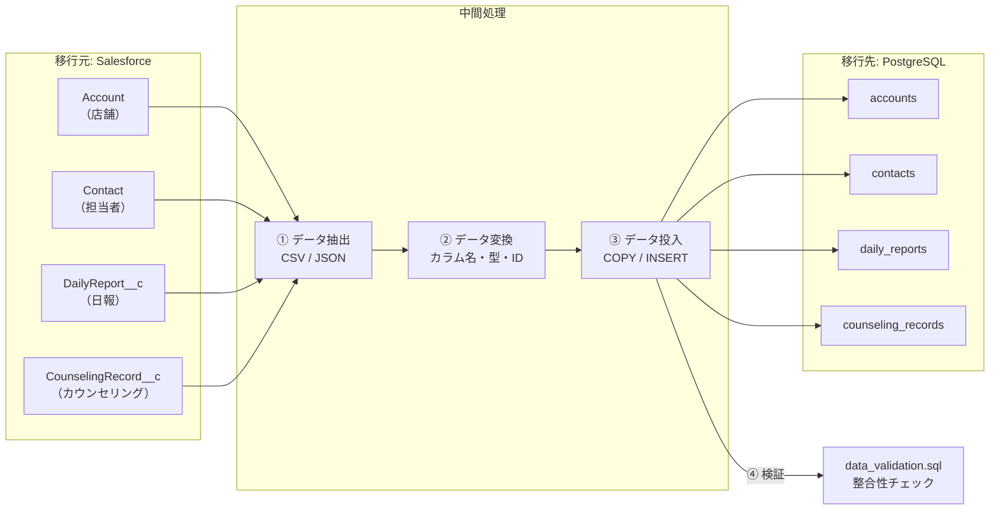
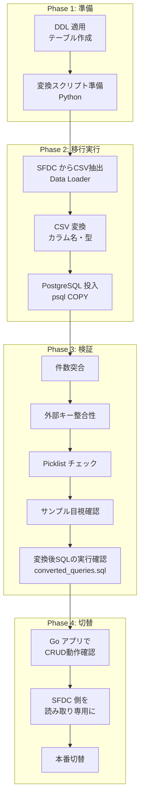

# 📦 SFDC データ移行ガイド — Salesforce → PostgreSQL (Cloud SQL)

> **スキーマ（器）の移行だけでは不十分。既存データ（中身）のマイグレーション戦略が必要です。**
>
> 本ドキュメントでは、Salesforce 上の既存データを Google Cloud の PostgreSQL (Cloud SQL) に
> 安全かつ検証可能な形で移行するための手順・ツール・検証方法を解説します。

---

## 1. データ移行の全体像



### 移行の 4 ステップ

| Step | 内容 | ツール | 所要時間目安 |
|------|------|--------|-------------|
| ① 抽出 | SFDC からデータを CSV/JSON でエクスポート | Data Loader / Bulk API / レポート | 〜1時間 |
| ② 変換 | カラム名・データ型・ID のマッピング変換 | Python スクリプト / AI 生成 | 〜30分 |
| ③ 投入 | PostgreSQL にデータをロード | `psql \copy` / Cloud SQL Import | 〜30分 |
| ④ 検証 | レコード件数・整合性・Picklist 値を突合 | `data_validation.sql` | 〜30分 |

---

## 2. Step ①: SFDC からデータを抽出する方法

### 方法比較

| 方法 | データ量の目安 | 技術レベル | 特徴 |
|------|-------------|-----------|------|
| **Data Export Service** | 小〜中 | ⭐ 低 | Setup画面からGUIで全データをZIP出力 |
| **Data Loader** | 小〜大 | ⭐⭐ 中 | SalesforceデスクトップアプリでCSV出力 |
| **Bulk API 2.0** | 大量 | ⭐⭐⭐ 高 | REST APIで大量データを非同期抽出 |
| **レポート CSV 出力** | 小 | ⭐ 低 | Salesforceレポートからそのまま出力 |
| **SFDX CLI** | 小〜中 | ⭐⭐ 中 | コマンドラインで SOQL 実行→JSON出力 |

### 方法 A: Data Loader（推奨・GUI）

Salesforce 公式のデスクトップアプリケーションです。

```
1. Data Loader を起動
2. 「Export」を選択
3. ログイン（本番 or Sandbox）
4. オブジェクトを選択（例: DailyReport__c）
5. エクスポートする SOQL を入力:
   SELECT Id, Name, ReportDate__c, Supervisor__c, Account__c,
          VisitStartTime__c, VisitEndTime__c, VisitPurpose__c,
          OverallCondition__c, Summary__c, NextAction__c, Status__c,
          ApprovedBy__c, ApprovedDate__c
   FROM DailyReport__c
6. CSV ファイルの保存先を指定
7. 「Finish」→ 全レコードが CSV 出力される
```

> [!TIP]
> オブジェクトごとに CSV を出力するので、以下の順序で実行すること（外部キー整合性のため）:
> 1. `Account` → 2. `Contact` → 3. `DailyReport__c` → 4. `CounselingRecord__c`

### 方法 B: SFDX CLI（開発者向け）

```bash
# Salesforce CLI のインストール
npm install -g @salesforce/cli

# 認証
sf org login web --alias my-org

# SOQL でデータ抽出 → CSV 出力
sf data query \
  --query "SELECT Id, Name, ReportDate__c, Supervisor__c, Account__c, \
           VisitStartTime__c, VisitEndTime__c, VisitPurpose__c, \
           OverallCondition__c, Summary__c, Status__c \
           FROM DailyReport__c" \
  --target-org my-org \
  --result-format csv \
  > sfdc_export/daily_reports.csv

# 全オブジェクトを順番にエクスポート
for obj in Account Contact DailyReport__c CounselingRecord__c; do
  sf data query \
    --query "SELECT FIELDS(ALL) FROM ${obj} LIMIT 50000" \
    --target-org my-org \
    --result-format csv \
    > "sfdc_export/${obj}.csv"
done
```

### 方法 C: Bulk API 2.0（大量データ向け）

10万件以上のデータがある場合は Bulk API が適切です。

```bash
# ジョブ作成
curl -X POST https://YOUR_INSTANCE.salesforce.com/services/data/v60.0/jobs/query \
  -H "Authorization: Bearer ${ACCESS_TOKEN}" \
  -H "Content-Type: application/json" \
  -d '{
    "operation": "query",
    "query": "SELECT Id, Name, ReportDate__c, Account__c, Status__c FROM DailyReport__c"
  }'

# ジョブ結果の取得（CSV）
curl https://YOUR_INSTANCE.salesforce.com/services/data/v60.0/jobs/query/{JOB_ID}/results \
  -H "Authorization: Bearer ${ACCESS_TOKEN}" \
  > daily_reports_bulk.csv
```

### エクスポートされる CSV の例

```csv
"Id","Name","ReportDate__c","Supervisor__c","Account__c","VisitStartTime__c","VisitEndTime__c","VisitPurpose__c","OverallCondition__c","Summary__c","Status__c"
"a0B5g00000XYZ12ABC","DR-0001","2026-03-15","0055g00000ABC12DEF","0015g00000DEF34GHI","2026-03-15T09:00:00.000+0900","2026-03-15T12:00:00.000+0900","定期巡回","A","店舗状態良好。スタッフの接客レベルが向上。","承認済"
"a0B5g00000XYZ13ABC","DR-0002","2026-03-16","0055g00000ABC12DEF","0015g00000DEF35GHI","2026-03-16T13:00:00.000+0900","2026-03-16T15:30:00.000+0900","緊急対応","C","空調故障の件で訪問。修理業者は翌日対応予定。","提出済"
```

---

## 3. Step ②: データ変換（SFDC → PostgreSQL マッピング）

SFDC の CSV をそのまま PostgreSQL に入れることはできません。カラム名・データ型の変換が必要です。

### 変換マッピング表

#### accounts (Account)

| SFDC カラム | PostgreSQL カラム | 変換処理 |
|------------|-----------------|---------|
| `Id` | `id` | そのまま（VARCHAR(18)） |
| `Name` | `name` | そのまま |
| `StoreCode__c` | `store_code` | `__c` 除去 + snake_case |
| `Region__c` | `region` | `__c` 除去 |
| `OpenDate__c` | `open_date` | `YYYY-MM-DD` 形式確認 |
| `IsActive__c` | `is_active` | `"true"/"false"` → `BOOLEAN` |
| `Phone` | `phone` | そのまま |
| `LastVisitDate__c` | `last_visit_date` | `__c` 除去 |

#### daily_reports (DailyReport__c)

| SFDC カラム | PostgreSQL カラム | 変換処理 |
|------------|-----------------|---------|
| `Id` | `id` | そのまま |
| `Name` | `name` | AutoNumber（`DR-0001`）そのまま |
| `ReportDate__c` | `report_date` | `YYYY-MM-DD` |
| `Supervisor__c` | `supervisor_id` | SFDC User ID（15→18桁化必要な場合あり） |
| `Account__c` | `account_id` | SFDC Account ID |
| `VisitStartTime__c` | `visit_start_time` | `YYYY-MM-DDThh:mm:ss.000+0900` → `TIMESTAMPTZ` |
| `VisitEndTime__c` | `visit_end_time` | 同上 |
| `VisitPurpose__c` | `visit_purpose` | そのまま（Picklist 値は同一） |
| `OverallCondition__c` | `overall_condition` | そのまま |
| `Status__c` | `status` | そのまま |

### Python 変換スクリプト

```python
#!/usr/bin/env python3
"""
sfdc_csv_to_postgres.py
SFDC エクスポート CSV を PostgreSQL 用 CSV に変換するスクリプト。
"""

import csv
import re
import sys
from pathlib import Path

# カラム名の変換ルール: SFDC名 → PostgreSQL名
COLUMN_MAPPINGS = {
    "accounts": {
        "Id": "id",
        "Name": "name",
        "StoreCode__c": "store_code",
        "Region__c": "region",
        "OpenDate__c": "open_date",
        "IsActive__c": "is_active",
        "Phone": "phone",
        "BillingCity": "billing_city",
        "BillingState": "billing_state",
        "LastVisitDate__c": "last_visit_date",
    },
    "contacts": {
        "Id": "id",
        "FirstName": "first_name",
        "LastName": "last_name",
        "Email": "email",
        "Phone": "phone",
        "Title": "title",
        "AccountId": "account_id",
    },
    "daily_reports": {
        "Id": "id",
        "Name": "name",
        "ReportDate__c": "report_date",
        "Supervisor__c": "supervisor_id",
        "Account__c": "account_id",
        "VisitStartTime__c": "visit_start_time",
        "VisitEndTime__c": "visit_end_time",
        "VisitPurpose__c": "visit_purpose",
        "OverallCondition__c": "overall_condition",
        "Summary__c": "summary",
        "NextAction__c": "next_action",
        "Status__c": "status",
        "ApprovedBy__c": "approved_by",
        "ApprovedDate__c": "approved_date",
    },
    "counseling_records": {
        "Id": "id",
        "Name": "name",
        "DailyReport__c": "daily_report_id",
        "Contact__c": "contact_id",
        "Category__c": "category",
        "Detail__c": "detail",
        "DurationMinutes__c": "duration_minutes",
        "FollowUpRequired__c": "follow_up_required",
        "FollowUpDate__c": "follow_up_date",
        "FollowUpNote__c": "follow_up_note",
    },
}


def convert_value(col_name: str, value: str) -> str:
    """SFDC の値を PostgreSQL 用に変換"""
    if value == "" or value is None:
        return ""

    # Boolean 変換
    if col_name in ("is_active", "follow_up_required"):
        return "true" if value.lower() in ("true", "1") else "false"

    # DateTime → TIMESTAMPTZ（SFDC: 2026-03-15T09:00:00.000+0900）
    if col_name in ("visit_start_time", "visit_end_time", "approved_date"):
        # SFDC 形式はそのまま PostgreSQL が解釈可能
        return value

    # Integer 変換（小数点除去）
    if col_name == "duration_minutes":
        try:
            return str(int(float(value)))
        except ValueError:
            return value

    return value


def convert_csv(table_name: str, input_path: str, output_path: str):
    """SFDC CSV を PostgreSQL 用 CSV に変換"""
    mapping = COLUMN_MAPPINGS.get(table_name)
    if not mapping:
        print(f"ERROR: Unknown table: {table_name}")
        sys.exit(1)

    with open(input_path, "r", encoding="utf-8") as infile, \
         open(output_path, "w", encoding="utf-8", newline="") as outfile:

        reader = csv.DictReader(infile)
        pg_columns = [mapping[col] for col in reader.fieldnames if col in mapping]
        writer = csv.DictWriter(outfile, fieldnames=pg_columns)
        writer.writeheader()

        count = 0
        for row in reader:
            pg_row = {}
            for sfdc_col, pg_col in mapping.items():
                if sfdc_col in row:
                    pg_row[pg_col] = convert_value(pg_col, row[sfdc_col])
            writer.writerow(pg_row)
            count += 1

        print(f"✅ {table_name}: {count} records converted → {output_path}")


if __name__ == "__main__":
    # 使用例:
    # python sfdc_csv_to_postgres.py accounts sfdc_export/Account.csv pg_import/accounts.csv
    if len(sys.argv) != 4:
        print("Usage: python sfdc_csv_to_postgres.py <table_name> <input.csv> <output.csv>")
        print("Tables: accounts, contacts, daily_reports, counseling_records")
        sys.exit(1)

    convert_csv(sys.argv[1], sys.argv[2], sys.argv[3])
```

### 変換の実行

```bash
# ディレクトリ準備
mkdir -p sfdc_export pg_import

# 変換実行（外部キー依存順に）
python3 sfdc_csv_to_postgres.py accounts       sfdc_export/Account.csv               pg_import/accounts.csv
python3 sfdc_csv_to_postgres.py contacts       sfdc_export/Contact.csv               pg_import/contacts.csv
python3 sfdc_csv_to_postgres.py daily_reports  sfdc_export/DailyReport__c.csv        pg_import/daily_reports.csv
python3 sfdc_csv_to_postgres.py counseling_records sfdc_export/CounselingRecord__c.csv pg_import/counseling_records.csv
```

---

## 4. Step ③: PostgreSQL へデータを投入

### 方法 A: `psql \copy`（ローカル / 小〜中規模）

```bash
# テーブル作成（DDL 適用済み前提）
# 外部キー依存の順序で投入
psql -h localhost -U app_user -d daily_report << 'EOF'

-- 外部キー制約を一時的に無効化（大量データ時に高速化）
SET session_replication_role = 'replica';

\copy accounts(id,name,store_code,region,open_date,is_active,phone,billing_city,billing_state,last_visit_date) FROM 'pg_import/accounts.csv' WITH (FORMAT csv, HEADER true, NULL '');

\copy contacts(id,first_name,last_name,email,phone,title,account_id) FROM 'pg_import/contacts.csv' WITH (FORMAT csv, HEADER true, NULL '');

\copy daily_reports(id,name,report_date,supervisor_id,account_id,visit_start_time,visit_end_time,visit_purpose,overall_condition,summary,next_action,status,approved_by,approved_date) FROM 'pg_import/daily_reports.csv' WITH (FORMAT csv, HEADER true, NULL '');

\copy counseling_records(id,name,daily_report_id,contact_id,category,detail,duration_minutes,follow_up_required,follow_up_date,follow_up_note) FROM 'pg_import/counseling_records.csv' WITH (FORMAT csv, HEADER true, NULL '');

-- 外部キー制約を再有効化
SET session_replication_role = 'origin';

-- created_at / updated_at はデフォルト値（CURRENT_TIMESTAMP）が自動設定される

EOF
```

### 方法 B: Cloud SQL Import（GCP 本番環境）

```bash
# 1. CSV を Cloud Storage にアップロード
gsutil cp pg_import/*.csv gs://${BUCKET_NAME}/data-migration/

# 2. Cloud SQL にインポート（テーブルごと）
for table in accounts contacts daily_reports counseling_records; do
  gcloud sql import csv ${INSTANCE_NAME} \
    gs://${BUCKET_NAME}/data-migration/${table}.csv \
    --database=daily_report \
    --table=${table} \
    --quiet
done
```

---

## 5. Step ④: データ整合性の検証

### 5-1. レコード件数の突合

```sql
-- PostgreSQL 側の件数
SELECT 'accounts' AS table_name, COUNT(*) AS pg_count FROM accounts
UNION ALL
SELECT 'contacts', COUNT(*) FROM contacts
UNION ALL
SELECT 'daily_reports', COUNT(*) FROM daily_reports
UNION ALL
SELECT 'counseling_records', COUNT(*) FROM counseling_records;
```

SFDC 側の件数と一致することを確認:
```
-- SFDC 側（Data Loader or SOQL で確認）
SELECT COUNT() FROM Account
SELECT COUNT() FROM Contact
SELECT COUNT() FROM DailyReport__c
SELECT COUNT() FROM CounselingRecord__c
```

### 5-2. 外部キー整合性チェック

```sql
-- 孤立レコードの検出（外部キー先が存在しない）
SELECT 'contacts→accounts' AS relation, COUNT(*) AS orphan_count
FROM contacts c WHERE c.account_id IS NOT NULL
  AND NOT EXISTS (SELECT 1 FROM accounts a WHERE a.id = c.account_id)
UNION ALL
SELECT 'daily_reports→accounts', COUNT(*)
FROM daily_reports dr WHERE NOT EXISTS (SELECT 1 FROM accounts a WHERE a.id = dr.account_id)
UNION ALL
SELECT 'counseling_records→daily_reports', COUNT(*)
FROM counseling_records cr WHERE NOT EXISTS (SELECT 1 FROM daily_reports dr WHERE dr.id = cr.daily_report_id)
UNION ALL
SELECT 'counseling_records→contacts', COUNT(*)
FROM counseling_records cr WHERE NOT EXISTS (SELECT 1 FROM contacts c WHERE c.id = cr.contact_id);
```

> すべて `orphan_count = 0` であること。

### 5-3. Picklist 値チェック

```sql
-- CHECK 制約外の値が存在しないか
SELECT 'status' AS field, status AS value, COUNT(*) AS cnt
FROM daily_reports
WHERE status NOT IN ('下書き', '提出済', '承認済', '差戻し')
GROUP BY status
UNION ALL
SELECT 'visit_purpose', visit_purpose, COUNT(*)
FROM daily_reports
WHERE visit_purpose NOT IN ('定期巡回', '緊急対応', '新規オープン支援', '研修', '監査')
GROUP BY visit_purpose
UNION ALL
SELECT 'overall_condition', overall_condition, COUNT(*)
FROM daily_reports
WHERE overall_condition NOT IN ('A', 'B', 'C', 'D')
GROUP BY overall_condition
UNION ALL
SELECT 'category', category, COUNT(*)
FROM counseling_records
WHERE category NOT IN ('業務改善', '人材育成', 'クレーム対応', '売上分析', '衛生管理', 'その他')
GROUP BY category;
```

> 結果が空（0行）であること。

### 5-4. サンプルデータの目視確認

```sql
-- 日報 + カウンセリング記録の結合確認
SELECT
    dr.name AS report_number,
    dr.report_date,
    a.name AS store_name,
    dr.status,
    COUNT(cr.id) AS counseling_count,
    SUM(cr.duration_minutes) AS total_minutes
FROM daily_reports dr
JOIN accounts a ON dr.account_id = a.id
LEFT JOIN counseling_records cr ON cr.daily_report_id = dr.id
GROUP BY dr.id, dr.name, dr.report_date, a.name, dr.status
ORDER BY dr.report_date DESC
LIMIT 10;
```

---

## 6. 移行戦略まとめ



### 本番移行時の注意点

| # | 注意点 | 対策 |
|---|--------|------|
| 1 | **SFDC ID の 15桁 / 18桁問題** | Data Loader は 18桁を出力するので問題なし。API 経由は要確認 |
| 2 | **DateTime のタイムゾーン** | SFDC は UTC / ユーザー TZ 混在あり。`TIMESTAMPTZ` で統一 |
| 3 | **リッチテキスト（HTML）** | `LongTextArea` に HTML が含まれる場合、サニタイズが必要 |
| 4 | **添付ファイル / ContentDocument** | 本スキーマには含まれないが別途移行が必要な場合あり |
| 5 | **User ID のマッピング** | SFDC `User.Id` → 移行先の認証基盤（Cloud Identity 等）との紐付け |
| 6 | **差分移行** | 移行期間中の SFDC 側の更新分を追加反映する手順が必要 |
| 7 | **ダウンタイム最小化** | 全量移行 → 差分移行 → カットオーバーの3段階が望ましい |

---

## 7. ワークショップではどう扱うか？

ワークショップ環境では実際の SFDC Org に接続できないため、**テスト用のシードデータ**を用意して PostgreSQL に直接投入します。

> [!TIP]
> `hands-on/00-sfdc-reference/seed_data.sql` にシードデータを用意しておくと、
> `docker-compose.yml` の初期化スクリプトとして自動投入できます（前回のガイド参照）。

```sql
-- seed_data.sql（サンプル）
INSERT INTO accounts (id, name, store_code, region, is_active) VALUES
  ('ACC001', '東京渋谷店',   'TK-001', '関東', true),
  ('ACC002', '大阪梅田店',   'OS-001', '関西', true),
  ('ACC003', '名古屋栄店',   'NG-001', '中部', true);

INSERT INTO contacts (id, first_name, last_name, email, account_id) VALUES
  ('CON001', '太郎', '田中', 'tanaka@example.com', 'ACC001'),
  ('CON002', '花子', '鈴木', 'suzuki@example.com', 'ACC002');

INSERT INTO daily_reports (id, name, report_date, supervisor_id, account_id,
  visit_start_time, visit_end_time, visit_purpose, overall_condition, status) VALUES
  ('DR001', 'DR-0001', '2026-03-15', 'SV001', 'ACC001',
   '2026-03-15 09:00:00+09', '2026-03-15 12:00:00+09', '定期巡回', 'A', '承認済'),
  ('DR002', 'DR-0002', '2026-03-16', 'SV001', 'ACC002',
   '2026-03-16 13:00:00+09', '2026-03-16 15:30:00+09', '緊急対応', 'C', '提出済');

INSERT INTO counseling_records (id, name, daily_report_id, contact_id,
  category, detail, duration_minutes, follow_up_required, follow_up_date) VALUES
  ('CR001', 'CR-0001', 'DR001', 'CON001',
   '業務改善', 'レジオペレーションの効率化を提案', 30, true, '2026-03-22'),
  ('CR002', 'CR-0002', 'DR001', 'CON001',
   '人材育成', '新人スタッフへの OJT 進捗確認', 20, false, NULL);
```
