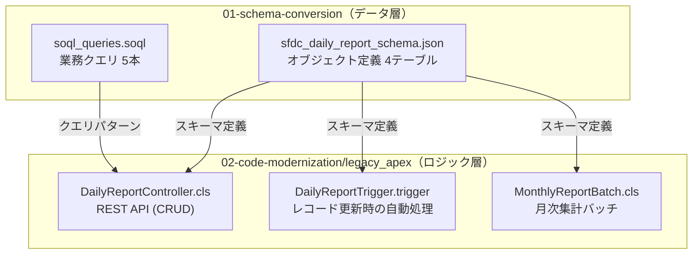
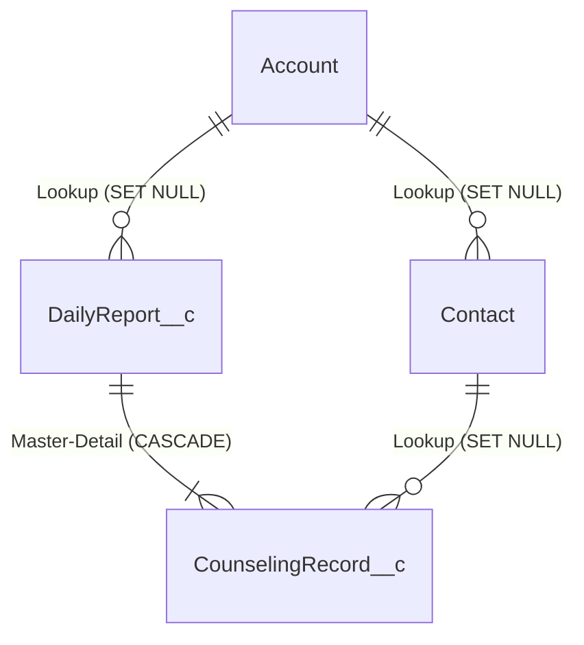
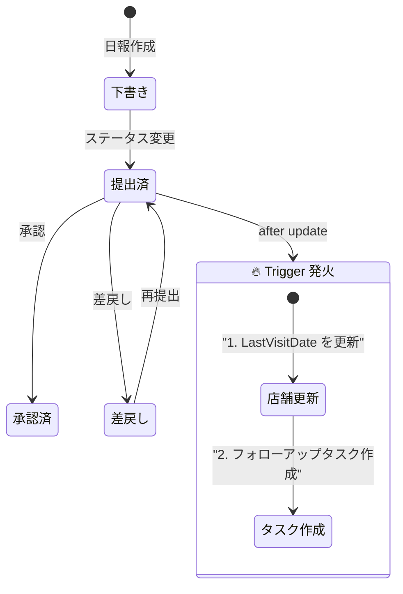
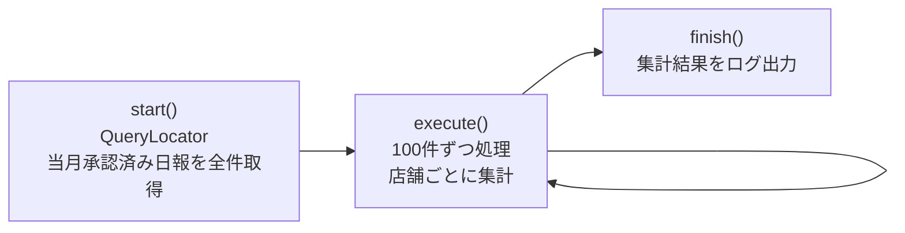
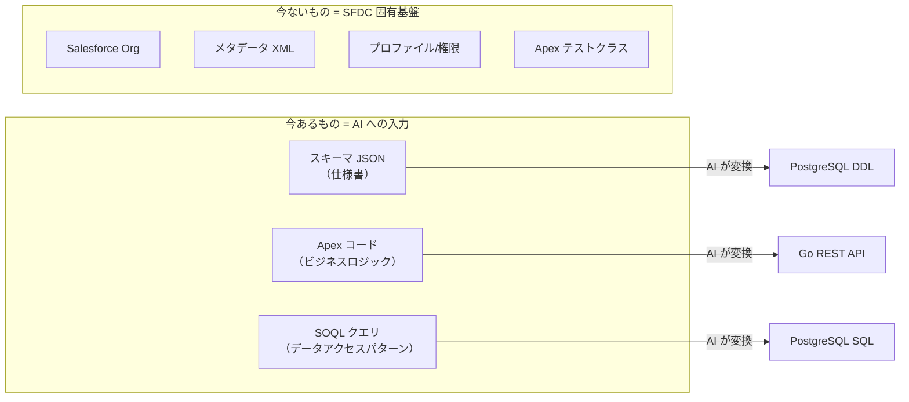
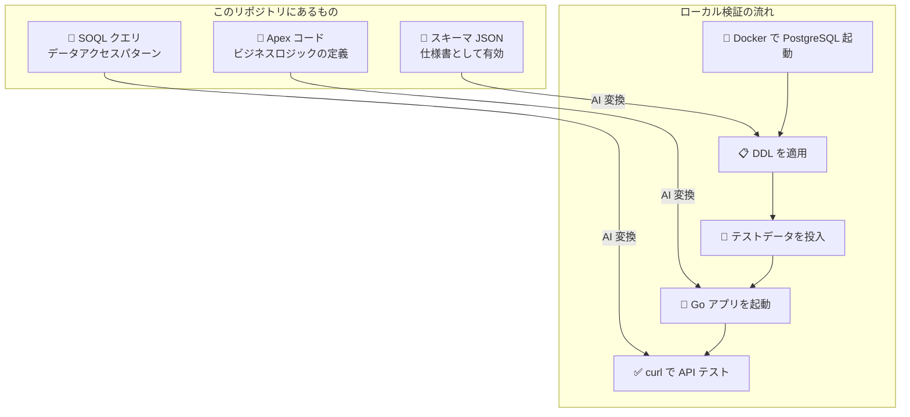

# 📘 SFDC サンプルコード解説 & ローカル検証ガイド

> **結論: このリポジトリにあるファイルだけでは SFDC 上で動くアプリにはなりません。**
> ただしワークショップの目的上、**移行元の「仕様書」として十分に機能**します。
> ローカルで「移行前の動作」を確認するには、**移行先の Go + PostgreSQL を動かして機能等価性を検証**するアプローチが現実的です。

---

## 1. 今あるファイルの全体像



---

## 2. 各ファイルの詳細解説

### 2-1. `sfdc_daily_report_schema.json` — オブジェクトメタデータ

これは **SFDC のカスタムオブジェクト定義を JSON で表現したもの** です。

> [!IMPORTANT]
> これは Salesforce の正式なメタデータ形式（XML）**ではありません**。
> ワークショップ用に作られた「仕様書フォーマット」であり、SFDC にそのままデプロイすることはできません。

#### 定義されている 4 オブジェクト

| # | オブジェクト名 | SFDC 種別 | 概要 | フィールド数 |
|---|--------------|-----------|------|-------------|
| 1 | `Account` | 標準オブジェクト | フランチャイズ店舗 | 10 |
| 2 | `Contact` | 標準オブジェクト | 店舗担当者 | 7 |
| 3 | `DailyReport__c` | カスタムオブジェクト | 業務日報 | 13 |
| 4 | `CounselingRecord__c` | カスタムオブジェクト | カウンセリング記録 | 9 |

#### リレーション構造



- **Lookup 関係**: 親が削除されると子の外部キーが NULL になる（任意の関連）
- **Master-Detail 関係**: 親が削除されると子も CASCADE 削除される（強い所有関係）

#### SFDC 固有のデータ型

| SFDC 型 | 意味 | 例 |
|---------|------|-----|
| `Id` | 18桁のグローバル一意ID | `a0B5g00000XYZ12ABC` |
| `AutoNumber` | 自動採番（読取専用） | `DR-0001`, `CR-0042` |
| `Picklist` | 選択リスト（制限値） | `"下書き"`, `"提出済"`, `"承認済"`, `"差戻し"` |
| `MasterDetail` | 強い親子関係（CASCADE 削除） | CounselingRecord → DailyReport |
| `Lookup` | 緩い参照関係（SET NULL） | Contact → Account |
| `Checkbox` | Boolean 値 | `IsActive__c`, `FollowUpRequired__c` |

#### `__c` サフィックスの意味

SFDC では、ユーザーが作成した **カスタムフィールド/カスタムオブジェクト** には自動的に `__c` が付きます。
- `DailyReport__c` → カスタムオブジェクト
- `ReportDate__c` → カスタムフィールド
- `Account__r` → リレーション参照（`__r` は navigation 用）

---

### 2-2. `soql_queries.soql` — SOQL クエリ集

SOQL (Salesforce Object Query Language) は SQL に似ていますが、いくつかの独自構文があります。

| # | クエリ概要 | SFDC 独自構文 |
|---|----------|--------------|
| Q1 | 特定エリアの提出済み日報一覧 | `Account__r.Name`（ドット記法による暗黙 JOIN） |
| Q2 | 今月の店舗別訪問回数集計 | `THIS_MONTH`（日付リテラル） |
| Q3 | フォローアップ未完了の記録 | `DailyReport__r.Account__r.Name`（多段リレーション） |
| Q4 | 過去30日のカウンセリング分類別集計 | `LAST_N_DAYS:30`（相対日付リテラル） |
| Q5 | 評価 C 以下の店舗の最新日報 | `LAST_N_DAYS:90` |

#### SOQL と SQL の主な違い

| 特徴 | SOQL | SQL (PostgreSQL) |
|------|------|------------------|
| JOIN | 不要。`Account__r.Name` で暗黙的に JOIN | `JOIN accounts a ON ...` が必要 |
| 日付 | `THIS_MONTH`, `LAST_N_DAYS:30` | `date_trunc('month', CURRENT_DATE)` |
| サブクエリ | 親子クエリ `(SELECT ... FROM Children__r)` | 別クエリ or JOIN |
| LIMIT | `LIMIT 200`（最大2000） | `LIMIT` 制限なし |
| INSERT/UPDATE | 不可（SOQL は読取専用） | 可能 |

---

### 2-3. `DailyReportController.cls` — REST API コントローラー

SFDC の **Apex REST API** を実装したクラスです。

#### エンドポイント構成

| HTTP メソッド | 処理 | パス | 主なロジック |
|-------------|------|------|-------------|
| `GET` | 日報一覧 | `/api/daily-reports` | 動的 SOQL クエリ構築（status, region, date フィルタ） |
| `POST` | 日報新規作成 | `/api/daily-reports` | 日報 + カウンセリング記録を一括作成 |
| `PATCH` | ステータス更新 | `/api/daily-reports/{id}` | ステータス遷移バリデーション付き |
| `DELETE` | 日報削除 | `/api/daily-reports/{id}` | 下書きのみ削除可能 |

#### SFDC 固有コードのポイント

```apex
// ① SFDC 固有: ログイン中のユーザー ID を暗黙取得
report.Supervisor__c = UserInfo.getUserId();

// ② SFDC 固有: DML 操作（暗黙トランザクション）
insert report;        // SFDC が自動でトランザクション管理
insert records;       // 同一実行コンテキスト内で両方 commit or rollback

// ③ SFDC 固有: Dynamic SOQL（バインド変数）
Database.query(query); // SQL インジェクション対策は SFDC プラットフォーム側が担保

// ④ SFDC 固有: Master-Detail による暗黙 CASCADE
delete report;         // CounselingRecord__c も自動削除される
```

#### ビジネスルール

- **ステータス遷移制約**: `提出済` への変更は `下書き` or `差戻し` からのみ
- **承認処理**: `承認済` にすると `ApprovedBy__c` と `ApprovedDate__c` が自動設定
- **削除制約**: `下書き` 以外の日報は削除不可

---

### 2-4. `DailyReportTrigger.trigger` — トリガー（自動処理）

SFDC の **トリガー** は、レコード操作（INSERT/UPDATE/DELETE）に応じて自動実行される処理です。

#### 発火条件と処理内容



- **発火タイミング**: `after update`（日報レコードが更新された**後**）
- **発火条件**: `Status__c` が `提出済` に変更されたとき
- **処理①**: 訪問先 Account の `LastVisitDate__c` を日報日付で更新
- **処理②**: `FollowUpRequired__c = true` のカウンセリング記録に対してフォローアップ `Task` を作成

> [!WARNING]
> トリガー内で SOQL クエリ（L31-37）を発行しているのは、「ガバナー制限に対するベストプラクティス違反」です。
> 大量レコード更新時に `Too many SOQL queries` エラーになる可能性があります。
> これは **ワークショップ用のレガシーコードとして意図的に含めた設計上の問題点** です。

---

### 2-5. `MonthlyReportBatch.cls` — バッチ処理

SFDC の **Batch Apex** は、大量データを分割して非同期処理するための仕組みです。

#### 3フェーズ構造



| フェーズ | メソッド | 処理内容 |
|---------|---------|---------|
| **start** | `start()` | 当月の承認済み日報を `QueryLocator` で取得（SOQL） |
| **execute** | `execute()` | 100件ずつバッチ処理。店舗ごとに訪問回数・評価分布・カウンセリング時間を集計 |
| **finish** | `finish()` | 集計結果を `System.debug` でログ出力（本番ではカスタムオブジェクトに保存想定） |

#### 集計項目（MonthlySummary）

| 項目 | 型 | 説明 |
|------|---|------|
| `visitCount` | Integer | 店舗ごとの訪問回数 |
| `gradeA`〜`gradeD` | Integer | 評価別の件数分布 |
| `totalCounselingMinutes` | Integer | カウンセリング合計時間（分） |
| `followUpTotal` | Integer | フォローアップ必要件数 |
| `followUpOverdue` | Integer | フォローアップ期限超過件数 |

> [!NOTE]
> `Database.Stateful` を実装しているため、`summaryMap` がバッチ全体で共有されます。
> これにより、複数の `execute()` 呼び出しにまたがって集計状態を保持できます。

---

## 3. 「これだけで SFDC 上で動くのか？」 — 答え: No

### 不足しているもの一覧

| # | 不足要素 | 説明 | Salesforce での役割 |
|---|---------|------|-------------------|
| 1 | **sfdx-project.json** | Salesforce DX プロジェクト定義ファイル | プロジェクト構成の宣言 |
| 2 | **カスタムオブジェクト XML** | `DailyReport__c.object-meta.xml` 等 | フィールド定義・リレーション・レイアウトの実体 |
| 3 | **カスタムフィールド XML** | `ReportDate__c.field-meta.xml` 等 | 各フィールドの型・バリデーション・デフォルト値 |
| 4 | **Apex テストクラス** | `DailyReportControllerTest.cls` 等 | **本番デプロイには 75% 以上のカバレッジが必須** |
| 5 | **プロファイル / 権限セット** | `Admin.profile-meta.xml` 等 | オブジェクト・フィールドへのアクセス権 |
| 6 | **Salesforce 組織 (Org)** | Developer Edition / Scratch Org | Apex が動作するマルチテナント環境 |
| 7 | **`Task` 標準オブジェクト** | トリガーで使用 | フォローアップタスクの保存先 |
| 8 | **`User` 標準オブジェクト** | Controller/Trigger で使用 | `UserInfo.getUserId()` の実体 |

### なぜ「これだけ」なのか？

> [!TIP]
> **このリポジトリの目的はマイグレーションのワークショップ**です。
> SFDC のフル構成を再現することが目的ではなく、
> **「移行元の仕様を明確にし、AI にコンテキストとして渡す」** ことが目的です。



つまり、ファイルの役割は **「SFDC のアプリそのもの」ではなく「移行元の仕様を伝えるコンテキスト」** です。

---

## 4. ローカルで動作確認する方法

### 方法 A: SFDC 側を動かす（非推奨）

SFDC の Apex は **Salesforce プラットフォーム上でしか動作しません**。ローカル実行は不可能です。

もしどうしてもやるなら：

1. [Salesforce Developer Edition](https://developer.salesforce.com/signup) に登録（無料）
2. Salesforce CLI (`sf`) をインストール
3. カスタムオブジェクト・フィールドの XML メタデータを作成
4. `sf project deploy start` でデプロイ
5. Developer Console で Apex テストを実行

→ **ワークショップの趣旨に合わないため非推奨**

---

### 方法 B: 移行先（Go + PostgreSQL）をローカルで動かす（✅ 推奨）

**「マイグレーション前のアプリが正しく移行されたか」** を検証するには、
**移行先の Go アプリをローカルで起動し、Apex と同等の動作をするか確認する** のが最も現実的です。

#### 必要なもの

| ツール | 用途 | インストール |
|--------|------|-------------|
| Docker | PostgreSQL コンテナ | `brew install --cask docker` |
| Go 1.24+ | アプリ実行 | `brew install go` |
| curl / httpie | API テスト | `brew install httpie` |

#### 手順

```bash
# 1. PostgreSQL をコンテナで起動
docker run -d \
  --name daily-report-db \
  -e POSTGRES_USER=app_user \
  -e POSTGRES_PASSWORD=password \
  -e POSTGRES_DB=daily_report \
  -p 5432:5432 \
  postgres:16

# 2. DDL を適用してテーブルを作成
cat hands-on/01-schema-conversion/expected_output/ddl.sql | \
  docker exec -i daily-report-db psql -U app_user -d daily_report

# 3. Go アプリを起動
cd hands-on/02-code-modernization/output/generated_go
export DB_HOST=localhost
export DB_PORT=5432
export DB_USER=app_user
export DB_PASSWORD=password
export DB_NAME=daily_report
go run cmd/server/main.go

# 4. API をテスト（別ターミナル）
# 日報の作成
curl -s -X POST http://localhost:8080/api/daily-reports \
  -H "Content-Type: application/json" \
  -d '{
    "reportDate": "2026-04-02",
    "accountId": "ACC001",
    "visitStartTime": "2026-04-02T09:00:00Z",
    "visitEndTime": "2026-04-02T12:00:00Z",
    "visitPurpose": "定期巡回",
    "overallCondition": "A",
    "summary": "店舗状態良好",
    "counselingRecords": [
      {
        "contactId": "CON001",
        "category": "業務改善",
        "detail": "レジ周りのオペレーション改善を提案",
        "durationMinutes": 30,
        "followUpRequired": true,
        "followUpDate": "2026-04-09"
      }
    ]
  }' | python3 -m json.tool

# 日報一覧の取得
curl -s "http://localhost:8080/api/daily-reports?status=下書き" | python3 -m json.tool
```

#### Apex ↔ Go の機能等価性チェックリスト

| # | Apex の動作 | Go で検証する操作 | 期待結果 |
|---|-----------|-----------------|---------|
| 1 | `@HttpGet` — フィルタ付き一覧 | `GET /api/daily-reports?status=下書き` | JSON 配列が返る |
| 2 | `@HttpPost` — 日報+子レコード一括作成 | `POST /api/daily-reports` (上記 curl) | 日報と counseling_records が同時に INSERT |
| 3 | `@HttpPatch` — ステータス遷移 | `PATCH /api/daily-reports/{id}` `{"status":"提出済"}` | `下書き→提出済` のみ許可、他は 400 |
| 4 | `@HttpPatch` — 承認処理 | `PATCH /api/daily-reports/{id}` `{"status":"承認済"}` | `approved_by` と `approved_date` が自動設定 |
| 5 | `@HttpDelete` — 下書き削除 | `DELETE /api/daily-reports/{id}` | `下書き` のみ 204、他は 400 |
| 6 | CASCADE 削除 | 日報削除時に counseling_records も消える | `ON DELETE CASCADE` で自動削除 |
| 7 | **Trigger** — 最終訪問日更新 | ステータスを `提出済` に変更 | accounts.last_visit_date が更新（ワーカー経由） |
| 8 | **Batch** — 月次集計 | `go run cmd/batch/main.go` | 店舗ごとの集計結果がログ出力 |

---

### 方法 C: docker compose で一発セットアップ

以下の `docker-compose.yml` を使えば、PostgreSQL + テストデータ投入まで一発で起動できます。

```yaml
# hands-on/docker-compose.yml
services:
  db:
    image: postgres:16
    environment:
      POSTGRES_USER: app_user
      POSTGRES_PASSWORD: password
      POSTGRES_DB: daily_report
    ports:
      - "5432:5432"
    volumes:
      - ./01-schema-conversion/expected_output/ddl.sql:/docker-entrypoint-initdb.d/01_ddl.sql
      - ./00-sfdc-reference/seed_data.sql:/docker-entrypoint-initdb.d/02_seed.sql
    healthcheck:
      test: ["CMD-SHELL", "pg_isready -U app_user -d daily_report"]
      interval: 5s
      timeout: 3s
      retries: 5
```

```bash
# 起動
cd hands-on
docker compose up -d

# Go アプリを起動
cd 02-code-modernization/output/generated_go
DB_HOST=localhost DB_PORT=5432 DB_USER=app_user DB_PASSWORD=password DB_NAME=daily_report \
  go run cmd/server/main.go
```

---

## 5. まとめ



| 質問 | 回答 |
|------|------|
| **今のファイルだけで SFDC 上で動く？** | ❌ No。メタデータ XML、テストクラス、Salesforce Org が不足 |
| **ファイルの役割は？** | 移行元の仕様書（スキーマ + ビジネスロジック + クエリパターン） |
| **ローカルで検証できる？** | ✅ 移行先の Go + PostgreSQL をローカルで動かして等価性を検証 |
| **SFDC を動かす必要ある？** | ワークショップの目的上は不要。Go 側で同等の動作を確認すれば十分 |
