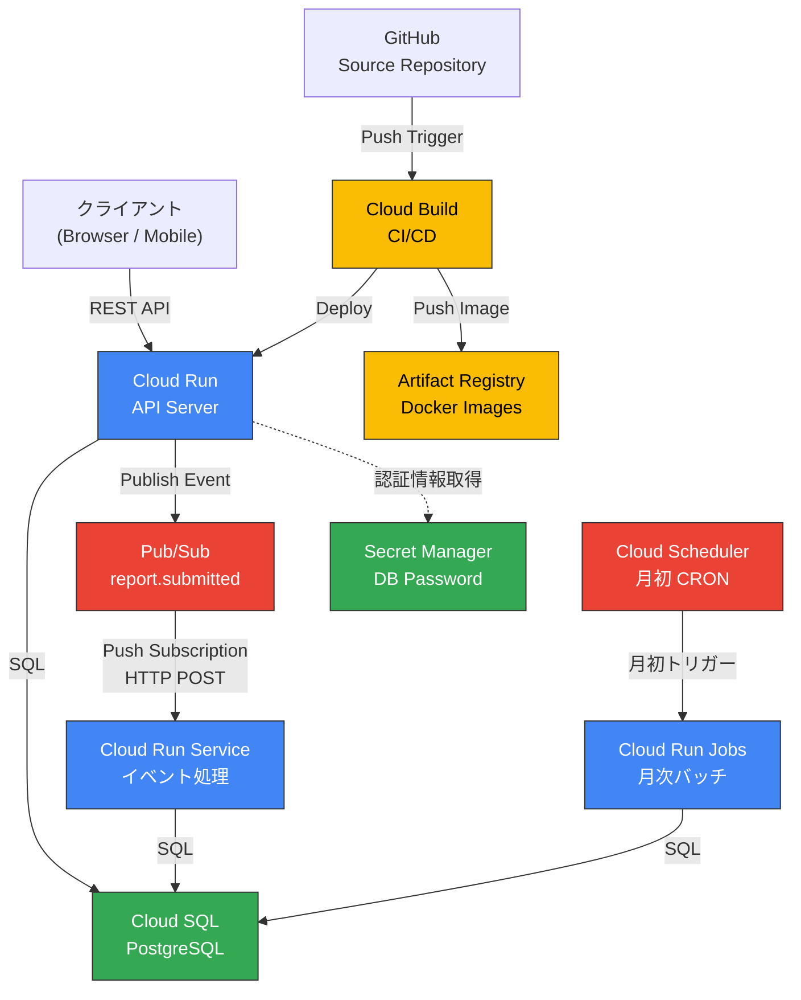
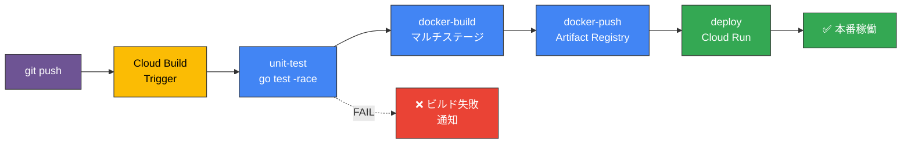
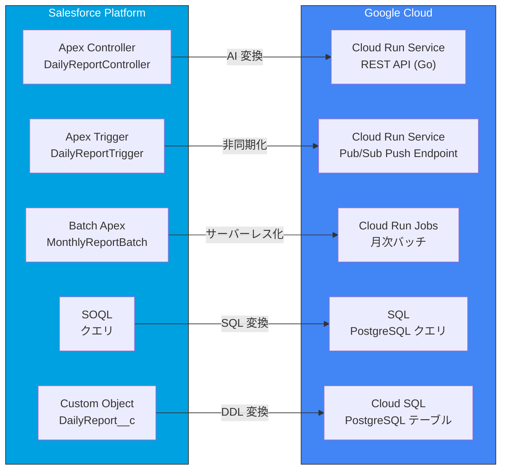
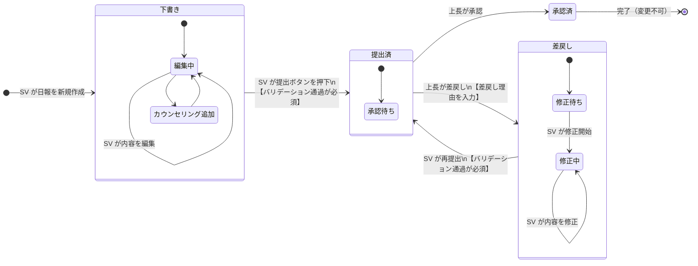

# Architecture Decision Records (ADR)

> **プロジェクト**: SFDC → Google Cloud マイグレーション ワークショップ
> **作成日**: 2026-03-27
> **ステータス**: 全件 承認済

---

## ADR-001: データベースに PostgreSQL (Cloud SQL) を採用

- **ステータス**: 承認済
- **コンテキスト**: SFDC のカスタムオブジェクト（DailyReport__c, CounselingRecord__c 等）をリレーショナルDB に移行する必要がある。MasterDetail / Lookup の関係性、Picklist の制約、AutoNumber など SFDC 固有のデータモデルを適切にマッピングできる DB が必要。
- **決定**: Google Cloud SQL for PostgreSQL を採用する。
- **理由**:
  | 選択肢 | 評価 |
  |---|---|
  | **Cloud SQL (PostgreSQL)** ✅ | SFDC の Lookup/MasterDetail を FK で自然に表現可能。CHECK 制約で Picklist を制限。運用負荷が低い。エコシステム（ORM、ツール）が豊富。 |
  | Cloud Spanner | グローバル分散は不要。スキーマ設計の学習コストが高い。小〜中規模には過剰。 |
  | AlloyDB | PostgreSQL 互換だが、分析ワークロードが主目的ではない。コストが高い。 |
  | Firestore | NoSQL のため SFDC のリレーショナル構造と相性が悪い。JOIN 不可。 |
- **結果**: SFDC の外部キー関係を FK 制約で表現し、Picklist を CHECK 制約でマッピング。Cloud SQL Auth Proxy 経由で Cloud Run から接続。将来的に AlloyDB への移行パスも確保。

---

## ADR-002: アプリケーション言語に Go を採用

- **ステータス**: 承認済
- **コンテキスト**: SFDC の Apex コードを Google Cloud 上で動作するモダンな言語に移行する必要がある。Cloud Run でのコールドスタート性能、開発チームのスキルセット、長期的な保守性を考慮。
- **決定**: Go (golang) 1.24 を採用する。
- **理由**:
  | 選択肢 | 評価 |
  |---|---|
  | **Go** ✅ | コールドスタートが高速（<100ms）。静的バイナリで distroless 対応。強い型システムでバグ抑止。Google Cloud SDK/ライブラリが充実。 |
  | Java (Spring Boot) | Apex 開発者の移行は容易だが、コールドスタートが遅い（数秒）。GraalVM Native Image は複雑。 |
  | Python (FastAPI) | 開発速度は速いが、型安全性が弱い。大規模コードベースの保守性に懸念。 |
  | Node.js (TypeScript) | コールドスタートは良好だが、Go ほどのパフォーマンスはない。 |
- **結果**: Apex → Go の変換は AI（Gemini）で支援。`database/sql` + 標準ライブラリ中心で依存を最小化。distroless イメージで数 MB のコンテナ実現。

---

## ADR-003: クリーンアーキテクチャ（3 層構成）を採用

- **ステータス**: 承認済
- **コンテキスト**: Apex では Controller に DB アクセス・ビジネスロジック・HTTP レスポンスが混在していた。テスタビリティが低く、ロジック変更時の影響範囲が大きい。
- **決定**: handler / usecase / repository の 3 層クリーンアーキテクチャを採用する。
- **理由**:
  | 選択肢 | 評価 |
  |---|---|
  | **3 層クリーンアーキテクチャ** ✅ | 関心の分離が明確。インターフェースによる DI でテスト容易。Layer 間の依存方向が一方向。 |
  | MVC（Rails 風） | Repository 層がなく、Model に DB ロジックが混在しがち。 |
  | Hexagonal Architecture | 概念的には優れるが、ワークショップの時間内で理解・実装するには複雑すぎる。 |
  | フラット構成（1 ファイル） | 小規模なら十分だが、今回のように複数エンティティ＋イベント連携がある場合はすぐ破綻。 |
- **結果**:
  ```
  internal/
  ├── handler/    ← HTTP リクエスト/レスポンス
  ├── usecase/    ← ビジネスロジック（バリデーション、ステータス遷移）
  ├── repository/ ← DB アクセス（SQL 発行）
  ├── model/      ← ドメインモデル（構造体定義）
  ├── event/      ← イベント発行・購読
  ├── worker/     ← イベントハンドラー
  └── config/     ← 環境設定
  ```
  usecase テストではモック Repository を DI し、DB 不要でテスト可能。handler テストではモック UseCase を DI し、HTTP リクエスト/レスポンスのみ検証。

---

## ADR-004: コンテナ基盤に Cloud Run を採用

- **ステータス**: 承認済
- **コンテキスト**: Apex のランタイム（Salesforce Platform）から Google Cloud のコンテナ基盤へ移行する必要がある。運用負荷、スケーラビリティ、コストを考慮。
- **決定**: Cloud Run (managed) を採用する。
- **理由**:
  | 選択肢 | 評価 |
  |---|---|
  | **Cloud Run** ✅ | サーバーレス。ゼロスケール対応でコスト効率良好。Dockerfile だけで即デプロイ。Cloud SQL 接続が組み込み。 |
  | GKE (Autopilot) | Kubernetes の知識が必要。小規模アプリには過剰。ゼロスケール不可（最小 1 Pod）。 |
  | GKE (Standard) | 最大の柔軟性だが、ノード管理・クラスタ運用のコストが高い。 |
  | App Engine (Flex) | コンテナ対応だが、Cloud Run より制約が多い。デプロイが遅い。 |
- **結果**: `min-instances=0` でゼロスケール。`max-instances=10` でコスト上限設定。Cloud SQL Auth Proxy 経由で DB 接続。distroless nonroot イメージでセキュリティ確保。

---

## ADR-005: CI/CD に Cloud Build を採用

- **ステータス**: 承認済
- **コンテキスト**: コード変更からデプロイまでの自動化パイプラインが必要。Google Cloud ネイティブで、Artifact Registry・Cloud Run との統合が容易であること。
- **決定**: Cloud Build を採用する。
- **理由**:
  | 選択肢 | 評価 |
  |---|---|
  | **Cloud Build** ✅ | Google Cloud ネイティブ。Artifact Registry / Cloud Run との IAM 統合が容易。`cloudbuild.yaml` 1 ファイルで定義。Secret Manager 連携。 |
  | GitHub Actions | 汎用的だが、Google Cloud への認証設定（Workload Identity Federation）が追加で必要。 |
  | GitLab CI | セルフホスト runner が必要。Google Cloud 統合は Cloud Build ほど密ではない。 |
  | Jenkins | 運用負荷が非常に高い。コンテナ化時代には過剰。 |
- **結果**: 4 ステップパイプライン（test → build → push → deploy）。substitutions でパラメータ外出し。Secret Manager で DB パスワード管理。

---

## ADR-006: Apex Trigger を Pub/Sub + Cloud Run ワーカーに移行

- **ステータス**: 承認済
- **コンテキスト**: SFDC の `DailyReportTrigger`（日報提出時に店舗の最終訪問日を自動更新）を Google Cloud で再現する必要がある。同期処理（Trigger）を非同期イベント駆動に変換する設計判断。
- **決定**: Pub/Sub トピック + Cloud Run Service（Push サブスクリプション経由のイベント処理エンドポイント）で実現する。
- **理由**:
  | 選択肢 | 評価 |
  |---|---|
  | **Pub/Sub + Cloud Run Service (Push)** ✅ | 疎結合。リトライ・DLQ が組み込み。スケーラブル。API サーバーとイベント処理サービスを独立デプロイ可能。 |
  | DB トリガー（PostgreSQL TRIGGER） | DB 層にロジックが混入。テスト困難。スケールしない。 |
  | 同期処理（UseCase 内で直接更新） | 単純だがトランザクション境界が複雑化。障害時の部分更新リスク。 |
  | Cloud Tasks | 1:1 のタスクキュー向き。Fan-out やイベント駆動には Pub/Sub が適切。 |
- **結果**: 日報ステータスが「提出済」に更新された時、UseCase が `report.submitted` イベントを Pub/Sub に Publish。Pub/Sub Push サブスクリプションが Cloud Run Service（イベント処理用）のエンドポイントに HTTP POST し、`accounts.last_visit_date` を更新 + `monthly_aggregates` を upsert。

---

## ADR-007: Batch Apex を Cloud Run Jobs + Cloud Scheduler に移行

- **ステータス**: 承認済
- **コンテキスト**: SFDC の `MonthlyReportBatch`（月次集計バッチ）を Google Cloud で再現する必要がある。Apex の `Database.Batchable` インターフェースに相当する実行基盤を選定。
- **決定**: Cloud Run Jobs + Cloud Scheduler で実現する。
- **理由**:
  | 選択肢 | 評価 |
  |---|---|
  | **Cloud Run Jobs + Cloud Scheduler** ✅ | サーバーレスバッチ。スケジュール実行が容易。タイムアウト最大 24 時間。失敗時の自動リトライ。コンテナイメージを API サーバーと共有可能。 |
  | Cloud Functions (2nd gen) | タイムアウト 60 分まで。大量データ処理には不向き。 |
  | Dataflow | ETL/ストリーミング向け。月次集計には過剰。Apache Beam の学習コスト。 |
  | GKE CronJob | Kubernetes クラスタが必要。運用負荷が高い。 |
- **結果**: Cloud Scheduler が CRON 式で月初に Cloud Run Jobs を起動。Jobs コンテナは前月の日報を集計し `monthly_aggregates` テーブルに書き込む。API サーバーと同一の Go バイナリを使い、エントリーポイント（サブコマンド）で分岐。

---

## アーキテクチャ図

### 図1: アーキテクチャ全体図



### 図2: CI/CD パイプラインフロー



### 図3: SFDC → Google Cloud マッピング



### 図4: 日報ステータス遷移図

> **アクター**: SV（スーパーバイザー）= 日報作成者、上長 = 承認者



#### 遷移時のシステム処理（副作用）

| 遷移 | トリガー | システム処理 |
|---|---|---|
| 下書き → **提出済** | SV が提出 | ① バリデーション実行（必須項目・時間整合性チェック）<br/>② `report.submitted` イベントを Pub/Sub に Publish<br/>③ Pub/Sub → Cloud Run Service が `accounts.last_visit_date` を更新 |
| 提出済 → **承認済** | 上長が承認 | ① `approved_by` / `approved_at` を記録<br/>② ステータスをイミュータブル化（以降の編集を禁止） |
| 提出済 → **差戻し** | 上長が差戻し | ① `rejection_reason` を記録<br/>② SV に通知 |
| 差戻し → **提出済** | SV が再提出 | ① バリデーション再実行<br/>② `report.submitted` イベントを再 Publish |

#### バリデーションルール（提出時）

| ルール | 内容 |
|---|---|
| 必須項目 | `report_date`, `account_id`, `visit_purpose`, `overall_condition` |
| 時間整合性 | `visit_start_time` < `visit_end_time` |
| カウンセリング | 1 件以上の `counseling_records` が紐づくこと |
| 所要時間 | `duration_minutes` > 0 |
