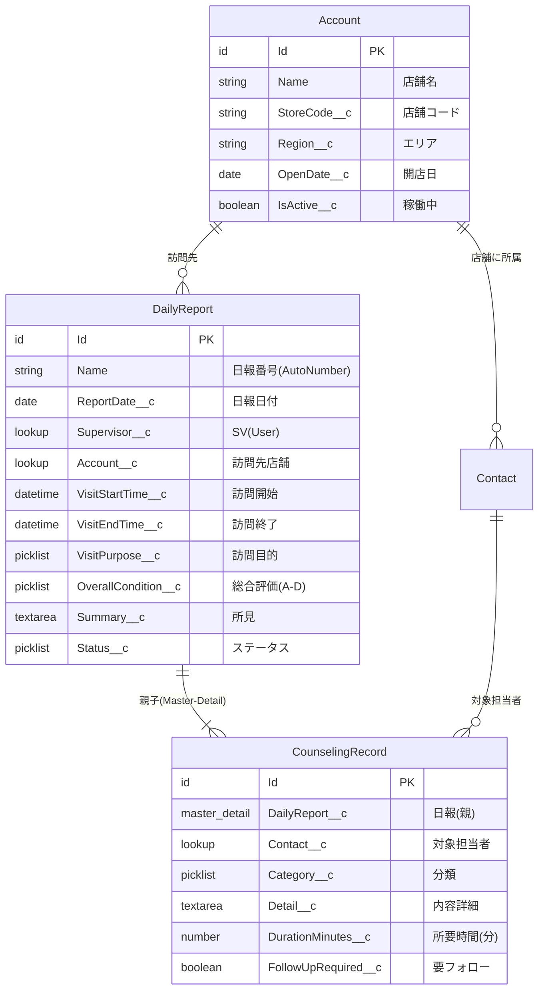
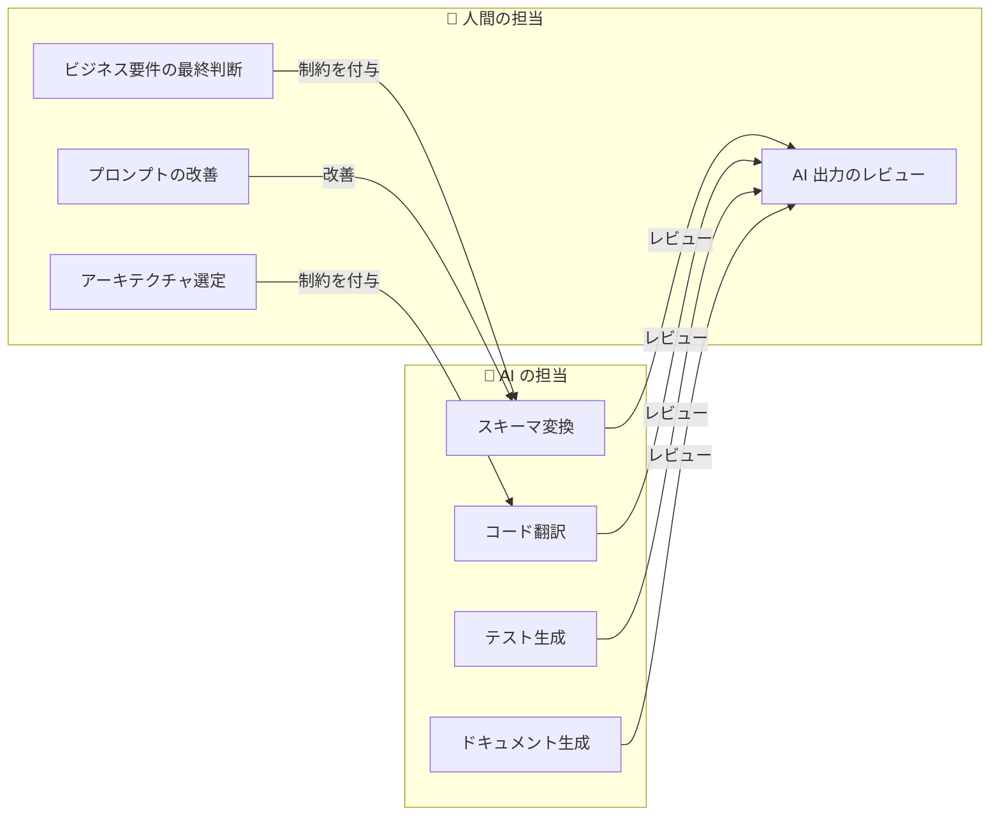

# 🚀 AI ネイティブ SFDC モダナイゼーション ハンズオン

> **1日で体験する「AI に書かせる移行」の全ステップ**
>
> 本ハンズオンでは、フランチャイズ店舗のスーパーバイザー (SV) が業務日報を管理する SFDC アプリをサンプルとし、**AI（Gemini / Antigravity）を最大限活用して**オープンな技術スタック（PostgreSQL + コンテナ化 REST API）へモダナイズするフローを step by step で体験します。

---

## 📋 タイムテーブル

| 時間 | Step | 内容 | AI の役割 |
|------|------|------|-----------|
| 10:00 – 10:30 | **Step 0** | キックオフ：AI ネイティブ移行の合意形成 | — |
| 10:30 – 12:00 | **Step 1** | DB スキーマ変換（SFDC → PostgreSQL DDL） | 🤖 DDL 自動生成、SOQL→SQL 変換 |
| 12:00 – 13:00 | | 🍱 昼休み | |
| 13:00 – 14:30 | **Step 2** | コードリファクタリング（Apex → モダン API） | 🤖 クリーンアーキテクチャへの翻訳 |
| 14:30 – 15:30 | **Step 3** | テスト自動生成（品質保証のモダナイズ） | 🤖 テストコード生成 |
| 15:30 – 16:30 | **Step 4** | コンテナ化・CI パイプライン構築 | 🤖 Dockerfile / CI YAML 生成 |
| 16:30 – 17:00 | **Step 5** | Docs as Code & クロージング | 🤖 ADR / API 仕様書の自動生成 |

---

## 📁 ディレクトリ構成

```
hands-on/
├── HANDSON.md                      ← 📖 本ドキュメント
├── 01-schema-conversion/
│   ├── sfdc_daily_report_schema.json   # SFDC メタデータ（入力）
│   ├── soql_queries.soql               # SOQL クエリ集（入力）
│   └── expected_output/
│       ├── ddl.sql                     # 期待される DDL 出力
│       └── converted_queries.sql       # 期待される SQL 変換結果
├── 02-code-modernization/
│   └── legacy_apex/
│       ├── DailyReportController.cls   # Apex REST コントローラー
│       ├── DailyReportTrigger.trigger  # Apex トリガー
│       └── MonthlyReportBatch.cls      # Batch Apex
├── 03-test-generation/                 # Step 3 で AI に生成させる
├── 04-containerization/
│   └── expected_output/
│       ├── Dockerfile                  # マルチステージビルド
│       └── cloudbuild.yaml             # CI/CD パイプライン
└── 05-documentation/                   # Step 5 で AI に生成させる
```

---

## 🎯 サンプルアプリの概要

### ビジネスコンテキスト

フランチャイズチェーンの **スーパーバイザー（SV）** が、担当店舗を定期的に巡回し、店舗スタッフへの **カウンセリング（業務改善指導・人材育成）** を実施した結果を **業務日報** として記録・管理するシステムです。

### SFDC オブジェクト構成



---

## Step 0: キックオフ — AI ネイティブ移行の合意形成（10:00 – 10:30）

### 最も重要なマインドセット転換

> 🧠 **「コードを人間が書き直す」のではなく、「AI に適切な制約とコンテキストを与え、生成させる」**

| 項目 | 従来アプローチ | AI ネイティブアプローチ |
|------|--------------|----------------------|
| **スキーマ変換** | 手動で型マッピング表を確認しながら DDL を記述 | SFDC メタデータ JSON + 変換ルールを AI に渡し DDL を一括生成 |
| **コード変換** | Apex を読み解き、ロジックを手動で Go/Python に書き直す | Apex ソース + アーキテクチャ制約を AI に渡しコードを生成 |
| **テスト作成** | ロジックを理解してからテストケースを手動設計 | 生成コードを AI に渡し「網羅的なテストを書け」と指示 |
| **ドキュメント** | 人間が一から Word/Confluence に記述 | 生成物を AI に渡し ADR / API 仕様を自動生成 |

### 役割分担



### 💬 議論ポイント

1. 御社の SFDC アプリのうち、**移行コスト対効果が高い**ものはどれか？
2. 移行先の言語は Go / Python / TypeScript のどれが社内スキルに合うか？
3. DB は PostgreSQL（Cloud SQL）で十分か、AlloyDB が必要か？

---

## Step 1: AI によるスキーマ変換（10:30 – 12:00）

### 1-1. SFDC メタデータの確認（10分）

まず、サンプルの SFDC スキーマ定義を確認します。

📂 **入力ファイル:** [`01-schema-conversion/sfdc_daily_report_schema.json`](./01-schema-conversion/sfdc_daily_report_schema.json)

このファイルには、業務日報システムの 4 オブジェクト（Account, Contact, DailyReport__c, CounselingRecord__c）の全フィールド定義が JSON 形式で格納されています。

```bash
# ファイルを確認
cat hands-on/01-schema-conversion/sfdc_daily_report_schema.json | python3 -m json.tool | head -50
```

### 1-2. 🤖 DDL 自動生成プロンプトの実行（30分）

以下のプロンプトを **Gemini**（または Antigravity / Claude）にコピー＆ペーストし、DDL を生成させます。

#### プロンプト

````markdown
# 指示
あなたは Salesforce から PostgreSQL への移行スペシャリストです。
以下の SFDC オブジェクトメタデータ（JSON）を入力として受け取り、
PostgreSQL 用の DDL（CREATE TABLE 文）を生成してください。

# 変換ルール（厳守）
1. **テーブル名**: オブジェクト名を snake_case に変換。`__c` サフィックスは除去。
   - Account → accounts, DailyReport__c → daily_reports
2. **カラム名**: フィールド名を snake_case に変換。`__c` サフィックスは除去。
3. **データ型マッピング**:
   | SFDC 型 | PostgreSQL 型 |
   |---------|----|
   | Id | VARCHAR(18) PRIMARY KEY |
   | Text | VARCHAR(length) |
   | LongTextArea | TEXT |
   | Checkbox | BOOLEAN |
   | Number | INTEGER または NUMERIC(precision, scale) |
   | Date | DATE |
   | DateTime | TIMESTAMPTZ |
   | Email | VARCHAR(254) |
   | Phone | VARCHAR(40) |
   | Picklist | VARCHAR(length) + CHECK 制約 |
   | AutoNumber | VARCHAR(20) NOT NULL |
4. **リレーション**:
   - Lookup → FOREIGN KEY ... ON DELETE SET NULL
   - MasterDetail → FOREIGN KEY ... ON DELETE CASCADE, NOT NULL
5. **必須フィールド**: required=true のフィールドに NOT NULL を付与
6. **全テーブルに追加**: created_at TIMESTAMPTZ DEFAULT CURRENT_TIMESTAMP, updated_at TIMESTAMPTZ DEFAULT CURRENT_TIMESTAMP
7. **インデックス**: 外部キー列、検索頻度の高い列（status, report_date 等）にインデックスを作成
8. **コメント**: 各テーブル・カラムの日本語ラベルを COMMENT ON で付与

# 出力形式
- 純粋な SQL のみ（説明は SQL コメントとして記述）
- テーブル間の依存関係を考慮した作成順序で出力

# 入力データ（SFDC メタデータ）
```json
（ここに sfdc_daily_report_schema.json の内容を貼り付け）
```
````

#### 🔍 チェックポイント（人間のレビュー）

生成された DDL を以下の観点で確認しましょう：

| # | チェック項目 | 確認内容 |
|---|-------------|---------|
| 1 | テーブル名 | snake_case で `__c` が除去されているか |
| 2 | データ型 | マッピング表のとおりか（特に `TIMESTAMPTZ`, `TEXT`） |
| 3 | PRIMARY KEY | 全テーブルに `VARCHAR(18) PRIMARY KEY` があるか |
| 4 | FOREIGN KEY | Lookup は `ON DELETE SET NULL`、MasterDetail は `ON DELETE CASCADE` か |
| 5 | NOT NULL | SFDC の必須フィールドに NOT NULL が付いているか |
| 6 | CHECK 制約 | Picklist の値が制約に含まれているか |
| 7 | インデックス | 外部キー列にインデックスが作られているか |
| 8 | COMMENT ON | 日本語ラベルが付与されているか |

📂 **期待出力:** [`01-schema-conversion/expected_output/ddl.sql`](./01-schema-conversion/expected_output/ddl.sql)

### 1-3. 🤖 SOQL → SQL 変換の実践（30分）

次に、SOQL クエリを PostgreSQL の標準 SQL に変換します。

📂 **入力ファイル:** [`01-schema-conversion/soql_queries.soql`](./01-schema-conversion/soql_queries.soql)

#### プロンプト

```markdown
# 指示
以下の SOQL クエリを PostgreSQL 用の標準 SQL に変換してください。

# 変換ルール
1. **リレーション参照**（ドット記法）→ JOIN + ON 句
   - `Account__r.Name` → `JOIN accounts a ON dr.account_id = a.id` で `a.name`
   - `DailyReport__r.Account__r.Name` → 多段 JOIN
2. **日付リテラル**:
   - THIS_MONTH → `date_trunc('month', CURRENT_DATE)`
   - TODAY → `CURRENT_DATE`
   - LAST_N_DAYS:30 → `CURRENT_DATE - INTERVAL '30 days'`
3. **集計関数**: COUNT(Id) → COUNT(dr.id)
4. **テーブル名・カラム名**: 先ほど生成した DDL の命名規則に準拠
5. 各クエリに対して、**パフォーマンスに有効なインデックスも提案**してください

# 入力（SOQL クエリ）
（ここに soql_queries.soql の内容を貼り付け）

# DDL（参考：テーブル定義）
（ここに先ほど生成した DDL を貼り付け）
```

#### 🔑 変換のキーポイント解説

| SOQL 構文 | PostgreSQL 変換 | 解説 |
|-----------|-----------------|------|
| `Account__r.Name` | `JOIN accounts a ON ... ; a.name` | SOQL のドット記法は暗黙 JOIN。SQL では明示的 JOIN が必要 |
| `THIS_MONTH` | `date_trunc('month', CURRENT_DATE)` | PostgreSQL の関数で月初日を取得 |
| `LAST_N_DAYS:30` | `CURRENT_DATE - INTERVAL '30 days'` | INTERVAL 型で日数計算 |
| サブクエリ（子レコード） | 別クエリ or JOIN | SOQL の親子クエリは SQL では JOIN か別クエリに分割 |

📂 **期待出力:** [`01-schema-conversion/expected_output/converted_queries.sql`](./01-schema-conversion/expected_output/converted_queries.sql)

### 💬 議論ポイント

- Picklist の値を CHECK 制約で管理するか、別テーブル（マスター）にするか？
- `supervisor_id` / `approved_by` は SFDC の User に対応するが、どう管理するか？

---

## Step 2: AI 駆動コードリファクタリング（13:00 – 14:30）

### 2-1. レガシー Apex コードの確認（10分）

変換対象の Apex コードを確認します。3 つのパターンがあります。

| # | ファイル | Apex パターン | 変換先 |
|---|---------|--------------|--------|
| 1 | `DailyReportController.cls` | REST API（CRUD） | ステートレス REST API |
| 2 | `DailyReportTrigger.trigger` | レコード更新トリガー | イベント駆動ワーカー |
| 3 | `MonthlyReportBatch.cls` | バッチ集計処理 | CLI / Cloud Run Jobs |

📂 **入力ファイル:** [`02-code-modernization/legacy_apex/`](./02-code-modernization/legacy_apex/)

### 2-2. 🤖 Apex → モダン REST API への変換（50分）

最も重要な変換パターンです。単なる言語翻訳ではなく、**クリーンアーキテクチャへの構造的変換**を AI に指示します。

#### プロンプト（DailyReportController.cls の変換）

```markdown
# 指示
以下の Salesforce Apex REST コントローラーを、
**Go 言語のクリーンアーキテクチャ構成の REST API** に変換してください。

# アーキテクチャ要件（厳守）
1. **レイヤー分離**（3層）:
   - `handler/` — HTTP リクエスト/レスポンスの処理（net/http）
   - `usecase/` — ビジネスロジック（純粋な Go、外部依存なし）
   - `repository/` — データアクセス層（database/sql + PostgreSQL ドライバ）
2. **依存性注入 (DI)**:
   - usecase は repository のインターフェースに依存する（具象に依存しない）
   - handler は usecase のインターフェースに依存する
3. **エラーハンドリング**:
   - 構造化エラーレスポンス（JSON: `{"error": "message", "code": "ERROR_CODE"}`）
   - HTTP ステータスコードを適切に使い分け
4. **環境変数**:
   - DB接続情報は `os.Getenv()` で注入
5. **ロギング**: `log/slog` を使用した構造化ログ
6. **トランザクション管理**: 日報＋カウンセリング記録の作成は `sql.Tx` でアトミックに
7. **入力検証**: リクエストボディのバリデーション

# 出力形式
以下のファイルに分割して出力:
- `cmd/server/main.go` — エントリーポイント
- `internal/handler/daily_report.go` — HTTP ハンドラー
- `internal/usecase/daily_report.go` — ビジネスロジック
- `internal/repository/daily_report.go` — DB アクセス
- `internal/model/daily_report.go` — 構造体定義

# 入力（Apex ソースコード）
（ここに DailyReportController.cls の内容を貼り付け）

# 参考（PostgreSQL テーブル定義）
（ここに先ほど生成した DDL を貼り付け）
```

#### 🔍 レビューチェックリスト

| # | チェック項目 | なぜ重要か |
|---|-------------|----------|
| 1 | レイヤー分離されているか | テスタビリティと保守性の土台 |
| 2 | インターフェースで DI されているか | モックに差し替えてテスト可能に |
| 3 | `sql.Tx` でトランザクション管理されているか | Apex の暗黙トランザクションを明示的に |
| 4 | `os.Getenv` で設定注入されているか | 12-Factor App 準拠、コンテナ対応 |
| 5 | `slog` で構造化ログされているか | Cloud Logging での検索性 |
| 6 | エラーが JSON で返されるか | API クライアントの UX |
| 7 | SFDC 固有コード（`UserInfo.getUserId()` 等）が除去されているか | SFDC 依存の排除 |

### 2-3. 🤖 Apex Trigger → イベント駆動パターンへの変換（20分）

#### プロンプト（DailyReportTrigger の変換）

```markdown
# 指示
以下の Salesforce Apex Trigger を、**イベント駆動アーキテクチャ**のワーカーに変換してください。

# 設計要件
1. **イベント発行側**: 日報のステータスが「提出済」に変更されたとき、
   イベント（JSON）を発行する関数を作成
2. **ワーカー側**: そのイベントを受信し、以下の処理を行う関数を作成:
   - 店舗の最終訪問日を更新
   - フォローアップが必要なカウンセリング記録に対してタスク（TODO）を作成
3. **冪等性**: 同じイベントが2回来ても問題ない設計にする
4. **言語**: Go (net/http)
5. **メッセージ形式**: JSON（イベントの型定義を含む）
6. 将来 Pub/Sub に繋ぐことを念頭に、メッセージ受信部分はインターフェースで抽象化する

# 入力（Apex トリガーのソースコード）
（ここに DailyReportTrigger.trigger の内容を貼り付け）
```

### 💬 議論ポイント

- Apex の暗黙的な DML ガバナー制限 vs Go の明示的なトランザクション管理
- Trigger → Pub/Sub 変換時の**イベントスキーマ設計**
- Batch Apex → Cloud Run Jobs にした場合の**スケジューリング**（Cloud Scheduler）

---

## Step 3: AI によるテスト自動生成（14:30 – 15:30）

### 3-1. 🤖 単体テストの自動生成（30分）

Step 2 で生成したコードを AI に渡し、テストコードを生成させます。

#### プロンプト

```markdown
# 指示
以下の Go コード（handler / usecase / repository）に対する
**網羅的な単体テスト**を生成してください。

# テスト要件（厳守）
1. **テスト形式**: Table-Driven Tests（Go の標準的なテーブル駆動テスト）
2. **モック**: usecase のテストでは repository のインターフェースをモック化する
3. **カバーすべきケース**:
   - ✅ 正常系（CRUD 各操作の成功パターン）
   - ❌ バリデーションエラー（必須項目の欠損、不正な Picklist 値）
   - 💥 DB エラー時のハンドリング（接続エラー、制約違反）
   - 🔒 ステータス遷移の制約（「下書き」→「提出済」のみ許可 等）
   - 📏 境界値テスト（DurationMinutes が 0 や負の場合）
4. **handler テスト**: `httptest.NewRecorder` を使い、HTTP ステータスコードとレスポンスボディを検証
5. **テスト命名**: `Test<関数名>_<シナリオ>` 形式

# 入力（テスト対象のコード）
（ここに Step 2 で生成した handler / usecase のコードを貼り付け）
```

#### 🔍 生成テストのレビューポイント

| # | チェック項目 |
|---|-------------|
| 1 | テーブル駆動テストの構造が正しいか（`tests` スライス + `t.Run`） |
| 2 | モックが正しく DI されているか |
| 3 | 正常系・異常系の両方がカバーされているか |
| 4 | HTTP ステータスコードが適切に検証されているか |
| 5 | ボディの JSON 構造が期待通りに検証されているか |

### 3-2. 🤖 データ整合性検証 SQL の生成（15分）

将来のデータ移行に備え、SFDC と PostgreSQL 間のデータ整合性を検証する SQL を生成させます。

#### プロンプト

```markdown
# 指示
SFDC から PostgreSQL へデータ移行した後の整合性検証用 SQL を生成してください。

# 対象テーブル
accounts, contacts, daily_reports, counseling_records

# 検証項目
1. **レコード件数チェック**: 各テーブルの総件数（SFDC 側と突合用）
2. **孤立レコードチェック**: 外部キー先が存在しないレコードの検出
3. **NULL チェック**: NOT NULL 制約のカラムに NULL が存在しないか
4. **Picklist 値チェック**: CHECK 制約外の値が存在しないか
5. **カウンセリング記録の整合性**: 日報に紐づくカウンセリング記録件数の検証
```

### 💬 議論ポイント

- テストカバレッジの目標値は何%にするか？
- 結合テスト（DB を使うテスト）は Testcontainers で実施するか？

---

## Step 4: AI によるコンテナ化・CI パイプライン構築（15:30 – 16:30）

### 4-1. 🤖 セキュアな Dockerfile の生成（20分）

#### プロンプト

```markdown
# 指示
以下の Go アプリケーション用の **セキュアな Dockerfile** を生成してください。

# セキュリティ要件（厳守）
1. **マルチステージビルド**: ビルドステージと実行ステージを分離
2. **非 root 実行**: distroless または nonroot ユーザーで実行
3. **最小イメージ**: 実行ステージは `gcr.io/distroless/static-debian12:nonroot` を使用
4. **バイナリ最適化**: `CGO_ENABLED=0` + `-ldflags="-s -w"` でサイズ最小化
5. **ポート**: 8080 を EXPOSE

# アプリ構成
- Go 1.24
- エントリーポイント: cmd/server/main.go
- go.mod / go.sum あり
```

📂 **期待出力:** [`04-containerization/expected_output/Dockerfile`](./04-containerization/expected_output/Dockerfile)

#### 🔍 Dockerfile レビューポイント

| # | チェック項目 | なぜ重要か |
|---|-------------|----------|
| 1 | マルチステージビルドか | 最終イメージにビルドツールを含めない |
| 2 | `USER nonroot` が設定されているか | コンテナ内の権限昇格を防止 |
| 3 | `CGO_ENABLED=0` か | distroless で動作するため必須 |
| 4 | `go mod download` が COPY より前か | Docker キャッシュレイヤーの最適化 |

### 4-2. 🤖 CI/CD パイプラインの生成（30分）

#### プロンプト

```markdown
# 指示
以下の Go アプリケーション用の **Cloud Build CI/CD パイプライン**（cloudbuild.yaml）を生成してください。

# パイプラインのステップ
1. **unit-test**: `go test -v -race ./...` でテスト実行
2. **docker-build**: Docker イメージをビルド（Artifact Registry 向けタグ付き）
3. **docker-push**: Artifact Registry にイメージを Push
4. **deploy**: Cloud Run にデプロイ
   - Cloud SQL 接続(--add-cloudsql-instances)
   - 環境変数で DB 接続情報を注入
   - Secret Manager で DB パスワードを管理

# 要件
- リージョンは asia-northeast1
- substitutions を使ってパラメータを外出しする
- service account を明示的に指定する
```

📂 **期待出力:** [`04-containerization/expected_output/cloudbuild.yaml`](./04-containerization/expected_output/cloudbuild.yaml)

### 💬 議論ポイント

- ブランチ戦略（main / develop / feature）とデプロイ先の対応
- Cloud Run のオートスケーリング設定（最小/最大インスタンス数）
- Secret Manager での DB パスワード管理

---

## Step 5: Docs as Code & クロージング（16:30 – 17:00）

### 5-1. 🤖 ADR（Architecture Decision Record）の自動生成（15分）

本日の議論と生成物を AI に渡し、意思決定を文書化させます。

#### プロンプト

```markdown
# 指示
本日のワークショップで決定したアーキテクチャ方針について、
ADR（Architecture Decision Record）を生成してください。

# ADR フォーマット
## ADR-001: [タイトル]
- **ステータス**: 承認済
- **コンテキスト**: なぜこの決定が必要だったか
- **決定**: 何を決定したか
- **理由**: なぜその選択肢を採用したか（代替案との比較）
- **結果**: この決定による影響・トレードオフ

# 本日決定した事項
1. DB: PostgreSQL (Cloud SQL) を採用
2. 言語: Go を採用
3. アーキテクチャ: クリーンアーキテクチャ（handler/usecase/repository の3層）
4. コンテナ基盤: Cloud Run を採用
5. CI/CD: Cloud Build を採用
6. Trigger の移行: Pub/Sub + Cloud Run ワーカーへ
7. Batch の移行: Cloud Run Jobs + Cloud Scheduler へ

（各項目について理由と代替案を含めて生成してください）
```

### 5-2. 今後のロードマップ策定（15分）

| フェーズ | 期間目安 | 内容 |
|---------|---------|------|
| Phase 1 | 1-2週間 | 本日の成果物をベースに、実業務アプリのアセスメントを実施 |
| Phase 2 | 2-4週間 | パイロットアプリ 1 本の完全移行（本番 DB + CI/CD + モニタリング） |
| Phase 3 | 順次 | 残り 24 アプリへの横展開（AI プロンプトテンプレートを再利用） |
| Phase 4 | 継続 | Google Cloud 上での運用最適化（スケーリング、コスト最適化） |

### 💬 最終議論ポイント

1. パイロットアプリとして最適な候補は？（複雑すぎず、ビジネスインパクトがあるもの）
2. プロンプトテンプレートの管理方法は？（Git リポジトリに蓄積？）
3. AI 出力のレビュープロセスをどう標準化するか？

---

## 🎒 持ち帰り素材

本日のハンズオンで使用・生成した全ファイルは `hands-on/` ディレクトリに格納されています。

| カテゴリ | ディレクトリ | 内容 |
|---------|-------------|------|
| SFDC 入力 | `01-schema-conversion/` | メタデータ JSON、SOQL クエリ |
| Apex 入力 | `02-code-modernization/legacy_apex/` | REST Controller, Trigger, Batch |
| DDL 出力 | `01-schema-conversion/expected_output/` | PostgreSQL DDL、変換後 SQL |
| コンテナ | `04-containerization/expected_output/` | Dockerfile、cloudbuild.yaml |

> 📝 **ポイント**: `expected_output/` は AI が理想的に生成した場合の参考出力です。実際の AI 出力は微妙に異なる場合がありますが、**レビューチェックリスト**に沿って人間が検証することで品質を担保できます。

---

## 🔁 プロンプトテンプレート一覧

本ハンズオンで使用したプロンプトは、他の SFDC アプリの移行にも再利用できます。

| # | 用途 | 入力 | 出力 |
|---|------|------|------|
| P1 | スキーマ変換 | SFDC メタデータ JSON + 変換ルール | PostgreSQL DDL |
| P2 | SOQL → SQL | SOQL クエリ + DDL + 変換ルール | PostgreSQL SQL + インデックス |
| P3 | Apex → REST API | Apex ソース + アーキテクチャ要件 | Go クリーンアーキテクチャ |
| P4 | Trigger → イベント駆動 | Trigger ソース + 設計要件 | イベント発行 + ワーカー |
| P5 | テスト生成 | 生成コード + テスト要件 | Table-Driven Tests |
| P6 | データ整合性検証 | テーブル定義 + 検証項目 | 検証 SQL |
| P7 | Dockerfile | アプリ構成 + セキュリティ要件 | セキュア Dockerfile |
| P8 | CI/CD | パイプライン要件 | cloudbuild.yaml |
| P9 | ADR 生成 | 決定事項 + ADR フォーマット | ADR ドキュメント |

> 💡 **プロンプトエンジニアリングのコツ**: 「変換ルール」や「厳守」セクションに具体的な制約を列挙することで、AI の出力品質が大幅に安定します。曖昧な指示は AI のハルシネーションを招きます。
