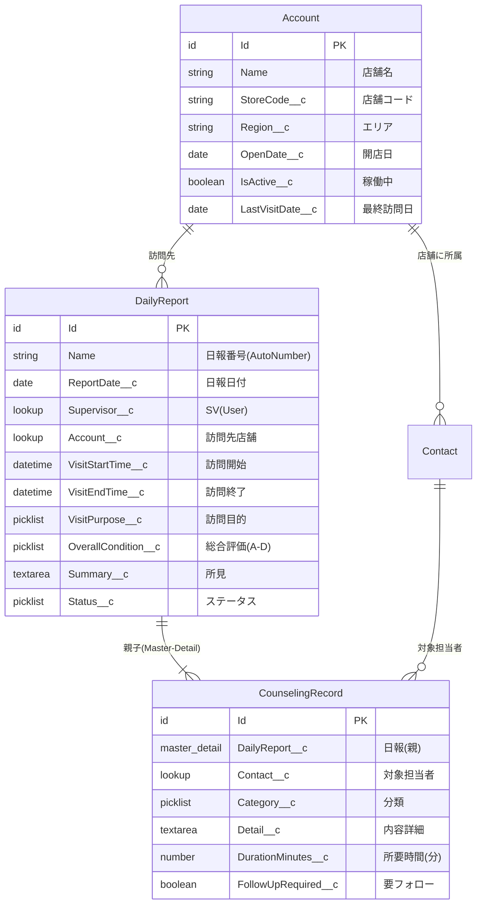
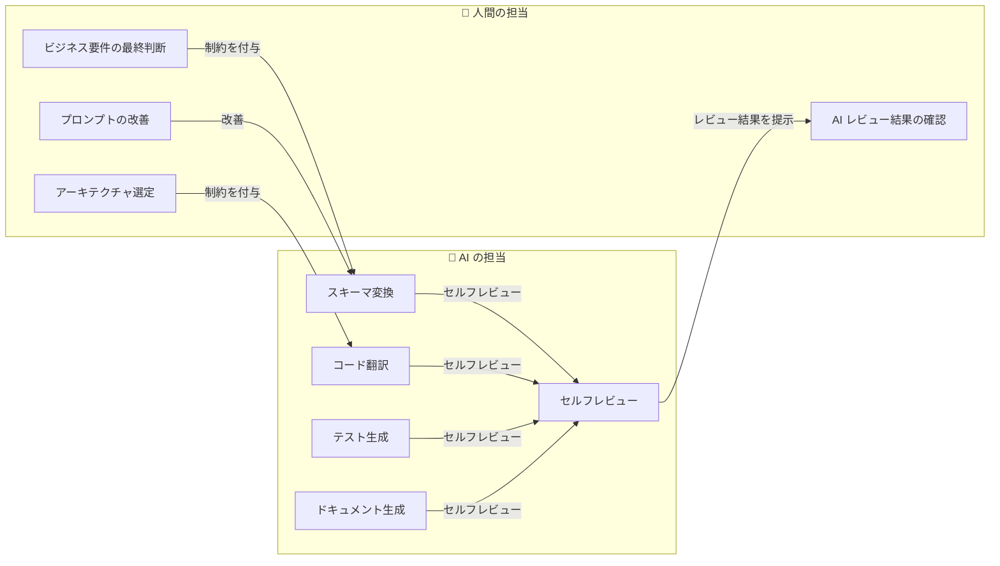
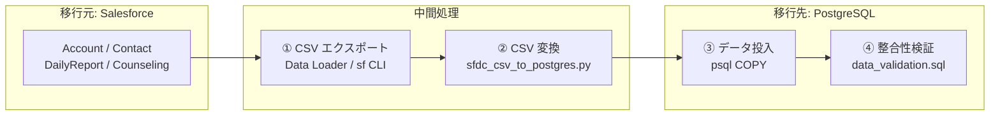
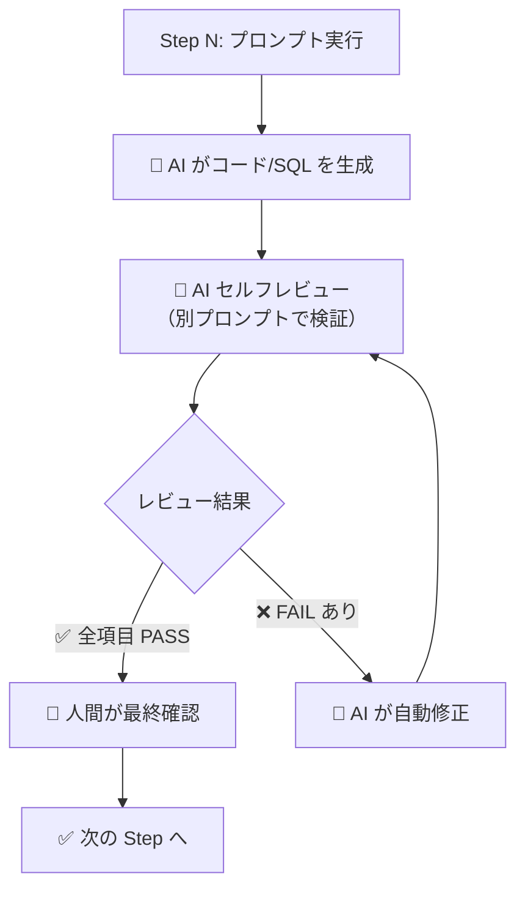

# 🚀 AI ネイティブ SFDC モダナイゼーション ハンズオン

> **1日で体験する「AI に書かせる移行」の全ステップ**
>
> 本ハンズオンでは、フランチャイズ店舗のスーパーバイザー (SV) が業務日報を管理する SFDC アプリをサンプルとし、**AI（Gemini / Antigravity）を最大限活用して**オープンな技術スタック（PostgreSQL + コンテナ化 REST API）へモダナイズするフローを step by step で体験します。

## 🛡️ AI ネイティブ移行における品質保証 (QA) アプローチ

<div><video controls src="./appendix/ai-native-qa-guide.mp4" muted="false"></video></div>

AI を活用したモダナイゼーションにおいて、最も重要なのは「生成されたコードの品質と等価性をいかに保証するか（AI への過信を防ぐか）」です。本ハンズオンでは、以下の手順で品質保証を実践に落とし込みます。

1. **データとクエリの即時検証 (Step 1)**: 生成された DDL と SQL を、本番同等のシードデータを用いてローカル DB（コンテナ）で即実行・検証し、移行前後での抽出結果の一致を保証します。
2. **振る舞いの等価性と TDD (Step 2, 3)**: レガシーコードからビジネス要件だけを抽出し、テストコードを先行して自動生成（TDD アプローチ）することで、新コードが元の仕様を満たしていることを機械的に立証します。
3. **継続的検証パイプライン (Step 4)**: 作成したテストコードと連携する CI パイプラインを定義し、ビルド・テスト・コンテナ化のフローを自動化することで属人的なミスを防ぎます。
4. **Docs as Code による証跡化 (Step 5)**: コードだけでなく、技術選定の理由 (ADR) やアーキテクチャ図も AI で自動生成・リポジトリ管理し、将来のメンテナンス性とトレーサビリティを確保します。

---

## 📋 タイムテーブル

| 時間 | Step | 内容 | AI の役割 |
|------|------|------|-----------| 
| 10:00 – 10:30 | **Step 0** | キックオフ：AI ネイティブ移行の合意形成 | — |
| 10:30 – 12:00 | **Step 1** | DB スキーマ変換（SFDC → PostgreSQL DDL） | 🤖 DDL 自動生成、SOQL→SQL 変換 |
| 12:00 – 13:00 | | 🍱 昼休み | |
| 13:00 – 13:30 | **Step 1.5** | データ移行（SFDC → PostgreSQL）＋ローカル検証環境構築 | 🤖 変換スクリプト / シードデータ |
| 13:30 – 14:30 | **Step 2** | コードリファクタリング（Apex → モダン API） | 🤖 クリーンアーキテクチャへの翻訳 |
| 14:30 – 15:30 | **Step 3** | テスト自動生成（品質保証のモダナイズ） | 🤖 テストコード生成 |
| 15:30 – 16:30 | **Step 4** | コンテナ化・CI パイプライン構築 | 🤖 Dockerfile / CI YAML 生成 |
| 16:30 – 17:00 | **Step 5** | Docs as Code & クロージング | 🤖 ADR / アーキテクチャ図の自動生成 |

---

## 📁 ディレクトリ構成

> [!IMPORTANT]
> **出力ルール**: 各 Step で AI が生成した成果物は、対応する Step ディレクトリの **`output/`** サブディレクトリに出力してください。これによりレビューや Git 管理が容易になります。

```
hands-on/
├── README.md                             ← 📖 本ドキュメント
├── 00-sfdc-reference/                       # ← 📚 SFDC 参考資料 & データ移行ツール
│   ├── SFDC_IMPLEMENTATION_GUIDE.md         # SFDC 実装解説（Apex/SOQL の読み方）
│   ├── DATA_MIGRATION_GUIDE.md              # データ移行ガイド（抽出→変換→投入→検証）
│   ├── seed_data.sql                        # ワークショップ用シードデータ
│   └── sfdc_csv_to_postgres.py              # SFDC CSV → PostgreSQL CSV 変換スクリプト
├── 01-schema-conversion/
│   ├── sfdc_daily_report_schema.json        # SFDC メタデータ（入力）
│   ├── soql_queries.soql                    # SOQL クエリ集（入力）
│   ├── output/                              # ← 🤖 AI 生成物の出力先
│   │   ├── .gitkeep
│   │   ├── generated_ddl.sql                # 生成された DDL
│   │   └── converted_queries.sql            # 変換された SQL
│   └── expected_output/
│       ├── ddl.sql                          # 期待出力（参考）
│       └── converted_queries.sql
├── 02-code-modernization/
│   ├── legacy_apex/
│   │   ├── DailyReportController.cls        # Apex REST コントローラー
│   │   ├── DailyReportTrigger.trigger       # Apex トリガー
│   │   └── MonthlyReportBatch.cls           # Batch Apex
│   └── output/                              # ← 🤖 AI 生成物の出力先
│       ├── .gitkeep
│       └── generated_go/                    # Go プロジェクト一式
│           ├── go.mod
│           ├── go.sum
│           ├── cmd/server/main.go
│           └── internal/...
├── 03-test-generation/                      # Step 3 で AI が生成
│   ├── .gitkeep
│   └── output/                              # ← 🤖 AI 生成物の出力先
│       ├── .gitkeep
│       ├── *_test.go                        # テストコード
│       └── data_validation.sql              # データ整合性検証 SQL
├── 04-containerization/
│   ├── output/                              # ← 🤖 AI 生成物の出力先
│   │   ├── .gitkeep
│   │   ├── Dockerfile
│   │   └── cloudbuild.yaml
│   └── expected_output/
│       ├── Dockerfile                       # 期待出力（参考）
│       └── cloudbuild.yaml
└── 05-documentation/                        # Step 5 で AI が生成
    ├── .gitkeep
    └── output/                              # ← 🤖 AI 生成物の出力先
        ├── .gitkeep
        ├── architecture_decision_records.md # ADR
        └── architecture_diagram.md          # アーキテクチャ図
```

> [!TIP]
> `expected_output/` は AI が理想的に生成した場合の参考出力です。`output/` にある実際の AI 出力と比較してレビューできます。

---

## 🎯 サンプルアプリの概要

### ビジネスコンテキスト

フランチャイズチェーンの **スーパーバイザー（SV）** が、担当店舗を定期的に巡回し、店舗スタッフへの **カウンセリング（業務改善指導・人材育成）** を実施した結果を **業務日報** として記録・管理するシステムです。

### SFDC オブジェクト構成



---

## Step 0: キックオフ — AI ネイティブ移行の合意形成（10:00 – 10:30）

### 最も重要なマインドセット転換

> 🧠 **「コードを人間が書き直す」のではなく、「AI に適切な制約とコンテキストを与え、生成させる」**

| 項目 | 従来アプローチ | AI ネイティブアプローチ |
|------|--------------|----------------------|
| **スキーマ変換** | 手動で型マッピング表を確認しながら DDL を記述 | SFDC メタデータ JSON + 変換ルールを AI に渡し DDL を一括生成 |
| **コード変換** | Apex を読み解き、ロジックを手動で Go/Python に書き直す | Apex ソース + アーキテクチャ制約を AI に渡しコードを生成 |
| **テスト作成** | ロジックを理解してからテストケースを手動設計 | 生成コードを AI に渡し「網羅的なテストを書け」と指示 |
| **ドキュメント** | 人間が一から Word/Confluence に記述 | 生成物を AI に渡し ADR / API 仕様を自動生成 |

### 役割分担



### 💬 議論ポイント

1. 御社の SFDC アプリのうち、**移行コスト対効果が高い**ものはどれか？
2. 移行先の言語は Go / Python / TypeScript のどれが社内スキルに合うか？
3. DB は PostgreSQL（Cloud SQL）で十分か、AlloyDB が必要か？

---

## Step 1: AI によるスキーマ変換（10:30 – 12:00）

### 1-1. SFDC メタデータの確認（10分）

まず、サンプルの SFDC スキーマ定義を確認します。

📂 **入力ファイル:** [`01-schema-conversion/sfdc_daily_report_schema.json`](./01-schema-conversion/sfdc_daily_report_schema.json)

このファイルには、業務日報システムの 4 オブジェクト（Account, Contact, DailyReport__c, CounselingRecord__c）の全フィールド定義が JSON 形式で格納されています。

```bash
# ファイルを確認
cat hands-on/01-schema-conversion/sfdc_daily_report_schema.json | python3 -m json.tool | head -50
```

### 1-2. 🤖 DDL 自動生成プロンプトの実行（30分）

以下のプロンプトを **Gemini**（または Antigravity / Claude）にコピー＆ペーストし、DDL を生成させます。

> [!IMPORTANT]
> **出力先**: `hands-on/01-schema-conversion/output/generated_ddl.sql`

#### プロンプト

````markdown
# 指示
あなたは Salesforce から PostgreSQL への移行スペシャリストです。
以下の SFDC オブジェクトメタデータ（JSON）を入力として受け取り、
PostgreSQL 用の DDL（CREATE TABLE 文）を生成してください。

# 変換ルール（厳守）
1. **テーブル名**: オブジェクト名を snake_case に変換。`__c` サフィックスは除去。
   - Account → accounts, DailyReport__c → daily_reports
2. **カラム名**: フィールド名を snake_case に変換。`__c` サフィックスは除去。
3. **データ型マッピング**:
   | SFDC 型 | PostgreSQL 型 |
   |---------|-----|
   | Id | VARCHAR(18) PRIMARY KEY |
   | Text | VARCHAR(length) |
   | LongTextArea | TEXT |
   | Checkbox | BOOLEAN |
   | Number | INTEGER または NUMERIC(precision, scale) |
   | Date | DATE |
   | DateTime | TIMESTAMPTZ |
   | Email | VARCHAR(254) |
   | Phone | VARCHAR(40) |
   | Picklist | VARCHAR(length) + CHECK 制約 |
   | AutoNumber | VARCHAR(20) NOT NULL |
4. **リレーション**:
   - Lookup → FOREIGN KEY ... ON DELETE SET NULL
   - MasterDetail → FOREIGN KEY ... ON DELETE CASCADE, NOT NULL
5. **必須フィールド**: required=true のフィールドに NOT NULL を付与
6. **全テーブルに追加**: created_at TIMESTAMPTZ DEFAULT CURRENT_TIMESTAMP, updated_at TIMESTAMPTZ DEFAULT CURRENT_TIMESTAMP
7. **インデックス**: 外部キー列、検索頻度の高い列（status, report_date 等）にインデックスを作成
8. **コメント**: 各テーブル・カラムの日本語ラベルを COMMENT ON で付与

# 出力形式
- 純粋な SQL のみ（説明は SQL コメントとして記述）
- テーブル間の依存関係を考慮した作成順序で出力
- **出力先ファイル**: `hands-on/01-schema-conversion/output/generated_ddl.sql`

# 入力データ（SFDC メタデータ）
```json
（ここに sfdc_daily_report_schema.json の内容を貼り付け）
```
````

#### 🤖 AI セルフレビュー

> [!TIP]
> シニアエンジニアのレビューが難しい場合は、**AI 自身にレビューさせましょう**。生成された DDL を以下のプロンプトで検証します。

```markdown
# 指示
あなたはデータベース設計のシニアレビュアーです。
以下の PostgreSQL DDL を厳格にレビューし、問題点を指摘してください。

# レビュー観点（全項目を必ずチェックすること）
1. **テーブル名・カラム名**: snake_case で `__c` が除去されているか
2. **データ型**: マッピング表のとおりか（特に `TIMESTAMPTZ`, `TEXT`）
3. **PRIMARY KEY**: 全テーブルに `VARCHAR(18) PRIMARY KEY` があるか
4. **FOREIGN KEY**: Lookup は `ON DELETE SET NULL`、MasterDetail は `ON DELETE CASCADE` か
5. **NOT NULL**: SFDC の必須フィールドに NOT NULL が付いているか
6. **CHECK 制約**: Picklist の値が制約に含まれているか
7. **インデックス**: 外部キー列にインデックスが作られているか
8. **COMMENT ON**: 日本語ラベルが付与されているか
9. **セキュリティ**: SQL インジェクションの懸念がないか
10. **パフォーマンス**: N+1 問題を引き起こす設計になっていないか

# 出力形式
各チェック項目について ✅ OK / ❌ NG を判定し、NG の場合は修正案を具体的に示せ。

# 入力（レビュー対象の DDL）
（ここに生成された DDL を貼り付け）
```

📂 **期待出力:** [`01-schema-conversion/expected_output/ddl.sql`](./01-schema-conversion/expected_output/ddl.sql)

### 1-3. 🤖 SOQL → SQL 変換の実践（30分）

次に、SOQL クエリを PostgreSQL の標準 SQL に変換します。

📂 **入力ファイル:** [`01-schema-conversion/soql_queries.soql`](./01-schema-conversion/soql_queries.soql)

> [!IMPORTANT]
> **出力先**: `hands-on/01-schema-conversion/output/converted_queries.sql`

#### プロンプト

```markdown
# 指示
以下の SOQL クエリを PostgreSQL 用の標準 SQL に変換してください。

# 変換ルール
1. **リレーション参照**（ドット記法）→ JOIN + ON 句
   - `Account__r.Name` → `JOIN accounts a ON dr.account_id = a.id` で `a.name`
   - `DailyReport__r.Account__r.Name` → 多段 JOIN
2. **日付リテラル**:
   - THIS_MONTH → `date_trunc('month', CURRENT_DATE)`
   - TODAY → `CURRENT_DATE`
   - LAST_N_DAYS:30 → `CURRENT_DATE - INTERVAL '30 days'`
3. **集計関数**: COUNT(Id) → COUNT(dr.id)
4. **テーブル名・カラム名**: 先ほど生成した DDL の命名規則に準拠
5. 各クエリに対して、**パフォーマンスに有効なインデックスも提案**してください

# 出力先ファイル
`hands-on/01-schema-conversion/output/converted_queries.sql`

# 入力（SOQL クエリ）
（ここに soql_queries.soql の内容を貼り付け）

# DDL（参考：テーブル定義）
（ここに先ほど生成した DDL を貼り付け）
```

#### 🔑 変換のキーポイント解説

| SOQL 構文 | PostgreSQL 変換 | 解説 |
|-----------|-----------------|------|
| `Account__r.Name` | `JOIN accounts a ON ... ; a.name` | SOQL のドット記法は暗黙 JOIN。SQL では明示的 JOIN が必要 |
| `THIS_MONTH` | `date_trunc('month', CURRENT_DATE)` | PostgreSQL の関数で月初日を取得 |
| `LAST_N_DAYS:30` | `CURRENT_DATE - INTERVAL '30 days'` | INTERVAL 型で日数計算 |
| サブクエリ（子レコード） | 別クエリ or JOIN | SOQL の親子クエリは SQL では JOIN か別クエリに分割 |

📂 **期待出力:** [`01-schema-conversion/expected_output/converted_queries.sql`](./01-schema-conversion/expected_output/converted_queries.sql)

### 1-4. ▶️ 生成した DDL & SQL の実行・検証（20分）

> [!IMPORTANT]
> AI が生成した DDL と SQL は、**必ずローカルの PostgreSQL で実行して正しく動くことを確認**してください。
> 「生成しただけ」で終わらせず、「動く」ことを証明するのがこのハンズオンの重要なポイントです。

#### 1. 検証用 DB の起動

まず、ローカルに PostgreSQL 環境を構築します。

```bash
# PostgreSQL をコンテナで起動
docker run -d \
  --name daily-report-db \
  -e POSTGRES_USER=app_user \
  -e POSTGRES_PASSWORD=password \
  -e POSTGRES_DB=daily_report \
  -p 5432:5432 \
  postgres:16

# DB の起動を数秒待機します
sleep 3
```

#### 2. DDL の適用と確認

```bash
# Step 1-2 で生成した DDL を適用
cat hands-on/01-schema-conversion/output/generated_ddl.sql | \
  docker exec -i daily-report-db psql -U app_user -d daily_report

# テーブルが作成されたか確認
docker exec -i daily-report-db psql -U app_user -d daily_report \
  -c "\dt"
# 期待結果:
#  Schema |        Name          | Type  |  Owner
# --------+---------------------+-------+----------
#  public | accounts            | table | app_user
#  public | contacts            | table | app_user
#  public | counseling_records  | table | app_user
#  public | daily_reports       | table | app_user
```

#### 3. シードデータの投入と確認

作成したテーブルに、テスト用のシードデータを直接流し込みます。

```bash
# シードデータを投入
cat hands-on/00-sfdc-reference/seed_data.sql | \
  docker exec -i daily-report-db psql -U app_user -d daily_report

# 投入状況の確認
docker exec -i daily-report-db psql -U app_user -d daily_report \
  -c "SELECT name, store_code, region FROM accounts;"
```

📂 **シードデータ:** [`00-sfdc-reference/seed_data.sql`](./00-sfdc-reference/seed_data.sql)
（7店舗・8担当者・6日報・8カウンセリング記録、全ステータス・全カテゴリ網羅）

#### 4. 変換後 SQL の実行（データ検証）

```bash
# 変換後 SQL（Q1: 関東エリアの提出済み日報）を実行
docker exec -i daily-report-db psql -U app_user -d daily_report \
  -c "SELECT dr.name, dr.report_date, a.name AS store, dr.status \
      FROM daily_reports dr JOIN accounts a ON dr.account_id = a.id \
      WHERE a.region = '関東' AND dr.status = '提出済' \
      ORDER BY dr.report_date DESC;"

# 変換後 SQL ファイルをまとめて実行（全5クエリ）
cat hands-on/01-schema-conversion/output/converted_queries.sql | \
  docker exec -i daily-report-db psql -U app_user -d daily_report
```

#### 期待出力との差分比較

```bash
# DDL の差分確認
diff hands-on/01-schema-conversion/output/generated_ddl.sql \
     hands-on/01-schema-conversion/expected_output/ddl.sql

# SQL の差分確認
diff hands-on/01-schema-conversion/output/converted_queries.sql \
     hands-on/01-schema-conversion/expected_output/converted_queries.sql
```

> [!TIP]
> 差分があること自体は問題ありません。AI の出力バリエーションとして議論のネタにしましょう。
> 重要なのは「**クエリが正しく実行でき、期待通りの結果を返すか**」です。

### 💬 議論ポイント

- Picklist の値を CHECK 制約で管理するか、別テーブル（マスター）にするか？
- `supervisor_id` / `approved_by` は SFDC の User に対応するが、どう管理するか？

---

## Step 1.5: 本番データ移行戦略の策定（13:00 – 13:30）

> [!NOTE]
> スキーマ（器）を作っただけでは移行は完了しません。
> **既存の SFDC 上のデータ（中身）をどう PostgreSQL に持ってくるか** を策定します。（ここはワークショップでは解説・議論のみとなります）

### 1.5-1. データ移行の全体フロー（15分）



📂 **詳細ガイド:** [`00-sfdc-reference/DATA_MIGRATION_GUIDE.md`](./00-sfdc-reference/DATA_MIGRATION_GUIDE.md)

### 1.5-2. 本番データ移行の具体的な手順（10分・解説）

実際の本番移行では、以下の手順でデータを移行します：

| Step | 手順 | ツール |
|------|------|--------|
| ① | SFDC から CSV エクスポート | Data Loader / sf CLI / Bulk API 2.0 |
| ② | CSV のカラム名・型を変換 | [`sfdc_csv_to_postgres.py`](./00-sfdc-reference/sfdc_csv_to_postgres.py) |
| ③ | PostgreSQL にデータ投入 | `psql \copy` / `gcloud sql import csv` |
| ④ | データ整合性を検証 | `data_validation.sql`（Step 3 で生成） |

```bash
# 本番移行の例（CSV 変換スクリプトの使い方）
python3 hands-on/00-sfdc-reference/sfdc_csv_to_postgres.py \
  accounts sfdc_export/Account.csv pg_import/accounts.csv
# → ✅ accounts: 150 records converted
```

> [!WARNING]
> 本番移行時の注意点:
> - SFDC ID の **15桁 / 18桁** 問題（Data Loader は 18桁出力で問題なし）
> - DateTime の **タイムゾーン** 変換（SFDC UTC → PostgreSQL `TIMESTAMPTZ`）
> - **差分移行**: 移行期間中の更新分を追加反映する手順が必要
> - **User ID マッピング**: SFDC `User.Id` → 移行先の認証基盤との紐付け

### 💬 議論ポイント

- データ移行のカットオーバー戦略（ビッグバン vs 段階移行）
- 差分移行の期間と頻度
- SFDC の添付ファイル（ContentDocument）の移行は必要か？

---

## Step 2: AI 駆動コードリファクタリング（13:30 – 14:30）

### 2-1. レガシー Apex コードの確認（10分）

変換対象の Apex コードを確認します。**3 つのパターン全て**を変換します。

| # | ファイル | Apex パターン | 変換先 |
|---|---------|--------------|--------|
| 1 | `DailyReportController.cls` | REST API（CRUD） | ステートレス REST API |
| 2 | `DailyReportTrigger.trigger` | レコード更新トリガー | Pub/Sub + イベント駆動ワーカー |
| 3 | `MonthlyReportBatch.cls` | バッチ集計処理 | Cloud Run Jobs + Cloud Scheduler |

📂 **入力ファイル:** [`02-code-modernization/legacy_apex/`](./02-code-modernization/legacy_apex/)

### 2-2. 🤖 Apex → モダン REST API への変換（40分）

最も重要な変換パターンです。単なる言語翻訳ではなく、**クリーンアーキテクチャへの構造的変換**を AI に指示します。

> [!IMPORTANT]
> **出力先**: `hands-on/02-code-modernization/output/generated_go/` 配下に Go プロジェクトとして出力

#### プロンプト（DailyReportController.cls の変換）

````markdown
# 指示
以下の Salesforce Apex REST コントローラーを、
**Go 言語のクリーンアーキテクチャ構成の REST API** に変換してください。

# アーキテクチャ要件（厳守）
1. **レイヤー分離**（3層）:
   - `handler/` — HTTP リクエスト/レスポンスの処理（net/http）
   - `usecase/` — ビジネスロジック（純粋な Go、外部依存なし）
   - `repository/` — データアクセス層（database/sql + PostgreSQL ドライバ）
2. **依存性注入 (DI)**:
   - usecase は repository のインターフェースに依存する（具象に依存しない）
   - handler は usecase のインターフェースに依存する
3. **エラーハンドリング**:
   - 構造化エラーレスポンス（JSON: `{"error": "message", "code": "ERROR_CODE"}`）
   - HTTP ステータスコードを適切に使い分け
4. **環境変数**:
   - DB接続情報は `os.Getenv()` で注入
5. **ロギング**: `log/slog` を使用した構造化ログ
6. **トランザクション管理**: 日報＋カウンセリング記録の作成は `sql.Tx` でアトミックに
7. **入力検証**: リクエストボディのバリデーション

# プロジェクト初期化要件（厳守）
> [!CAUTION]
> 以下を必ず含めること。これが欠けるとビルドが通りません。

8. **`go.mod` の生成**: `module daily-report-api` で初期化し、Go 1.24 を指定
9. **依存パッケージの明示**: `go.mod` に以下を含めること
   - `github.com/lib/pq` (PostgreSQL ドライバ)
   - `github.com/google/uuid` (UUID 生成)
10. **`go.sum` の生成**: `go mod tidy` で生成される内容を含めること
11. **ビルド確認コマンド**: 出力の末尾に以下のコマンドを記載
    ```bash
    cd hands-on/02-code-modernization/output/generated_go
    go mod tidy
    go build ./...
    ```

# 出力形式
以下のファイルに分割して `hands-on/02-code-modernization/output/generated_go/` に出力:
- `go.mod` — モジュール定義（**必須**）
- `cmd/server/main.go` — エントリーポイント
- `internal/handler/daily_report.go` — HTTP ハンドラー
- `internal/usecase/daily_report.go` — ビジネスロジック
- `internal/repository/daily_report.go` — DB アクセス
- `internal/model/daily_report.go` — 構造体定義

# 入力（Apex ソースコード）
```apex
（ここに DailyReportController.cls の内容を貼り付け）
```

# 参考（PostgreSQL テーブル定義）
```sql
（ここに先ほど生成した DDL を貼り付け）
```
````

### 2-3. 🤖 Apex Trigger → イベント駆動パターンへの変換（15分）

> [!IMPORTANT]
> **出力先**: `hands-on/02-code-modernization/output/generated_go/internal/event/` および `internal/worker/`

#### プロンプト（DailyReportTrigger の変換）

```markdown
# 指示
以下の Salesforce Apex Trigger を、**イベント駆動アーキテクチャ**のワーカーに変換してください。

# 設計要件
1. **イベント発行側**: 日報のステータスが「提出済」に変更されたとき、
   イベント（JSON）を発行する関数を作成
2. **ワーカー側**: そのイベントを受信し、以下の処理を行う関数を作成:
   - 店舗の最終訪問日を更新
   - フォローアップが必要なカウンセリング記録に対してタスク（TODO）を作成
3. **冪等性**: 同じイベントが2回来ても問題ない設計にする
4. **言語**: Go (net/http)
5. **メッセージ形式**: JSON（イベントの型定義を含む）
6. 将来 Pub/Sub に繋ぐことを念頭に、メッセージ受信部分はインターフェースで抽象化する

# 出力先
`hands-on/02-code-modernization/output/generated_go/internal/event/` と
`hands-on/02-code-modernization/output/generated_go/internal/worker/` に出力

# 入力（Apex トリガーのソースコード）
（ここに DailyReportTrigger.trigger の内容を貼り付け）
```

### 2-4. 🤖 Batch Apex → Cloud Run Jobs への変換（15分）

> [!IMPORTANT]
> **出力先**: `hands-on/02-code-modernization/output/generated_go/cmd/batch/`

#### プロンプト（MonthlyReportBatch.cls の変換）

````markdown
# 指示
以下の Salesforce Batch Apex（月次集計バッチ）を、
**Cloud Run Jobs で実行する Go のバッチプログラム**に変換してください。

# 設計要件
1. **エントリーポイント**: `cmd/batch/main.go` として独立した main パッケージ
2. **Batchable パターンの変換**:
   - `start()` (QueryLocator) → PostgreSQL カーソルベースのページネーション
   - `execute()` (バッチ処理) → goroutine による並列処理（`sync.WaitGroup`）
   - `finish()` (後処理) → 集計結果の DB 書き込み + ログ出力
3. **DB 接続**: `internal/repository/` の既存コードを再利用
4. **環境変数**:
   - `BATCH_SIZE`: 1バッチあたりの処理件数（デフォルト: 200）
   - `TARGET_MONTH`: 集計対象月（`YYYY-MM` 形式、デフォルト: 前月）
5. **エラーハンドリング**: 部分失敗時は失敗行をログに記録し、残りを継続処理
6. **Cloud Scheduler との連携**: 月次実行 `0 2 1 * *`（毎月1日 AM2:00）を想定

# 出力先
`hands-on/02-code-modernization/output/generated_go/cmd/batch/main.go`

# 入力（Apex Batch ソースコード）
```apex
（ここに MonthlyReportBatch.cls の内容を貼り付け）
```
````

### 2-5. 🤖 AI セルフレビュー（生成コード検証）

生成されたコードを AI 自身にレビューさせます。

````markdown
# 指示
あなたは Go 言語のシニアアーキテクトです。
以下の生成コードを厳格にレビューし、問題点と改善案を指摘してください。

# レビュー観点（全項目を必ずチェック）
1. ✅ レイヤー分離: handler/usecase/repository が正しく分離されているか
2. ✅ DI: インターフェースで依存注入されているか（具象に依存していないか）
3. ✅ トランザクション: `sql.Tx` で日報+カウンセリング記録がアトミック管理されているか
4. ✅ 環境変数: `os.Getenv()` で DB 接続情報が注入されているか
5. ✅ 構造化ログ: `slog` が使用されているか
6. ✅ エラーハンドリング: JSON 構造化エラーレスポンスになっているか
7. ✅ SFDC 依存排除: `UserInfo.getUserId()` 等の SFDC 固有コードがないか
8. ✅ go.mod: モジュール名・Go バージョン・依存パッケージが正しいか
9. ✅ ビルド可能: `go build ./...` が通る構成になっているか
10. ✅ Batch 変換: MonthlyReportBatch のロジックが cmd/batch/ に変換されているか

# 自動検証コマンド（可能であれば実行）
```bash
cd hands-on/02-code-modernization/output/generated_go
go mod tidy
go vet ./...
go build ./...
```

# 出力形式
各チェック項目について ✅ PASS / ❌ FAIL を判定。
FAIL の場合は修正コードを具体的に提示すること。

# 入力（レビュー対象のコード）
（ここに生成された Go コードを全ファイル貼り付け）
````

### 2-6. ▶️ 生成した Go コードのビルド・実行・API テスト（20分）

> [!IMPORTANT]
> AI が生成したコードは、**必ずローカルでビルド・起動・API テスト**まで行ってください。
> ビルドが通らない場合は AI にエラーメッセージを渡して修正させます。

#### ビルド確認

```bash
cd hands-on/02-code-modernization/output/generated_go

# 依存解決
go mod tidy

# 静的解析
go vet ./...

# ビルド（全パッケージ）
go build ./...

# 期待結果: エラーなし（何も出力されなければ成功）
```

> [!WARNING]
> `go mod tidy` でエラーになる場合、`go.mod` に不足パッケージがあります。
> エラーメッセージを AI に渡して修正させてください。

#### API サーバーの起動

```bash
# 環境変数を設定して API サーバーを起動
export DB_HOST=localhost
export DB_PORT=5432
export DB_USER=app_user
export DB_PASSWORD=password
export DB_NAME=daily_report

go run cmd/server/main.go
# 期待結果: "Server started on :8080" のようなログが出力される
```

#### API テスト（別ターミナルで実行）

```bash
# --- GET: 日報一覧の取得 ---
curl -s http://localhost:8080/api/daily-reports | python3 -m json.tool
# 期待結果: JSON 配列（シードデータの日報6件）

# --- GET: ステータスフィルタ付き ---
curl -s "http://localhost:8080/api/daily-reports?status=承認済" | python3 -m json.tool
# 期待結果: status=承認済 の日報のみ返る

# --- POST: 日報の新規作成 ---
curl -s -X POST http://localhost:8080/api/daily-reports \
  -H "Content-Type: application/json" \
  -d '{
    "reportDate": "2026-04-02",
    "supervisorId": "SV001",
    "accountId": "ACC001",
    "visitStartTime": "2026-04-02T09:00:00+09:00",
    "visitEndTime": "2026-04-02T12:00:00+09:00",
    "visitPurpose": "定期巡回",
    "overallCondition": "A",
    "summary": "AI ハンズオンから作成したテスト日報",
    "counselingRecords": [
      {
        "contactId": "CON001",
        "category": "業務改善",
        "detail": "API 経由でカウンセリング記録を作成",
        "durationMinutes": 30,
        "followUpRequired": true,
        "followUpDate": "2026-04-09"
      }
    ]
  }' | python3 -m json.tool
# 期待結果: 作成された日報の JSON が返る（status=下書き）

# --- PATCH: ステータス更新（下書き → 提出済） ---
# ※ 上の POST で返った ID を使う
curl -s -X PATCH http://localhost:8080/api/daily-reports/{ID} \
  -H "Content-Type: application/json" \
  -d '{"status": "提出済"}' | python3 -m json.tool
# 期待結果: status が "提出済" に変更された JSON

# --- PATCH: 不正なステータス遷移（承認済 → 下書き）---
curl -s -X PATCH http://localhost:8080/api/daily-reports/{ID} \
  -H "Content-Type: application/json" \
  -d '{"status": "下書き"}'
# 期待結果: 400 エラー（ステータス遷移ルール違反）

# --- DELETE: 下書き以外の日報を削除 ---
curl -s -X DELETE http://localhost:8080/api/daily-reports/{ID}
# 期待結果: 400 エラー（下書き以外は削除不可）
```

#### Apex の機能等価性チェックリスト

| # | Apex の動作 | Go API テスト | 結果 |
|---|-----------|--------------|------|
| 1 | `@HttpGet` フィルタ付き一覧 | `GET /api/daily-reports?status=承認済` | ☐ |
| 2 | `@HttpPost` 日報+子レコード一括作成 | `POST /api/daily-reports` | ☐ |
| 3 | `@HttpPatch` ステータス遷移バリデーション | `PATCH ...` 下書き→提出済 | ☐ |
| 4 | `@HttpPatch` 不正遷移の拒否 | `PATCH ...` 承認済→下書き → 400 | ☐ |
| 5 | `@HttpDelete` 下書きのみ削除可能 | `DELETE ...` 提出済 → 400 | ☐ |
| 6 | CASCADE 削除 | 日報削除時に counseling_records も消える | ☐ |

### 💬 議論ポイント

- Apex の暗黙的な DML ガバナー制限 vs Go の明示的なトランザクション管理
- Trigger → Pub/Sub 変換時の**イベントスキーマ設計**
- Batch Apex → Cloud Run Jobs にした場合の**スケジューリング**（Cloud Scheduler）

---

## Step 3: AI によるテスト自動生成（14:30 – 15:30）

### 3-1. 🤖 単体テストの自動生成（30分）

Step 2 で生成したコードを AI に渡し、テストコードを生成させます。

> [!IMPORTANT]
> **出力先**: テストファイルは **ソースモジュール内の各パッケージに `*_test.go` として配置** します。
> 別モジュールに出力するとカバレッジ計測が機能しないため、テスト対象と同一パッケージに置きます。
>
> ```
> hands-on/02-code-modernization/output/generated_go/internal/
> ├── config/env_test.go
> ├── model/daily_report_test.go
> ├── usecase/daily_report_test.go
> ├── handler/daily_report_test.go
> ├── event/publisher_test.go
> ├── repository/daily_report_test.go  ← go-sqlmock で DB モック
> └── worker/daily_report_worker_test.go ← go-sqlmock で DB モック
> ```

#### プロンプト

```markdown
# 指示
以下の Go コード（**全パッケージ**: model / usecase / handler / config / event / repository / worker）に対する
**網羅的な単体テスト**を生成してください。
テストファイルはソースと同一パッケージ内に `*_test.go` として配置してください。

# テスト要件（厳守）
1. **テスト形式**: Table-Driven Tests（Go の標準的なテーブル駆動テスト）
2. **モック戦略**:
   - usecase テスト → `repository.DailyReportRepository` インターフェースをモック化
   - handler テスト → `usecase.DailyReportUseCase` インターフェースをモック化
   - event テスト → `event.Publisher` インターフェースをモック化
   - repository テスト → `go-sqlmock` で `*sql.DB` をモック化
   - worker テスト → `go-sqlmock` で `*sql.DB` をモック化
3. **カバーすべきケース**:
   - ✅ 正常系（CRUD 各操作の成功パターン）
   - ❌ バリデーションエラー（必須項目の欠損、不正な Picklist 値）
   - 💥 DB エラー時のハンドリング（接続エラー、制約違反）
   - 🔒 ステータス遷移の制約（「下書き」→「提出済」のみ許可 等）
   - 📏 境界値テスト（DurationMinutes が 0 や負の場合）
   - 🔧 config テスト（環境変数の有無、デフォルト値、`GetEnvInt` の不正値）
   - 📡 event テスト（InMemoryPublisher の Publish / Subscribe、ハンドラーエラー時の継続動作、`PublishReportSubmitted` のイベント構築）
   - 🗄️ repository テスト（ListReports / GetReportByID / CreateReportWithCounselings / UpdateReportStatus / DeleteReport）
   - ⚙️ worker テスト（HandleReportSubmitted のイベント処理、トランザクション内の UPDATE / SELECT / INSERT）
4. **handler テスト**: `httptest.NewRecorder` を使い、HTTP ステータスコードとレスポンスボディを検証
5. **テスト命名**: `Test<関数名>_<シナリオ>` 形式
6. **テストが通ること**: `go test -v -race -cover ./internal/...` でパスすること

# 出力先
各テストファイルをソースと同一パッケージ内に配置:
- `internal/model/daily_report_test.go` — モデルバリデーション・構造体テスト
- `internal/usecase/daily_report_test.go` — ユースケーステスト（mockRepo 使用）
- `internal/handler/daily_report_test.go` — HTTP ハンドラーテスト（mockUseCase 使用）
- `internal/config/env_test.go` — 環境変数ヘルパー / DSN 構築テスト
- `internal/event/publisher_test.go` — InMemoryPublisher / イベント発行テスト
- `internal/repository/daily_report_test.go` — DB 操作テスト（go-sqlmock 使用）
- `internal/worker/daily_report_worker_test.go` — イベントワーカーテスト（go-sqlmock 使用）

# 入力（テスト対象のコード）
（ここに Step 2 で生成した全パッケージのコードを貼り付け）
```

#### 🤖 AI セルフレビュー（テスト品質チェック）

````markdown
# 指示
以下の Go テストコードをレビューし、品質を評価してください。

# 検証項目
1. テーブル駆動テストの構造が正しいか（`tests` スライス + `t.Run`）
2. モックが正しく DI されているか
3. 正常系・異常系の両方がカバーされているか
4. HTTP ステータスコードが適切に検証されているか
5. テストが冪等で他テストに依存していないか

# 自動検証コマンド
```bash
go test -v -race -count=1 ./internal/...
go test -cover ./internal/...
```

# 入力（テストコード）
（ここにテストコードを貼り付け）
````

### 3-2. 🤖 データ整合性検証 SQL の生成（15分）

将来のデータ移行に備え、SFDC と PostgreSQL 間のデータ整合性を検証する SQL を生成させます。

> [!IMPORTANT]
> **出力先**: `hands-on/03-test-generation/output/data_validation.sql`

#### プロンプト

```markdown
# 指示
SFDC から PostgreSQL へデータ移行した後の整合性検証用 SQL を生成してください。

# 対象テーブル
accounts, contacts, daily_reports, counseling_records

# 検証項目
1. **レコード件数チェック**: 各テーブルの総件数（SFDC 側と突合用）
2. **孤立レコードチェック**: 外部キー先が存在しないレコードの検出
3. **NULL チェック**: NOT NULL 制約のカラムに NULL が存在しないか
4. **Picklist 値チェック**: CHECK 制約外の値が存在しないか
5. **カウンセリング記録の整合性**: 日報に紐づくカウンセリング記録件数の検証

# 出力先
`hands-on/03-test-generation/output/data_validation.sql`
```

### 3-3. ▶️ テストの実行・カバレッジ確認（15分）

> [!IMPORTANT]
> テストコードも「生成して終わり」ではありません。**必ず実行して全テストがパスすることを確認**してください。

#### 単体テストの実行

```bash
cd hands-on/02-code-modernization/output/generated_go

# 依存解決（go-sqlmock 等が追加されている場合）
go mod tidy

# 全テスト実行（レースコンディション検出付き）
go test -v -race -count=1 ./internal/...
# 期待結果: 全テストが PASS
#   --- PASS: TestValidateDailyReport_ValidInput (0.00s)
#   --- PASS: TestCreateReport_Success (0.00s)
#   --- PASS: TestHandleListReports_Success (0.00s)
#   ...
#   PASS
```

#### カバレッジ計測

```bash
# カバレッジ率の確認
go test -cover ./internal/...
# 期待結果:
#   ok   daily-report-api/internal/model      0.005s  coverage: 85.0% of statements
#   ok   daily-report-api/internal/usecase     0.008s  coverage: 78.0% of statements
#   ok   daily-report-api/internal/handler     0.012s  coverage: 72.0% of statements

# HTML カバレッジレポートの生成
go test -coverprofile=coverage.out ./internal/...
go tool cover -html=coverage.out -o coverage.html
open coverage.html  # ブラウザでカバレッジを視覚的に確認
```

> [!TIP]
> テストが失敗した場合は、エラーメッセージを AI に渡して修正させましょう。
> 「このテストが失敗しました。以下のエラーを見て修正してください」と伝えるだけで OK です。

#### データ整合性検証 SQL の実行

```bash
# Step 1.5 で投入したシードデータに対して検証 SQL を実行
cat hands-on/03-test-generation/output/data_validation.sql | \
  docker exec -i daily-report-db psql -U app_user -d daily_report
# 期待結果:
#   -- レコード件数チェック
#    table_name   | count
#   --------------+-------
#    accounts     |     7
#    contacts     |     8
#    daily_reports|     6
#    counseling_records | 8
#
#   -- 孤立レコードチェック
#    relation              | orphan_count
#   -----------------------+-------------
#    contacts→accounts    |            0
#    daily_reports→accounts|            0
#    ...
```

### 💬 議論ポイント

- テストカバレッジの目標値は何%にするか？
- 結合テスト（DB を使うテスト）は Testcontainers で実施するか？

---

## Step 4: AI によるコンテナ化・CI パイプライン構築（15:30 – 16:30）

### 4-1. 🤖 セキュアな Dockerfile の生成（20分）

> [!IMPORTANT]
> **出力先**: `hands-on/04-containerization/output/Dockerfile`

#### プロンプト

```markdown
# 指示
以下の Go アプリケーション用の **セキュアな Dockerfile** を生成してください。

# セキュリティ要件（厳守）
1. **マルチステージビルド**: ビルドステージと実行ステージを分離
2. **非 root 実行**: distroless または nonroot ユーザーで実行
3. **最小イメージ**: 実行ステージは `gcr.io/distroless/static-debian12:nonroot` を使用
4. **バイナリ最適化**: `CGO_ENABLED=0` + `-ldflags="-s -w"` でサイズ最小化
5. **ポート**: 8080 を EXPOSE

# アプリ構成
- Go 1.24
- エントリーポイント: cmd/server/main.go
- go.mod / go.sum あり

# 出力先
`hands-on/04-containerization/output/Dockerfile`
```

📂 **期待出力:** [`04-containerization/expected_output/Dockerfile`](./04-containerization/expected_output/Dockerfile)

#### 🤖 AI セルフレビュー（Dockerfile チェック）

```markdown
# 指示
以下の Dockerfile をセキュリティとベストプラクティスの観点でレビューしてください。

# チェック項目
1. マルチステージビルドか
2. `USER nonroot` が設定されているか
3. `CGO_ENABLED=0` か
4. `go mod download` が COPY . より前か（キャッシュ最適化）
5. 不要なツールやファイルが最終イメージに含まれていないか
6. HEALTHCHECK が定義されているか（推奨）

# 入力（Dockerfile）
（ここに Dockerfile を貼り付け）
```

### 4-2. 🤖 CI/CD パイプラインの生成（30分）

> [!IMPORTANT]
> **出力先**: `hands-on/04-containerization/output/cloudbuild.yaml`

#### プロンプト

```markdown
# 指示
以下の Go アプリケーション用の **Cloud Build CI/CD パイプライン**（cloudbuild.yaml）を生成してください。

# パイプラインのステップ
1. **unit-test**: `go test -v -race ./...` でテスト実行
2. **docker-build**: Docker イメージをビルド（Artifact Registry 向けタグ付き）
3. **docker-push**: Artifact Registry にイメージを Push
4. **deploy**: Cloud Run にデプロイ
   - Cloud SQL 接続(--add-cloudsql-instances)
   - 環境変数で DB 接続情報を注入
   - Secret Manager で DB パスワードを管理

# 要件
- リージョンは asia-northeast1
- substitutions を使ってパラメータを外出しする
- service account を明示的に指定する

# 出力先
`hands-on/04-containerization/output/cloudbuild.yaml`
```

📂 **期待出力:** [`04-containerization/expected_output/cloudbuild.yaml`](./04-containerization/expected_output/cloudbuild.yaml)

### 4-3. ▶️ Docker イメージのビルド・起動・動作確認（20分）

> [!IMPORTANT]
> Dockerfile も「生成して終わり」ではありません。**ローカルでイメージをビルドし、コンテナとして起動して API が動くことを確認**してください。

#### Docker イメージのビルド

```bash
cd hands-on/02-code-modernization/output/generated_go

# 生成された Dockerfile をコピー（または同じディレクトリに配置）
cp ../../../04-containerization/output/Dockerfile .
# ※ パスは output 構成に合わせて調整してください

# イメージをビルド
docker build -t daily-report-api:latest .
# 期待結果:
#   => [build 1/6] FROM golang:1.24 ...
#   => [build 6/6] RUN go build ...
#   => [runtime 1/3] FROM gcr.io/distroless/static-debian12:nonroot
#   => DONE

# イメージサイズの確認（distroless なので小さいはず）
docker images daily-report-api
# 期待結果: SIZE が 15-25MB 程度
```

#### コンテナの起動と API テスト

```bash
# DB と API を同じ名前解決で繋ぐため、カスタムネットワークを作成し DB を所属させます（Podman 互換）
docker network create report-net || true
docker network connect report-net daily-report-db || true

# コンテナとして起動（PostgreSQL と同じネットワーク上で）
docker run -d \
  --name daily-report-api \
  --network report-net \
  -e DB_HOST=daily-report-db \
  -e DB_PORT=5432 \
  -e DB_USER=app_user \
  -e DB_PASSWORD=password \
  -e DB_NAME=daily_report \
  -p 8080:8080 \
  daily-report-api:latest

# ログを確認（起動成功を確認）
docker logs -f daily-report-api
# 期待結果: "database connected" と "server starting port=8080" が表示されれば成功です。(Ctrl+Cで抜ける)

# API テスト
curl -s http://localhost:8080/api/daily-reports | python3 -m json.tool
# 期待結果: JSON 配列が返る（Step 2-6 と同じ）

# ヘルスチェック（定義されている場合）
curl -s http://localhost:8080/health
# 期待結果: 200 OK
```

#### セキュリティチェック

```bash
# コンテナ内のユーザーを確認（nonroot であること）
docker exec daily-report-api whoami 2>/dev/null || echo "distroless: shell なし（正常）"

# 不要なツールが入っていないことを確認
docker exec daily-report-api ls 2>/dev/null || echo "distroless: ls なし（正常）"
```

#### クリーンアップ

```bash
# テスト完了後にコンテナを停止・削除
docker stop daily-report-api && docker rm daily-report-api
```

#### cloudbuild.yaml の構文チェック

```bash
# YAML の構文検証（Python の yaml モジュールで）
python3 -c "
import yaml, sys
with open('hands-on/04-containerization/output/cloudbuild.yaml') as f:
    data = yaml.safe_load(f)
    print(f'✅ 構文OK: {len(data.get(\"steps\", []))} steps defined')
    for i, step in enumerate(data.get('steps', [])):
        print(f'  Step {i+1}: {step.get(\"id\", step.get(\"name\", \"unnamed\"))}')
"
# 期待結果:
#   ✅ 構文OK: 4 steps defined
#   Step 1: unit-test
#   Step 2: docker-build
#   Step 3: docker-push
#   Step 4: deploy

# 期待出力との差分
diff hands-on/04-containerization/output/cloudbuild.yaml \
     hands-on/04-containerization/expected_output/cloudbuild.yaml
```

### 💬 議論ポイント

- ブランチ戦略（main / develop / feature）とデプロイ先の対応
- Cloud Run のオートスケーリング設定（最小/最大インスタンス数）
- Secret Manager での DB パスワード管理

---

## Step 5: Docs as Code & クロージング（16:30 – 17:00）

### 5-1. 🤖 ADR（Architecture Decision Record）の自動生成（10分）

本日の議論と生成物を AI に渡し、意思決定を文書化させます。

> [!IMPORTANT]
> **出力先**: `hands-on/05-documentation/output/architecture_decision_records.md`

#### プロンプト

````markdown
# 指示
本日のワークショップで決定したアーキテクチャ方針について、
ADR（Architecture Decision Record）を生成してください。

# ADR フォーマット
## ADR-001: [タイトル]
- **ステータス**: 承認済
- **コンテキスト**: なぜこの決定が必要だったか
- **決定**: 何を決定したか
- **理由**: なぜその選択肢を採用したか（代替案との比較）
- **結果**: この決定による影響・トレードオフ

# 本日決定した事項
1. DB: PostgreSQL (Cloud SQL) を採用
2. 言語: Go を採用
3. アーキテクチャ: クリーンアーキテクチャ（handler/usecase/repository の3層）
4. コンテナ基盤: Cloud Run を採用
5. CI/CD: Cloud Build を採用
6. Trigger の移行: Pub/Sub + Cloud Run ワーカーへ
7. Batch の移行: Cloud Run Jobs + Cloud Scheduler へ

（各項目について理由と代替案を含めて生成してください）

# Mermaid 図の生成（必須）
ADR の末尾に以下の Mermaid 図を必ず含めてください:

## 図1: アーキテクチャ全体図
全コンポーネント（Cloud Run, Cloud SQL, Pub/Sub, Cloud Scheduler, Artifact Registry, Cloud Build）
の関係を `graph TD` で可視化。

## 図2: CI/CD パイプラインフロー
Cloud Build のステップ（test → build → push → deploy）を `graph LR` で可視化。

## 図3: SFDC → Google Cloud マッピング図
移行元（Apex Controller, Trigger, Batch, SOQL, Custom Object）と
移行先（Cloud Run Service, Pub/Sub Worker, Cloud Run Jobs, SQL, PostgreSQL）の
対応関係を `graph LR` で可視化。

## 図4: ステータス遷移図
日報のステータス遷移（下書き → 提出済 → 承認済 / 差戻し）を
`stateDiagram-v2` で可視化。

# 出力先
`hands-on/05-documentation/output/architecture_decision_records.md`
````

### 5-2. ▶️ 生成した ADR の検証・全 Step 成果物の最終確認（10分）

> [!IMPORTANT]
> ドキュメントも「生成して終わり」ではありません。**Mermaid 図が正しくレンダリングされるか、ADR の内容が本日の議論と一致しているか** を確認してください。

#### ADR の内容チェック

```bash
# ADR が生成されたか確認
cat hands-on/05-documentation/output/architecture_decision_records.md | head -50

# ADR に必須セクションが含まれているか確認
echo "=== ADR セクションチェック ==="
for section in "ADR-001" "ADR-002" "ADR-003" "ステータス" "コンテキスト" "決定" "理由" "結果"; do
  if grep -q "$section" hands-on/05-documentation/output/architecture_decision_records.md; then
    echo "  ✅ $section: 存在"
  else
    echo "  ❌ $section: 欠落"
  fi
done
```

#### Mermaid 図のチェック

```bash
# Mermaid 図が含まれているか確認
echo "=== Mermaid 図チェック ==="
mermaid_count=$(grep -c '```mermaid' hands-on/05-documentation/output/architecture_decision_records.md || true)
echo "  Mermaid 図の数: ${mermaid_count}（期待: 4つ以上）"

# 各図のタイプを確認
grep -A1 '```mermaid' hands-on/05-documentation/output/architecture_decision_records.md
# 期待結果:
#   graph TD    — アーキテクチャ全体図
#   graph LR    — CI/CD パイプラインフロー
#   graph LR    — SFDC → GCP マッピング図
#   stateDiagram-v2 — ステータス遷移図
```

> [!TIP]
> Mermaid 図のレンダリング確認は、GitHub 上で PR を作成するか、
> VS Code の [Markdown Preview Mermaid Support](https://marketplace.visualstudio.com/items?itemName=bierner.markdown-mermaid) 拡張を使うと便利です。

#### 全 Step 成果物の最終確認

```bash
echo "=========================================="
echo "🎯 全 Step 成果物チェック"
echo "=========================================="

# Step 1: スキーマ変換
echo ""
echo "--- Step 1: スキーマ変換 ---"
for f in 01-schema-conversion/output/generated_ddl.sql 01-schema-conversion/output/converted_queries.sql; do
  [ -f "hands-on/$f" ] && echo "  ✅ $f" || echo "  ❌ $f (missing)"
done

# Step 2: コード変換
echo ""
echo "--- Step 2: コード変換 ---"
for f in go.mod cmd/server/main.go internal/model/daily_report.go internal/usecase/daily_report.go internal/handler/daily_report.go internal/repository/daily_report.go; do
  [ -f "hands-on/02-code-modernization/output/generated_go/$f" ] && echo "  ✅ $f" || echo "  ❌ $f (missing)"
done

# Step 3: テスト
echo ""
echo "--- Step 3: テスト ---"
for f in internal/model/daily_report_test.go internal/usecase/daily_report_test.go internal/handler/daily_report_test.go; do
  [ -f "hands-on/02-code-modernization/output/generated_go/$f" ] && echo "  ✅ $f" || echo "  ❌ $f (missing)"
done
[ -f "hands-on/03-test-generation/output/data_validation.sql" ] && echo "  ✅ data_validation.sql" || echo "  ❌ data_validation.sql (missing)"

# Step 4: コンテナ化
echo ""
echo "--- Step 4: コンテナ化 ---"
for f in 04-containerization/output/Dockerfile 04-containerization/output/cloudbuild.yaml; do
  [ -f "hands-on/$f" ] && echo "  ✅ $f" || echo "  ❌ $f (missing)"
done

# Step 5: ドキュメント
echo ""
echo "--- Step 5: ドキュメント ---"
for f in 05-documentation/output/architecture_decision_records.md; do
  [ -f "hands-on/$f" ] && echo "  ✅ $f" || echo "  ❌ $f (missing)"
done

echo ""
echo "=========================================="
echo "✅ チェック完了"
echo "=========================================="
```

### 5-3. 今後のロードマップ策定（10分）

| フェーズ | 期間目安 | 内容 |
|---------|---------|------|
| Phase 1 | 1-2週間 | 本日の成果物をベースに、実業務アプリのアセスメントを実施 |
| Phase 2 | 2-4週間 | パイロットアプリ 1 本の完全移行（本番 DB + CI/CD + モニタリング） |
| Phase 3 | 順次 | 残り 24 アプリへの横展開（AI プロンプトテンプレートを再利用） |
| Phase 4 | 継続 | Google Cloud 上での運用最適化（スケーリング、コスト最適化） |

### 💬 最終議論ポイント

1. パイロットアプリとして最適な候補は？（複雑すぎず、ビジネスインパクトがあるもの）
2. プロンプトテンプレートの管理方法は？（Git リポジトリに蓄積？）
3. AI セルフレビューの精度をどう向上させていくか？

---

## 🎒 持ち帰り素材

本日のハンズオンで使用・生成した全ファイルは `hands-on/` ディレクトリに格納されています。

| カテゴリ | 入力ディレクトリ | 出力ディレクトリ | 内容 |
|---------|-----------------|-----------------|------|
| SFDC 参考資料 | `00-sfdc-reference/` | — | 実装解説、データ移行ガイド、シードデータ、CSV 変換スクリプト |
| スキーマ変換 | `01-schema-conversion/` | `01-schema-conversion/output/` | DDL、変換後 SQL |
| コード変換 | `02-code-modernization/legacy_apex/` | `02-code-modernization/output/` | Go プロジェクト一式 |
| テスト | — | `03-test-generation/output/` | テストコード、検証 SQL |
| コンテナ | — | `04-containerization/output/` | Dockerfile、cloudbuild.yaml |
| ドキュメント | — | `05-documentation/output/` | ADR、アーキテクチャ図 |

> [!TIP]
> `expected_output/` と `output/` を diff することで、AI 出力の品質を客観的に評価できます。

---

## 🔁 プロンプトテンプレート一覧

本ハンズオンで使用したプロンプトは、他の SFDC アプリの移行にも再利用できます。

| # | 用途 | 入力 | 出力先 |
|---|------|------|--------|
| P1 | スキーマ変換 | SFDC メタデータ JSON + 変換ルール | `01-*/output/` |
| P2 | SOQL → SQL | SOQL クエリ + DDL + 変換ルール | `01-*/output/` |
| P2.5 | データ移行 | SFDC CSV + 変換ルール | `00-sfdc-reference/` |
| P3 | Apex → REST API | Apex ソース + アーキテクチャ要件 | `02-*/output/` |
| P4 | Trigger → イベント駆動 | Trigger ソース + 設計要件 | `02-*/output/` |
| P5 | Batch → Cloud Run Jobs | Batch ソース + 設計要件 | `02-*/output/` |
| P6 | テスト生成 | 生成コード + テスト要件 | `02-*/output/` |
| P7 | データ整合性検証 | テーブル定義 + 検証項目 | `03-*/output/` |
| P8 | Dockerfile | アプリ構成 + セキュリティ要件 | `04-*/output/` |
| P9 | CI/CD | パイプライン要件 | `04-*/output/` |
| P10 | ADR + 図 | 決定事項 + Mermaid 指示 | `05-*/output/` |

---

## 🤖 AI セルフレビューの仕組み

> [!NOTE]
> シニアエンジニアのレビューが常に得られるとは限りません。本ハンズオンでは **AI 自身にレビューさせる「セルフレビュー」パターン** を採用しています。

### セルフレビューフロー



### セルフレビューの 3 レベル

| レベル | 方法 | 適用場面 |
|--------|------|----------|
| **L1: 静的チェック** | `go vet`, `go build`, `golangci-lint` | 全 Step で自動実行 |
| **L2: AI レビュー** | 生成物を別プロンプトでレビューさせる | 各 Step 完了時 |
| **L3: 自動テスト** | `go test -v -race ./...` | Step 3 以降 |

### 汎用セルフレビュープロンプト

```markdown
# 指示
あなたはシニアソフトウェアアーキテクトです。
以下の成果物を「これが本番環境にデプロイされる」前提で厳格にレビューしてください。

# 汎用レビュー観点
1. **正確性**: 要件を満たしているか
2. **完全性**: 必要な要素が欠けていないか
3. **一貫性**: 命名規則や設計パターンが統一されているか
4. **安全性**: セキュリティ上の問題がないか
5. **保守性**: 将来の変更に耐えられる設計か

# 出力形式
各観点について ✅ PASS / ❌ FAIL で判定。
FAIL の場合は具体的な修正案をコード付きで提示。

# 入力
（ここに成果物を貼り付け）
```

> 💡 **プロンプトエンジニアリングのコツ**: 「変換ルール」や「厳守」セクションに具体的な制約を列挙することで、AI の出力品質が大幅に安定します。曖昧な指示は AI のハルシネーションを招きます。
