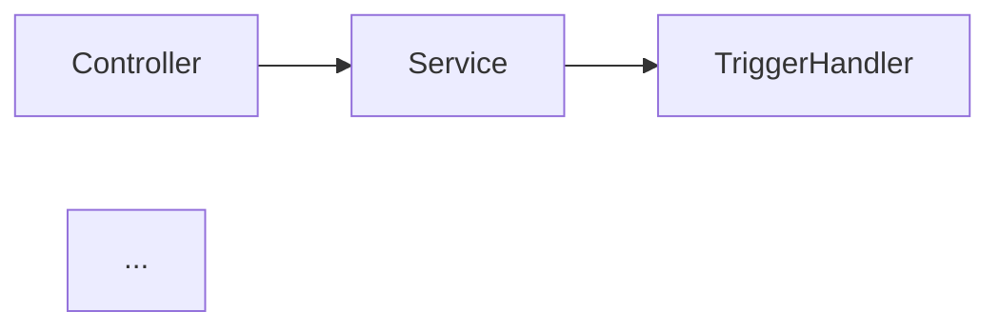
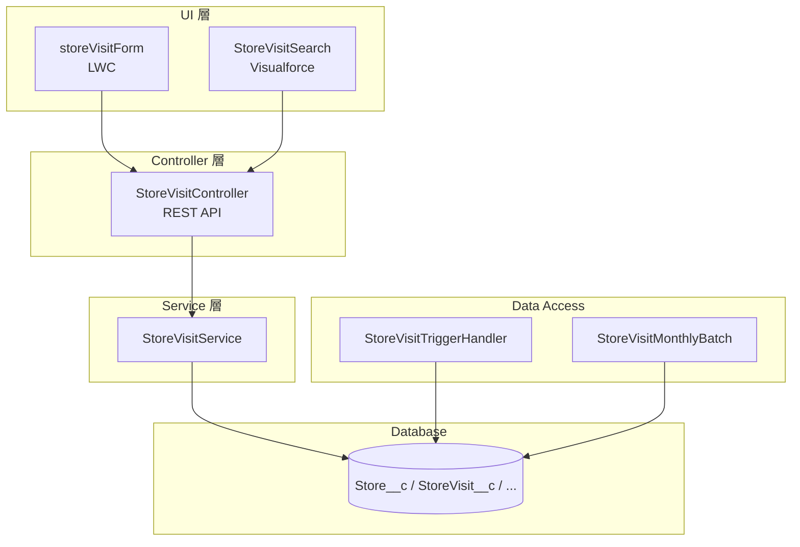
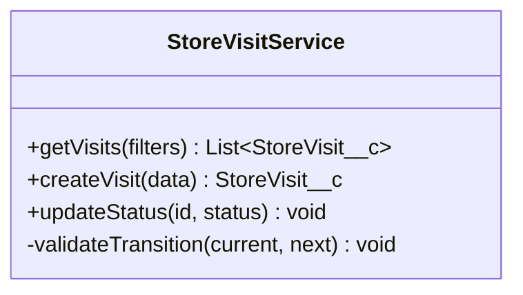
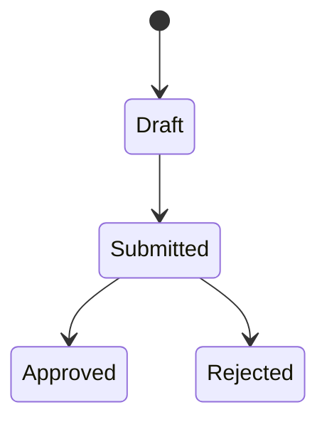
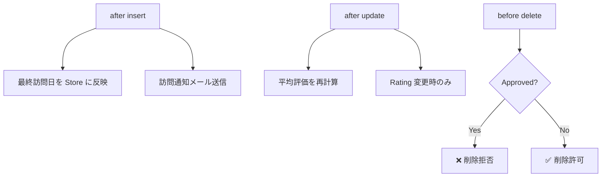
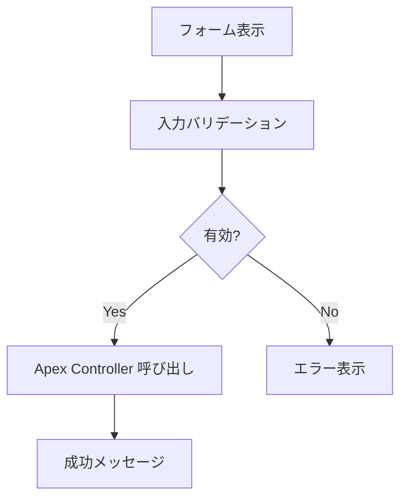
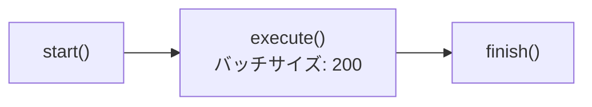

Step 1 Phase 1: ソースコードから Code Wiki を自動生成

## SFDX ソースディレクトリ
`$ARGUMENTS`

引数が空の場合は `./examples` をデフォルトとして使用してください。
以下、`<SOURCE>` は指定されたディレクトリを指します。

---

## 目的

SFDX プロジェクトの **全ファイルを1ファイル1ページ** で Wiki 化する。
この Wiki は後続の `/project:reverse-engineer` や `/project:assess-migration` の
**主要インプット** として機能し、AI が大規模プロジェクトでも効率的に全体像を把握できるようにする。

## 事前条件

`/project:discover-source` を先に実行し、以下が生成されていること:
- `01-reverse-engineering/output/source_tree.md`
- `01-reverse-engineering/output/knowledge_catalog.md`

**未実行の場合**: 自分で `<SOURCE>` を再帰走査して必要な情報を収集してください。

---

## 出力先

```
01-reverse-engineering/output/wiki/
├── index.md                          ← Wiki トップ（全体概要 + ナビゲーション）
├── architecture.md                   ← アーキテクチャ俯瞰（依存関係グラフ + レイヤー図）
├── data-model.md                     ← 統合 ER 図 + オブジェクト間リレーション一覧
├── objects/                          ← カスタムオブジェクト（1オブジェクト = 1ページ）
│   ├── Store__c.md
│   ├── StoreVisit__c.md
│   └── ...
├── classes/                          ← Apex クラス（1クラス = 1ページ）
│   ├── StoreVisitController.md
│   ├── StoreVisitService.md
│   └── ...
├── triggers/                         ← Apex トリガー（1トリガー = 1ページ）
│   └── StoreVisitTrigger.md
├── ui/                               ← LWC / Visualforce（1コンポーネント = 1ページ）
│   ├── storeVisitForm.md
│   └── StoreVisitSearch.md
└── batch/                            ← バッチ / スケジューラー（1ジョブ = 1ページ）
    ├── StoreVisitMonthlyBatch.md
    └── StoreVisitScheduler.md
```

---

## Wiki ページの生成ルール

### 📘 index.md（Wiki トップ）

```markdown
# Code Wiki: {プロジェクト名}

生成日時: YYYY-MM-DD HH:MM
ソース: <SOURCE>

## プロジェクト概要
- 総ファイル数: N
- Apex クラス: N（うちテスト: N）
- カスタムオブジェクト: N（総フィールド数: N）
- Trigger: N
- LWC: N / Visualforce: N
- バッチ: N / スケジューラー: N

## アーキテクチャ概要
{1段落でシステムの目的と構造を記述}

## モジュール依存関係図


## ページ一覧
### カスタムオブジェクト
- [Store__c](objects/Store__c.md) — 店舗マスタ
- [StoreVisit__c](objects/StoreVisit__c.md) — 訪問記録
- ...

### Apex クラス
- [StoreVisitController](classes/StoreVisitController.md) — REST API (269行)
- [StoreVisitService](classes/StoreVisitService.md) — Service (244行)
- ...

### Trigger
- [StoreVisitTrigger](triggers/StoreVisitTrigger.md) — after insert/update, before delete

### UI
- [storeVisitForm](ui/storeVisitForm.md) — LWC 訪問記録入力フォーム
- ...

### バッチ / スケジューラー
- [StoreVisitMonthlyBatch](batch/StoreVisitMonthlyBatch.md) — 月次集計
- ...
```

---

### 📘 architecture.md（アーキテクチャ俯瞰）

```markdown
# アーキテクチャ俯瞰

## レイヤー構造



## 呼び出し関係マトリクス

| 呼び出し元 ＼ 呼び出し先 | Service | TriggerHandler | DB(DML) |
|----------------------|---------|---------------|---------|
| Controller           | ✅      |               |         |
| Service              |         |               | ✅      |
| TriggerHandler       |         |               | ✅      |
| Batch                |         |               | ✅      |

## 外部連携一覧
| 連携先 | 方式 | 該当クラス |
|-------|------|---------|
| (存在する場合に記載) | | |
```

---

### 📘 data-model.md（統合データモデル）

```markdown
# データモデル

## ER 図
```mermaid
erDiagram
    STORE ||--o{ STORE_VISIT : "Lookup"
    STORE_VISIT ||--o{ VISIT_DETAIL : "MasterDetail"
    STORE ||--o{ MONTHLY_VISIT_SUMMARY : "Lookup"
    ...（全フィールド付き）
```

## オブジェクト間リレーション
| 親オブジェクト | 子オブジェクト | リレーション種別 | フィールド | 削除時動作 |
|-------------|-------------|-------------|---------|---------|
| Store__c | StoreVisit__c | Lookup | Store__c | SET NULL |
| StoreVisit__c | VisitDetail__c | MasterDetail | StoreVisit__c | CASCADE |

## 数式フィールド / ロールアップ集計
| オブジェクト | フィールド | 種別 | 計算式/集計 |
|-----------|---------|------|---------|
| Store__c | AverageRating__c | Formula/Rollup | (存在する場合) |
```

---

### 📘 objects/{ObjectName}.md（カスタムオブジェクト）

各オブジェクトの `.object-meta.xml` と `fields/*.field-meta.xml` を読み込み、以下を生成:

```markdown
# {ObjectName}（{label}）

## 概要
{このオブジェクトの業務上の役割を1〜2文で記述}

## メタデータ
- API 名: {ObjectName}
- ラベル: {label}
- 共有モデル: {sharingModel}
- フィールド数: N
- リレーション: 親={N}, 子={N}

## フィールド定義
| # | フィールド名 | API 名 | データ型 | 長さ | 必須 | ユニーク | デフォルト | 説明 |
|---|-----------|--------|--------|------|------|--------|---------|------|
| 1 | 店舗コード | StoreCode__c | Text | 10 | ✅ | ✅ | — | 店舗の一意識別子 |
| 2 | ... | ... | ... | ... | ... | ... | ... | ... |

## Picklist 値
| フィールド | 値 | ラベル | デフォルト |
|---------|------|-------|---------|

## リレーション
| 方向 | 関連オブジェクト | フィールド | 種別 | 削除時動作 |
|------|-------------|---------|------|---------|
| 親→ | StoreVisit__c | Store__c | Lookup | SET NULL |

## バリデーションルール（コードから抽出）
| ルール名 | 条件 | エラーメッセージ | 該当コード |
|---------|------|-------------|---------|

## 数式フィールド
| フィールド | 計算式 | 参照先 |
|---------|--------|-------|

## 関連 Apex クラス
- [StoreVisitController](../classes/StoreVisitController.md) — CRUD 操作
- [StoreVisitService](../classes/StoreVisitService.md) — ビジネスロジック

## 移行メモ
- 移行先テーブル名（想定）: `{snake_case}`
- 特記事項: {Formula フィールドの計算戦略など}
```

---

### 📘 classes/{ClassName}.md（Apex クラス）

各 `.cls` ファイルを読み込み、以下を生成:

```markdown
# {ClassName}

## 概要
{このクラスの業務上の役割を2〜3文で記述}

## メタデータ
- 種別: {REST API / Service / TriggerHandler / Batch / Scheduler / Test / Utility}
- 行数: {N}
- 共有モデル: {with sharing / without sharing / inherited sharing}
- API バージョン: {N.0}

## クラス構造


## 公開メソッド
| # | メソッド名 | パラメータ | 戻り値 | 概要 |
|---|---------|---------|-------|------|
| 1 | getVisits | Map<String,String> filters | List<StoreVisit__c> | フィルタ付き訪問一覧取得 |
| 2 | createVisit | StoreVisit__c data | StoreVisit__c | 訪問記録作成（初期: Draft） |

## プライベートメソッド
| # | メソッド名 | 概要 |
|---|---------|------|
| 1 | validateTransition | ステータス遷移の妥当性検証 |

## 依存関係
### 呼び出し元（このクラスを使う側）
- [StoreVisitController](StoreVisitController.md) — REST エンドポイントから呼び出し

### 呼び出し先（このクラスが使う側）
- DML: insert, update, delete（Database 直接操作）
- [StoreVisitTriggerHandler](../triggers/StoreVisitTrigger.md) — DML 経由で暗黙的に起動

## SFDC プラットフォーム依存
| 依存 API | 出現行 | 用途 | 移行先パターン |
|---------|-------|------|-------------|
| Database.setSavepoint() | L45 | トランザクション制御 | SQLAlchemy Session |
| with sharing | L1 | 共有ルール適用 | 認可ミドルウェア |
| [SELECT ...] | L12,L30 | SOQL クエリ | SQLAlchemy select() |

## ビジネスルール
1. **ステータス遷移**: Draft→Submitted, Submitted→Approved/Rejected のみ許可
2. **Rating 範囲**: 1〜5（1未満または5超はバリデーションエラー）
3. **削除制約**: Approved 状態のレコードは削除不可

## ステータス遷移図（該当する場合）


## テストカバレッジ
| テストクラス | テストメソッド | 検証内容 |
|-----------|-----------|---------|
| StoreVisitServiceTest | testCreateVisit | 初期ステータスが Draft |
| StoreVisitServiceTest | testInvalidTransition | 不正遷移で例外発生 |

## 移行メモ
- 移行先: `usecase/store_visit_usecase.py`
- 難易度: M
- ⚠️ ガバナ制限チェック（`Limits.getQueries()`）→ 削除可能
- ⚠️ `Database.setSavepoint()` → SQLAlchemy Transaction に変換
```

---

### 📘 triggers/{TriggerName}.md（Apex トリガー）

```markdown
# {TriggerName}

## 概要
{このトリガーの目的を1〜2文で記述}

## メタデータ
- 対象オブジェクト: {ObjectName}
- 行数: {N}

## ハンドルするイベント
| イベント | 委譲先メソッド | 副作用 |
|---------|------------|-------|
| after insert | TriggerHandler.onAfterInsert() | 最終訪問日更新、メール通知 |
| after update | TriggerHandler.onAfterUpdate() | 平均評価再計算 |
| before delete | TriggerHandler.onBeforeDelete() | 削除可否チェック |

## 副作用フロー図


## Handler クラスの詳細
→ [StoreVisitTriggerHandler](../classes/StoreVisitTriggerHandler.md)

## 移行メモ
- Trigger の副作用は `usecase` 層で **明示的に** 呼び出す設計に変更
- 暗黙的な副作用チェーンを排除し、テスタビリティを向上
```

---

### 📘 ui/{ComponentName}.md（LWC / Visualforce）

```markdown
# {ComponentName}

## 概要
{この UI コンポーネントの目的を1〜2文で記述}

## メタデータ
- 種別: {LWC / Visualforce / Aura}
- ファイル構成: {.js, .html, .css, .js-meta.xml}
- 行数: JS={N}, HTML={N}

## 画面フロー


## Apex Controller バインディング
| 操作 | Apex メソッド | 用途 |
|-----|------------|------|
| 店舗一覧取得 | StoreVisitController.getStores() | ドロップダウン選択肢 |
| 保存 | StoreVisitController.createVisit() | フォーム送信 |

## クライアント側バリデーション
| フィールド | ルール | エラーメッセージ |
|---------|--------|-------------|
| visitDate | 必須 + 未来日不可 | '訪問日は今日以前...' |
| rating | 1〜5 | '評価は1〜5...' |

## 移行メモ
- スコープ: {移行対象 / スコープ外}
- 移行先候補: {React / Vue / Next.js / スコープ外}
```

---

### 📘 batch/{BatchName}.md（バッチ / スケジューラー）

```markdown
# {BatchName}

## 概要
{このバッチの目的を1〜2文で記述}

## メタデータ
- 種別: {Batchable / Schedulable}
- 行数: {N}
- インターフェース: {Database.Batchable<sObject>, Database.Stateful}
- スケジュール: {cron 式 / 手動}

## バッチフロー


## 処理詳細
### start(): クエリ
{QueryLocator の SOQL を記載}

### execute(): ロジック
{集計処理の内容を記述}

### finish(): 後処理
{通知やログの出力}

## 入出力
| 入力 | 出力 |
|------|------|
| StoreVisit__c（前月分） | MonthlyVisitSummary__c（集計レコード） |

## 移行メモ
- 移行先: Cloud Run Jobs
- BATCH_SIZE: 環境変数で制御
- スケジュール: Cloud Scheduler（cron 式を転記）
```

---

## 生成手順

1. `source_tree.md` のファイル一覧を参照し、Wiki 対象ファイルを確定
2. 各ファイルを読み込み、上記テンプレートに従って Wiki ページを生成
3. `index.md` を最後に生成（全ページのリンクを集約）
4. `architecture.md` と `data-model.md` を全体の分析結果から生成

## 品質基準

- [ ] `source_tree.md` に記載された全ソースファイルに対応する Wiki ページが存在する
- [ ] 全 Wiki ページ間のリンク（相対パス）が正しい
- [ ] 全オブジェクトのフィールドが `objects/` ページに網羅されている
- [ ] 全 Apex クラスの公開メソッドが `classes/` ページに記載されている
- [ ] 依存関係（呼び出し元/呼び出し先）が双方向で記載されている
- [ ] SFDC 依存 API が `knowledge_catalog.md` の検出結果と整合している
- [ ] 移行メモが全ページに記載されている
- [ ] Mermaid 図がレンダリング可能な構文であること

> [!IMPORTANT]
> この Wiki は **AI が読むためのドキュメント** です。
> 後続の `/project:reverse-engineer` は Wiki を参照して設計書を生成します。
> 人間が読んでも分かりやすい形式ですが、最大の目的は AI のコンテキスト効率の最大化です。
