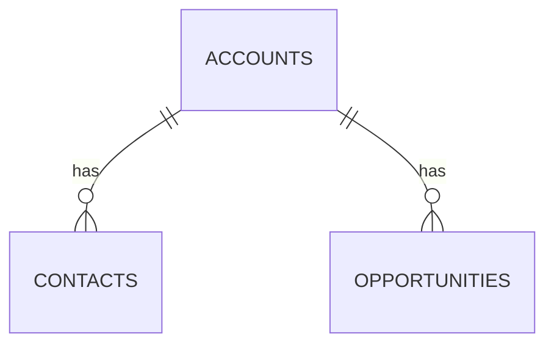
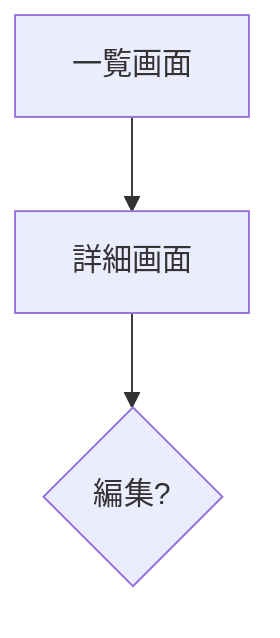

「ソースコードこそが唯一の真実」の原則に基づき、SFDC ソースコードからシステム設計を復元する。

## When to Activate
- SFDC ソースコード（SFDX プロジェクト）を分析するとき
- 設計書が存在しない / 古い場合にコードから仕様を抽出するとき
- 移行影響範囲を評価するとき
- ER 図や API 仕様を生成するとき

## 分析対象と優先度

| 対象 | パス例 | 抽出する情報 |
|------|-------|------------|
| カスタムオブジェクト | `objects/*__c.object-meta.xml` | フィールド定義、リレーション、バリデーション |
| Apex クラス | `classes/*.cls` | ビジネスロジック、ヘルパー、サービス |
| Apex トリガー | `triggers/*.trigger` | イベントハンドラ、副作用 |
| Apex テスト | `classes/*Test.cls` | テストシナリオ = 仕様 |
| Visualforce | `pages/*.page` | UI フロー、画面仕様 |
| LWC | `lwc/*` | UI コンポーネント |
| フロー | `flows/*.flow-meta.xml` | 自動化プロセス |
| 権限セット | `permissionsets/*.permissionset-meta.xml` | 認可要件 |

## 分析フロー

```
Phase 0: ディレクトリ再帰探索 → source_tree.md + knowledge_catalog.md を生成
  ↓
Step 1: オブジェクト定義を読む → ER 図を生成
Step 2: Apex クラスを読む → ビジネスロジック仕様を抽出
Step 3: Trigger を読む → 副作用マップを作成
Step 4: テストクラスを読む → テストシナリオ = 仕様として記録
Step 5: Visualforce/LWC を読む → 画面フローを特定
Step 6: 統合 → system_overview.md を生成
```

### Phase 0: ディレクトリ再帰探索

**固定パスを前提にしない。** `find` で再帰的に走査し、以下を生成:

1. **source_tree.md**: ディレクトリ Tree + ファイル種別統計 + 全ファイル一覧（パス, 種別, 行数, 概要）
2. **knowledge_catalog.md**: 以下の 3 カテゴリのナレッジ抽出結果
   - **SFDC 依存 API**: `grep` で検出した SFDC プラットフォーム固有 API の出現箇所と移行先パターン
   - **ビジネスロジックパターン**: ステータス遷移、バリデーション、集計、親子操作、外部 ID 等
   - **コーディング慣習**: 命名規則、レイヤー分離、テストパターン、Trigger パターン

## 出力フォーマット

### system_overview.md の構成

```markdown
# システム概要書: {プロジェクト名}

## 1. システム概要
- 目的と背景
- 主要ユースケース

## 2. データモデル（ER 図）


## 3. オブジェクト定義
### {オブジェクト名}
| フィールド | 型 | 必須 | 説明 |
|-----------|-----|------|------|

## 4. ビジネスロジック一覧
### {クラス名}
- 責務: ...
- 主要メソッド:
  - `methodName(params)`: 説明

## 5. Trigger / 副作用マップ
| Trigger | イベント | 副作用 |
|---------|---------|-------|

## 6. 画面フロー


## 7. テストシナリオ（仕様）
### {テストクラス名}
| テストメソッド | 検証内容 | 期待値 |
|-------------|---------|-------|

## 8. 移行影響度分析
| 項目 | 複雑度 | 移行リスク |
|------|-------|-----------|
```

## 複雑度の判定基準

| 複雑度 | 条件 | 移行工数目安 |
|-------|------|------------|
| **Low** | CRUD のみ、ロジックなし | 0.5日 |
| **Medium** | バリデーション + 簡易ロジック | 1日 |
| **High** | 複雑な状態遷移 / 外部連携 / Batch | 2-3日 |
| **Critical** | 承認プロセス / 複雑なシェアリング / 大量データ | 3-5日 |

## Mermaid 図のスタイルガイド

### ER 図
- 1:N は `||--o{`、1:1 は `||--||`、M:N は `}o--o{`
- テーブル名は大文字スネークケース

### フローチャート
- 開始は `([...])` 形式
- 分岐は `{...}` 形式
- 外部システムは `[/...\\]` 形式

### 状態遷移図
- `stateDiagram-v2` を使用
- `[*]` で開始/終了状態を表現
