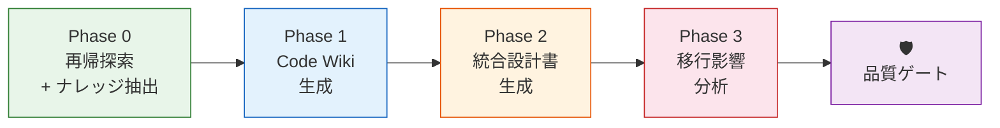

# Step 1: AI による設計ドキュメント逆起こし（10:30 – 12:00）

> [!IMPORTANT]
> **ワークショップ最大の目玉ステップ。** 設計書なしの状況を逆手に取り、ソースコードから AI に設計を逆起こしさせる。
> ここで生成した成果物（**Code Wiki + 統合設計書**）が、Step 2 以降すべてのインプットになる。

## 🎯 ゴール

「ソースコードを読んだ AI」を「そのシステムの専門家」に変える。

| 成果物 | 出力先 | 概要 |
|--------|--------|------|
| ソースツリーマップ | `01-reverse-engineering/output/source_tree.md` | ディレクトリ構造・ファイル統計 |
| ナレッジカタログ | `01-reverse-engineering/output/knowledge_catalog.md` | SFDC 依存 API 検出結果 |
| **Code Wiki** | `01-reverse-engineering/output/wiki/` | 全ソースの 1ファイル=1ページ 百科事典 |
| **統合設計書** | `01-reverse-engineering/output/system_overview.md` | ER 図 / API 仕様 / ステータス遷移 |
| 移行影響分析 | `01-reverse-engineering/output/migration_assessment.md` | 難易度スコアリング / SFDC 依存マッピング |

---

## 全体フロー



---

## Phase 0: 再帰探索 + ナレッジ抽出（10分）

> **何をするか**: SFDX プロジェクトのディレクトリ構造を再帰的に走査し、全体像を把握する。
> 固定パスを前提にせず、実際のファイルシステムから構造を検出する。

```
/discover-source ./examples
```

**AI が自律的に実行する内容**:
1. ディレクトリを再帰走査し、Tree 構造を生成
2. ファイル種別（.cls / .trigger / .object-meta.xml 等）の統計を集計
3. SFDC 依存 API パターンを検出（`UserInfo.getUserId()`, `Database.Batchable` 等）
4. ビジネスロジックパターンを分類

**出力**:
- `source_tree.md` — ファイルツリーマップ + 統計
- `knowledge_catalog.md` — SFDC 依存 API 検出結果

---

## Phase 1: Code Wiki 生成（30分）

> **何をするか**: 全ソースファイルを「1ファイル = 1ページ」で Wiki 化する。
> コンテキストウィンドウの制約を回避し、後続 Step で AI が効率的に情報を参照できる構造を作る。

```
/generate-wiki ./examples
```

**AI が自律的に実行する内容**:
1. 全 Apex クラス / Trigger / オブジェクト定義を読み込み
2. クラスごとに **メソッド一覧・依存関係・ビジネスルール** を Wiki ページ化
3. オブジェクトごとに **フィールド定義・リレーション・Picklist 値** を Wiki ページ化
4. `index.md`（全体概要）+ `architecture.md`（依存関係図）+ `data-model.md`（ER 図）を生成

**出力**: `wiki/` 配下に約 15〜20 ページ

```
wiki/
├── index.md              ← 全体概要
├── architecture.md       ← クラス間依存関係図
├── data-model.md         ← ER 図 + リレーション一覧
├── classes/
│   ├── StoreVisitController.md
│   ├── StoreVisitService.md
│   ├── StoreVisitTriggerHandler.md
│   └── ...
└── objects/
    ├── Store__c.md
    ├── StoreVisit__c.md
    └── ...
```

> [!TIP]
> **なぜ Wiki を作るのか？**
> AI のコンテキストウィンドウは有限です。Step 2 以降で「必要な情報だけ」を効率的に参照できるよう、
> ここで構造化された知識ベースを構築しておきます。

---

## Phase 2: 統合設計書の生成（20分）

> **何をするか**: Wiki の情報を統合し、人間が読みやすい 1 枚の設計書にまとめる。
> ER 図、API 仕様、ステータス遷移図をこのドキュメントに集約する。

```
/reverse-engineer ./examples
```

**AI が自律的に実行する内容**:
1. Wiki の各ページを統合し `system_overview.md` を生成
2. Skill `reverse-engineering` のフォーマットと Mermaid スタイルガイドに従い出力

**期待される出力** (`system_overview.md`):
- ER 図（オブジェクトのリレーション）
- クラス責務一覧（REST / Service / TriggerHandler / Batch / Scheduler / Test）
- API 仕様（HTTP メソッド / パス / 概要）
- ステータス遷移図（例: Draft → Submitted → Approved / Rejected）
- 副作用マップ（Trigger → 最終訪問日更新、通知、平均評価再計算）
- テストケース一覧（テストクラスの全 assert）

---

## Phase 3: 移行影響分析（20分）

> **何をするか**: 全コンポーネントの移行難易度をスコアリングし、SFDC 固有機能の移行先パターンをマッピングする。

```
/assess-migration ./examples
```

**期待される出力** (`migration_assessment.md`):

| コンポーネント | 種別 | 行数 | SFDC依存度 | 難易度 | 移行パターン |
|-------------|------|------|-----------|--------|------------|
| `XxxController` | REST | 〜200 | 低 | S | FastAPI REST API |
| `XxxTrigger` | Trigger | 〜100 | 中 | M | UseCase 層で明示管理 |
| `XxxBatch` | Batch | 〜300 | 中 | M | Cloud Run Jobs |

---

## 1-4. レビュー＆品質ゲート（20分）

### セルフチェック

- [ ] 全クラスが Wiki にページを持っている（漏れなし）
- [ ] ER 図のリレーションが正しい（Lookup / MasterDetail の区別）
- [ ] ステータス遷移が正しい
- [ ] テストクラスの全 assert がテストシナリオとして抽出されている

### 独立コンテキストレビュー（推奨）

> [!IMPORTANT]
> **品質を最大化するには**、builder（コード生成した AI）の思考履歴を消去し、まっさらな視点でレビューします。

```bash
# ① コンテキストをリセット（builder の思考履歴を消去）
/clear

# ② 独立コンテキストで品質チェック（quality-rubric に基づく 5 段階スコアリング）
/review-gate 1

# ③ PASS したらリセットして Step 2 へ
/clear
```

レビュー結果は `01-reverse-engineering/output/review_report.md` に出力されます。

### 人間によるディスカッション

> AI が生成した設計書は**出発点**です。人間にしか分からないビジネスコンテキストを補完するのがこのフェーズの目的。

1. **AI の出力に誤りや漏れはないか？**
2. **暗黙知の補完** — コードに現れない業務ルール（例: 「月末は集計処理が重い」）
3. **PoC 対象の再確認** — 影響分析の結果を踏まえて、Step 0 で選んだ PoC 対象は妥当か？

### 成果物の確定

```bash
ls -la 01-reverse-engineering/output/
git add 01-reverse-engineering/output/
git commit -m "Step 1: AI による設計ドキュメント逆起こし完了"
```

---

## ⏭️ 次のステップ

Step 1 で生成した以下を、Step 2 以降で利用します：

| 成果物 | 利用先 |
|--------|--------|
| Wiki (`wiki/objects/`) + ER 図 | → Step 2: DDL 変換の**主入力** |
| Wiki (`wiki/classes/`) + API 仕様 | → Step 3: テストシナリオの**主入力** |
| 移行影響分析 | → Step 5: ロードマップのインプット |

> [!NOTE]
> Step 2 以降のコマンドは、**生のソースコードではなく Step 1 の成果物（Wiki + 統合設計書）を主入力**とします。
> 生ソースの読み込みは Step 1 の一箇所に集約し、後続 Step では Wiki を参照します。
