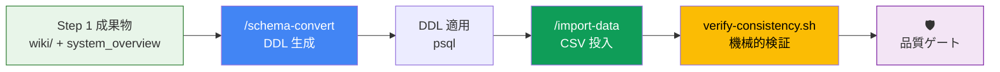

# Step 2: DB スキーマ移行 + 実データ投入（13:00 – 13:45）

> [!NOTE]
> Step 1 で生成した **Code Wiki（`wiki/objects/`）と統合設計書（`system_overview.md`）** をインプットに、
> PostgreSQL DDL の生成 → 実データ投入 → 整合性検証まで行う。
> 生の SFDC メタデータ（XML）は、Wiki に情報が不足している場合のみ補足参照する。

## 🎯 ゴール

SFDC のデータモデルを PostgreSQL に完全に再現し、実データが投入された状態を構築する。

| 成果物 | 出力先 |
|--------|--------|
| PostgreSQL DDL | `02-schema-migration/output/generated_ddl.sql` |
| データ整合性検証 SQL | `02-schema-migration/output/data_validation.sql` |
| データ投入スクリプト | `02-schema-migration/output/import_data.py` |
| 依存定義 | `02-schema-migration/output/requirements-import.txt` |

---

## 全体フロー



---

## 2-1. DDL 生成（15分）

> **何をするか**: SFDC のオブジェクト定義（型、制約、リレーション）を PostgreSQL の CREATE TABLE 文に変換する。
> 命名規則の変換（`__c` 除去、snake_case 化、複数形化）やデータ型マッピングは Skill `sfdc-schema-migration` に定義済み。

```
/schema-convert ./examples
```

**AI が自律的に実行する内容**:
1. Step 1 の `system_overview.md` から ER 図・リレーションを参照
2. Step 1 の `wiki/objects/` からフィールド定義（型、長さ、Picklist 値等）を参照
3. Skill `sfdc-schema-migration` の変換ルールを適用:
   - `Store__c` → `stores`、`StoreVisit__c` → `store_visits` ...
   - Lookup → `ON DELETE SET NULL`、MasterDetail → `ON DELETE CASCADE`
4. FK 依存関係をトポロジカルソートで解決
5. DDL + データ検証 SQL を生成

**変換ルール概要**:

| SFDC 型 | PostgreSQL 型 |
|---------|---------------|
| Id | `VARCHAR(18) PRIMARY KEY` |
| Text(n) | `VARCHAR(n)` |
| LongTextArea | `TEXT` |
| Checkbox | `BOOLEAN DEFAULT false` |
| Number(p, s) | `INTEGER` or `NUMERIC(p, s)` |
| DateTime | `TIMESTAMPTZ` |
| Picklist | `VARCHAR(255)` + CHECK 制約 |
| Lookup | FK `ON DELETE SET NULL` |
| MasterDetail | FK `ON DELETE CASCADE NOT NULL` |
| Formula | DDL に含めない（コメントで記録） |

---

## 2-2. DDL 適用 + 検証（5分）

```bash
# Step 0 で起動済みならスキップ
docker compose up -d db

# DDL を PostgreSQL に適用
docker compose exec db psql -U app_user -d migration_db \
  -f /workspace/02-schema-migration/output/generated_ddl.sql

# テーブル一覧を確認
docker compose exec db psql -U app_user -d migration_db -c "\dt"

# テーブル定義の詳細確認（代表1テーブル）
docker compose exec db psql -U app_user -d migration_db -c "\d stores"
```

**期待される結果**: 全オブジェクトに対応するテーブルが作成される。

---

## 2-3. 外部キー制約の確認

```bash
docker compose exec db psql -U app_user -d migration_db -c "
SELECT tc.table_name, kcu.column_name, ccu.table_name AS foreign_table
FROM information_schema.table_constraints tc
JOIN information_schema.key_column_usage kcu
    ON tc.constraint_name = kcu.constraint_name
JOIN information_schema.constraint_column_usage ccu
    ON ccu.constraint_name = tc.constraint_name
WHERE tc.constraint_type = 'FOREIGN KEY'
ORDER BY tc.table_name;
"
```

---

## 2-4. 実データ投入（10分）

> **何をするか**: 事前準備でエクスポートした SFDC の CSV データを PostgreSQL に投入する。
> AI がスクリプトを**生成→依存インストール→実行→検証**まで自律的に完了する。

```
/import-data ./examples
```

**AI が自律的に実行する内容**:
1. `data/` 配下の CSV を検出
2. `requirements-import.txt` を生成（`psycopg2-binary` 等の依存定義）
3. DDL のカラム定義から CSV ヘッダー → PostgreSQL カラム名のマッピングを自動生成
4. FK 依存関係を考慮した投入順序を決定（親テーブル → 子テーブル）
5. Python スクリプト `import_data.py` を生成
6. **依存パッケージをインストール** → **スクリプトを実行** → **結果を検証**

> [!NOTE]
> `/import-data` はスクリプト生成だけでなく、**実行と検証まで自律的に完了**します。
> エラーが発生した場合は AI が自動でスクリプトを修正し、再実行します。

---

## 2-5. データ投入結果の確認（人間による確認）

AI が出力した投入サマリーを確認してください。手動で追加確認する場合:

```bash
# テーブル別レコード数を確認
docker compose exec db psql -U app_user -d migration_db -c "
SELECT 'stores' AS table_name, COUNT(*) FROM stores
UNION ALL
SELECT 'store_visits', COUNT(*) FROM store_visits
UNION ALL
SELECT 'visit_details', COUNT(*) FROM visit_details;
"

# データ検証 SQL を実行（孤立レコードチェック・NULL チェック等）
docker compose exec db psql -U app_user -d migration_db \
  -f /workspace/02-schema-migration/output/data_validation.sql
```

---

## 2-6. 機械的検証

```bash
# Step 1 → Step 2 のデータ整合性を機械的にチェック
./scripts/verify-consistency.sh 1-2
```

---

## 2-7. 品質チェック + 品質ゲート

### セルフチェック

- [ ] DDL がエラーなく適用できた
- [ ] 全テーブルが作成された
- [ ] FK 制約が正しい方向で設定されている（Lookup = SET NULL, MasterDetail = CASCADE）
- [ ] Picklist の CHECK 制約が設定されている
- [ ] CSV の全レコードが投入された（件数一致）
- [ ] 孤立レコードが存在しない（FK 参照整合性）

### 独立コンテキストレビュー（推奨）

```bash
/clear
/review-gate 2
/clear
```

---

## 2-8. データ移行戦略の議論（5分）

> 本番移行の際の方式を議論する。ワークショップではサンプルデータで検証するが、本番では以下を検討する必要がある。

| 項目 | 選択肢 | 考慮事項 |
|------|--------|---------| 
| **移行方式** | ビッグバン / 段階移行 | ダウンタイム許容度、データ量 |
| **エクスポート** | Data Loader / Bulk API 2.0 / sf CLI | レコード件数で選択 |
| **差分移行** | 移行期間中の更新分の扱い | CDC / タイムスタンプベース |
| **ID マッピング** | SFDC ID をそのまま使う / UUID 採番 | 参照整合性の維持 |
