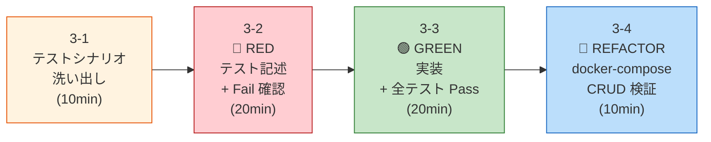

# Step 3: TDD によるコードモダナイズ PoC — Python（13:45 – 14:45）

> [!IMPORTANT]
> **「コードを書いてからテストを書く」のではなく、「テストを先に書いてから実装する」。**
> Apex の既存動作をテストシナリオとして先に定義することで、SFDC の実行ケースがデグレしないことを機械的に保証する。

## 🎯 ゴール

Step 0 で選定した代表1コンポーネントを TDD で Python（FastAPI）に変換し、docker-compose でコンテナ間 CRUD 検証まで行う。

| 成果物 | 出力先 |
|--------|--------|
| テストシナリオ一覧 | `03-code-modernization/output/TEST_SCENARIOS.md` |
| Python プロジェクト | `03-code-modernization/output/app/` |
| テストコード | `03-code-modernization/output/tests/` |
| Dockerfile | `03-code-modernization/output/Dockerfile` |
| requirements.txt | `03-code-modernization/output/requirements.txt` |

---

## TDD フロー



---

## 3-1. テストシナリオの洗い出し（10分）

Claude Code に Apex ソースコードを渡し、**実装には触れず**テストシナリオだけを抽出させる。

### プロンプト

```markdown
# 指示
以下の Apex ソースコードを分析し、**テストシナリオの一覧だけ**を出力してください。
コードの変換や実装は行わないでください。

# 抽出すべきテストシナリオ
1. 各 REST エンドポイント（@HttpGet/@HttpPost/@HttpPatch/@HttpDelete）の正常系
2. 各エンドポイントの異常系（バリデーションエラー、存在しないID、権限不足等）
3. ビジネスルール（ステータス遷移、計算ロジック、条件分岐）
4. Trigger の副作用（レコード更新、子レコード連動）
5. Batch の入出力仕様
6. 境界値（数値の上限/下限、空文字列、NULL）

# 出力形式
Markdown テーブルで出力:
| # | カテゴリ | シナリオ | 期待結果 | 元の Apex コード |
|---|---------|---------|---------|----------------|

# 出力先
workshop-real/03-code-modernization/output/TEST_SCENARIOS.md

# 入力（Apex ソースコード）
（ここにソースコードを貼り付け、または Claude Code にファイルを指定）
```

### 期待出力例

| # | カテゴリ | シナリオ | 期待結果 | 元コード |
|---|---------|---------|---------|---------|
| 1 | GET 正常系 | 一覧取得（パラメータなし） | 200 + JSON 配列 | `getReports()` |
| 2 | GET 正常系 | ステータスフィルタ | 200 + フィルタ結果 | `getReports(status)` |
| 3 | POST 正常系 | 新規作成（子レコード付き） | 201 + 作成結果 | `createReport()` |
| 4 | POST 異常系 | 必須項目欠損 | 400 + エラー | `createReport()` |
| 5 | PATCH 正常系 | ステータス遷移（下書き→提出） | 200 + 更新結果 | `updateStatus()` |
| 6 | PATCH 異常系 | 不正遷移（承認→下書き） | 400 + エラー | `updateStatus()` |
| 7 | DELETE 正常系 | 下書きの削除 | 204 | `deleteReport()` |
| 8 | DELETE 異常系 | 下書き以外の削除 | 400 + エラー | `deleteReport()` |

---

## 3-2. 🔴 RED — テストコードの記述 + Fail 確認（20分）

テストシナリオ一覧に基づき、Claude Code に**テストコードだけ**を生成させる。

### プロンプト

````markdown
# 指示
以下のテストシナリオ一覧に基づき、Python のテストコードを生成してください。
**実装コードは書かないでください。** テストだけを書いて、全テストが FAIL する状態を作ります。

# 技術要件
1. **テストフレームワーク**: pytest
2. **パラメタライズ**: `@pytest.mark.parametrize` でテーブル駆動テスト
3. **モック**: `unittest.mock.AsyncMock` で Repository 層をモック
4. **HTTP テスト**: FastAPI の `TestClient` を使用
5. **テスト命名**: `test_<機能>_<シナリオ>` 形式

# プロジェクト構造
以下の構造で作成（スタブ含む）:

```
03-code-modernization/output/
├── app/
│   ├── __init__.py
│   ├── main.py           # FastAPI app の初期化（最小限）
│   ├── config.py          # DB 接続設定（環境変数）
│   ├── model/
│   │   ├── __init__.py
│   │   └── schemas.py    # Pydantic モデル（型定義）
│   ├── router/
│   │   ├── __init__.py
│   │   └── resource.py   # スタブ（raise NotImplementedError）
│   ├── usecase/
│   │   ├── __init__.py
│   │   └── resource.py   # スタブ
│   └── repository/
│       ├── __init__.py
│       └── resource.py   # インターフェース（ABC）のみ
├── tests/
│   ├── __init__.py
│   ├── conftest.py        # 共通フィクスチャ（TestClient, mock repo）
│   ├── test_model.py      # モデルバリデーションテスト
│   ├── test_usecase.py    # ユースケーステスト
│   └── test_router.py     # API エンドポイントテスト
├── pyproject.toml
├── requirements.txt
└── Dockerfile
```

# テストシナリオ
（ここに 3-1 で生成した TEST_SCENARIOS.md の内容を貼り付け）
````

### Fail の確認

```bash
cd workshop-real/03-code-modernization/output

# 仮想環境セットアップ
python3 -m venv .venv && source .venv/bin/activate
pip install -r requirements.txt

# テスト実行 → 全て FAIL であることを確認
pytest -v --tb=short
# 期待結果:
#   test_router.py::test_list_resources_success FAILED
#   test_router.py::test_create_resource_success FAILED
#   test_usecase.py::test_create_with_validation_error FAILED
#   ...
#   X failed, 0 passed ❌
```

> [!WARNING]
> この段階で全テストが FAIL であること自体が正しい状態です。
> 実装がまだないので当然 Fail する — これが TDD の 🔴 RED フェーズです。

---

## 3-3. 🟢 GREEN — 実装 + 全テスト Pass（20分）

Claude Code に「全テストを Pass させるように実装して」と指示。

### プロンプト

```markdown
# 指示
以下のテストコードがすべて PASS するように、スタブになっている実装コードを完成させてください。

# アーキテクチャ要件
1. **レイヤー分離**: router/ → usecase/ → repository/
2. **DI**: usecase は repository の ABC に依存する（具象に依存しない）
3. **DB**: SQLAlchemy + asyncpg (PostgreSQL)
4. **設定**: Pydantic Settings（環境変数 DB_HOST, DB_PORT, DB_USER, DB_PASSWORD, DB_NAME）
5. **ログ**: structlog による構造化ログ
6. **Dockerfile**: マルチステージビルド + nonroot ユーザー
7. **エラー**: 構造化エラーレスポンス {"error": "message", "code": "ERROR_CODE"}

# テストコード
（テストコードを貼り付け or ファイルを指定）

# 出力先
workshop-real/03-code-modernization/output/ 配下の既存スタブを上書き
```

### Pass の確認

```bash
# テスト実行 → 全て PASS であることを確認
pytest -v --tb=short
# 期待結果:
#   test_model.py::test_valid_input PASSED
#   test_router.py::test_list_resources_success PASSED
#   test_usecase.py::test_create_success PASSED
#   ...
#   X passed, 0 failed ✅

# カバレッジ確認
pytest --cov=app --cov-report=term-missing -v
```

---

## 3-4. 🔵 REFACTOR — docker-compose でコンテナ間 CRUD 検証（10分）

Step 2 で構築した PostgreSQL コンテナと、アプリコンテナを docker-compose で接続し、**実際の DB に対して CRUD 操作**を検証する。

### コンテナの起動

```bash
cd workshop-real

# アプリ + DB をコンテナ間で接続して起動
docker compose up -d --build

# アプリの起動確認
docker compose logs app
# 期待: "Application startup complete" + DB 接続成功ログ
```

### CRUD 検証

```bash
# --- GET: 一覧取得 ---
# Step 2 で投入したシードデータが返ることを確認
curl -s http://localhost:8080/api/v1/resources | python3 -m json.tool

# --- POST: 新規作成 ---
curl -s -X POST http://localhost:8080/api/v1/resources \
  -H "Content-Type: application/json" \
  -d '{
    "field1": "value1",
    "field2": "value2"
  }' | python3 -m json.tool
# 期待結果: 201 + 作成されたリソースの JSON

# --- GET: 作成したリソースの取得 ---
curl -s http://localhost:8080/api/v1/resources/{id} | python3 -m json.tool

# --- PATCH: 更新 ---
curl -s -X PATCH http://localhost:8080/api/v1/resources/{id} \
  -H "Content-Type: application/json" \
  -d '{"field1": "updated_value"}' | python3 -m json.tool

# --- DELETE: 削除 ---
curl -s -X DELETE http://localhost:8080/api/v1/resources/{id}
# 期待結果: 204 No Content

# --- DB 側で反映を確認 ---
docker compose exec db psql -U app_user -d migration_db \
  -c "SELECT * FROM target_table ORDER BY created_at DESC LIMIT 5;"
```

### Apex の機能等価性チェックリスト

| # | Apex の動作 | Python API テスト | 結果 |
|---|-----------|-----------------|------|
| 1 | `@HttpGet` フィルタ付き一覧 | `GET /api/v1/resources?status=...` | ☐ |
| 2 | `@HttpPost` 子レコード一括作成 | `POST /api/v1/resources` | ☐ |
| 3 | `@HttpPatch` バリデーション | `PATCH ...` 正常遷移 | ☐ |
| 4 | `@HttpPatch` 不正遷移の拒否 | `PATCH ...` → 400 | ☐ |
| 5 | `@HttpDelete` 条件付き削除 | `DELETE ...` → 条件違反で 400 | ☐ |
| 6 | CASCADE 削除 | 親削除時に子レコードも消える | ☐ |

> [!TIP]
> TDD により、**Apex の既存動作がテストとして明文化**される。
> さらに docker-compose によるコンテナ間 CRUD 検証で、**本番に近い構成での動作保証**も得られる。

---

## ✅ Step 3 完了チェック

```bash
echo "=== Step 3 成果物チェック ==="

# テストシナリオ
[ -f "03-code-modernization/output/TEST_SCENARIOS.md" ] && echo "  ✅ TEST_SCENARIOS.md" || echo "  ❌ TEST_SCENARIOS.md"

# Python プロジェクト
for f in app/main.py app/config.py app/model/schemas.py app/router/resource.py app/usecase/resource.py app/repository/resource.py; do
  [ -f "03-code-modernization/output/$f" ] && echo "  ✅ $f" || echo "  ❌ $f"
done

# テスト
for f in tests/conftest.py tests/test_model.py tests/test_usecase.py tests/test_router.py; do
  [ -f "03-code-modernization/output/$f" ] && echo "  ✅ $f" || echo "  ❌ $f"
done

# Dockerfile
[ -f "03-code-modernization/output/Dockerfile" ] && echo "  ✅ Dockerfile" || echo "  ❌ Dockerfile"

# コンテナ起動確認
docker compose ps
```
