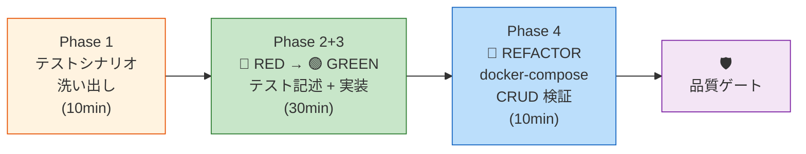
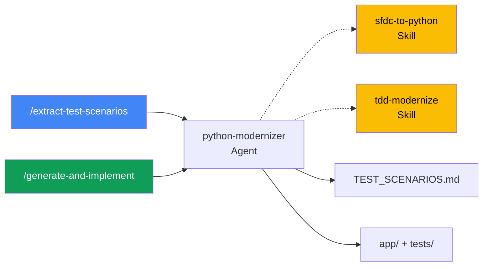
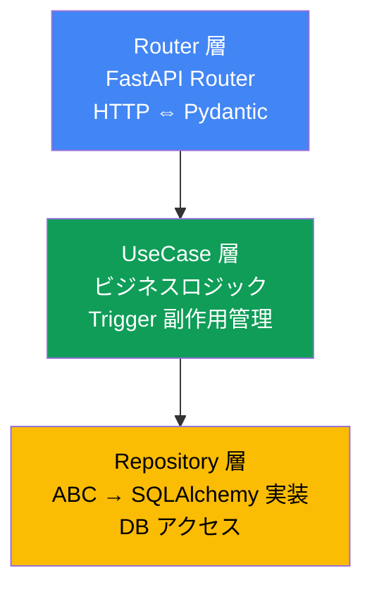

# Step 3: TDD によるコードモダナイズ PoC — Python（13:45 – 14:45）

> [!IMPORTANT]
> **「コードを書いてからテストを書く」のではなく、「テストを先に書いてから実装する」。**
> Apex の既存動作をテストシナリオとして先に定義することで、SFDC の実行ケースがデグレしないことを機械的に保証する。

## 🎯 ゴール

Step 0 で選定した代表1コンポーネントを TDD で Python（FastAPI）に変換し、docker-compose でコンテナ間 CRUD 検証まで行う。

| 成果物 | 出力先 |
|--------|--------|
| テストシナリオ一覧 | `03-code-modernization/output/TEST_SCENARIOS.md` |
| Python プロジェクト | `03-code-modernization/output/app/` |
| テストコード | `03-code-modernization/output/tests/` |
| Dockerfile | `03-code-modernization/output/Dockerfile` |
| 依存定義 | `03-code-modernization/output/requirements.txt` |

---

## 全体フロー



### 使用するコマンド・Agent・Skill



---

## Phase 1: テストシナリオの洗い出し（10分）

> **何をするか**: Apex のテストクラスの assert や REST エンドポイントから、移行後に検証すべきテストシナリオを抽出する。
> **コードの変換は一切行わない** — テストシナリオの定義だけに集中する。

```
/extract-test-scenarios ./examples
```

**AI が参照する入力**:
- **主入力**: Step 1 の `wiki/classes/`（メソッド一覧・依存関係・ビジネスルール）
- **主入力**: Step 1 の `system_overview.md`（API 仕様・テストケース一覧）
- **補足**: 生の Apex テストクラス（Wiki に assert 詳細が不足している場合のみ）

**期待される出力** (`TEST_SCENARIOS.md`):

| # | カテゴリ | シナリオ | 期待結果 | 元の Apex コード箇所 |
|---|---------|---------|---------|---------------------|
| 1 | GET 正常系 | 一覧取得（パラメータなし） | 200 + JSON 配列 | `getVisits()` |
| 2 | POST 正常系 | 新規作成（子レコード付き） | 201 + 作成結果 | `createVisit()` |
| 3 | POST 異常系 | 必須項目欠損 | 400 + エラー | `createVisit()` |
| 4 | PATCH 正常系 | ステータス遷移（Draft → Submitted） | 200 + 更新結果 | `updateStatus()` |
| 5 | PATCH 異常系 | 不正遷移（Approved → Draft） | 400 + エラー | `updateStatus()` |
| 6 | DELETE 正常系 | Draft の削除 | 204 | `deleteVisit()` |
| 7 | Trigger | ステータス変更時の親レコード更新 | 最終訪問日が更新される | `TriggerHandler` |
| 8 | 境界値 | Rating の上限/下限 | 1.0 ≤ rating ≤ 5.0 | `@HttpPatch` |

---

## Phase 2+3: 🔴 RED → 🟢 GREEN — テスト + 実装（30分）

> **何をするか**: テストシナリオに基づいて pytest テストコードを生成し（🔴 RED = 全テスト FAIL）、
> 次にそのテストを PASS させる実装コードを生成する（🟢 GREEN = 全テスト PASS）。

```
/generate-and-implement
```

**AI が参照する入力**:
- テストシナリオ: `03-code-modernization/output/TEST_SCENARIOS.md`
- 統合設計書: `01-reverse-engineering/output/system_overview.md`（API 仕様・ステータス遷移・副作用マップ）
- Code Wiki: `01-reverse-engineering/output/wiki/classes/`（Apex クラスの詳細ロジック）
- DDL: `02-schema-migration/output/generated_ddl.sql`（SQLAlchemy モデル生成のベース）

**AI が自律的に実行する内容**:

### 🔴 RED Phase
1. pytest テストコード + スタブ構造を生成
2. テスト実行 → **全テスト FAIL を確認**

### 🟢 GREEN Phase
1. 全テスト PASS するように実装コードを生成
2. テスト実行 → **全テスト PASS を確認**

### 生成されるプロジェクト構造

```
03-code-modernization/output/
├── app/
│   ├── __init__.py
│   ├── main.py              ← FastAPI app 定義
│   ├── config.py            ← pydantic-settings（環境変数）
│   ├── db.py                ← SQLAlchemy エンジン + セッション
│   ├── models/
│   │   └── {entity}.py      ← SQLAlchemy モデル
│   ├── schemas/
│   │   └── {entity}.py      ← Pydantic リクエスト/レスポンス
│   ├── router/
│   │   └── {entity}_router.py ← FastAPI Router
│   ├── usecase/
│   │   └── {entity}_usecase.py ← ビジネスロジック
│   └── repository/
│       ├── base.py           ← ABC（インターフェース）
│       └── {entity}_repository.py ← SQLAlchemy 実装
├── tests/
│   ├── conftest.py           ← 共通フィクスチャ
│   ├── test_model.py
│   ├── test_usecase.py
│   └── test_router.py
├── requirements.txt
├── pyproject.toml
└── Dockerfile                ← マルチステージ + nonroot
```

### アーキテクチャ（3層レイヤー分離）



- **Router**: HTTP リクエストの受付とレスポンス整形のみ（ロジックを持たない）
- **UseCase**: ビジネスロジック集約。Trigger の副作用（親レコード更新等）もここで明示的に管理
- **Repository**: DB アクセスの抽象化。ABC でインターフェースを定義し、テスト時はモックに差し替え

---

## Phase 4: 🔵 REFACTOR — docker-compose CRUD 検証（10分）

> **何をするか**: Step 2 で構築した PostgreSQL コンテナとアプリコンテナを接続し、
> **実際の DB に対して CRUD 操作**を検証する。

### コンテナの起動

```bash
# アプリ + DB をコンテナ間で接続して起動
docker compose up -d --build

# アプリの起動確認
docker compose logs app
# 期待: "Application startup complete" + DB 接続成功ログ
```

### CRUD 検証

```bash
# GET: 一覧取得（Step 2 で投入した実データが返ることを確認）
curl -s http://localhost:8080/api/v1/store-visits | python3 -m json.tool

# POST: 新規作成
curl -s -X POST http://localhost:8080/api/v1/store-visits \
  -H "Content-Type: application/json" \
  -d '{"store_id": "...", "visit_date": "2026-04-27", "status": "Draft"}' \
  | python3 -m json.tool

# PATCH: ステータス遷移
curl -s -X PATCH http://localhost:8080/api/v1/store-visits/{id} \
  -H "Content-Type: application/json" \
  -d '{"status": "Submitted"}' | python3 -m json.tool

# DELETE: 削除
curl -s -X DELETE http://localhost:8080/api/v1/store-visits/{id}

# DB 側で反映を確認
docker compose exec db psql -U app_user -d migration_db \
  -c "SELECT * FROM store_visits ORDER BY created_at DESC LIMIT 5;"
```

---

## 3-5. 機械的検証 + 品質ゲート

```bash
# Step 2 → Step 3 のデータ整合性を機械的にチェック
./scripts/verify-consistency.sh 2-3
```

### 独立コンテキストレビュー（推奨）

```bash
/clear
/review-gate 3
/clear
```

### Apex の機能等価性チェックリスト

| # | Apex の動作 | Python API テスト | 結果 |
|---|-----------|-----------------|------|
| 1 | `@HttpGet` フィルタ付き一覧 | `GET /api/v1/store-visits?status=...` | ☐ |
| 2 | `@HttpPost` 子レコード一括作成 | `POST /api/v1/store-visits` | ☐ |
| 3 | `@HttpPatch` 正常遷移 | `PATCH ...` Draft → Submitted | ☐ |
| 4 | `@HttpPatch` 不正遷移の拒否 | `PATCH ...` → 400 | ☐ |
| 5 | `@HttpDelete` 条件付き削除 | `DELETE ...` → Draft のみ可 | ☐ |
| 6 | CASCADE 削除 | 親削除時に子レコードも消える | ☐ |

> [!TIP]
> TDD により、**Apex の既存動作がテストとして明文化**される。
> さらに docker-compose によるコンテナ間 CRUD 検証で、**本番に近い構成での動作保証**も得られる。
