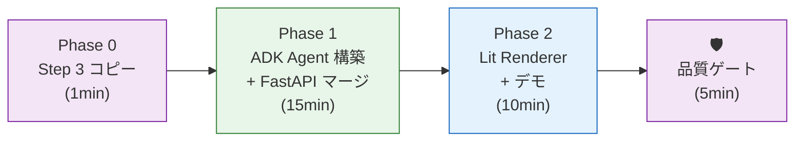
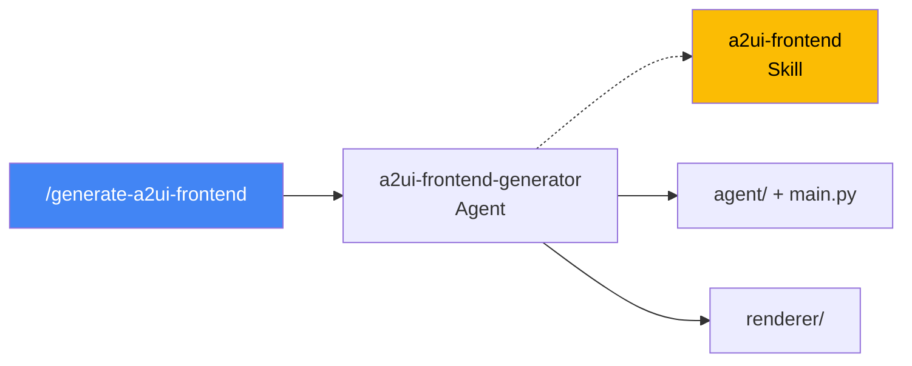
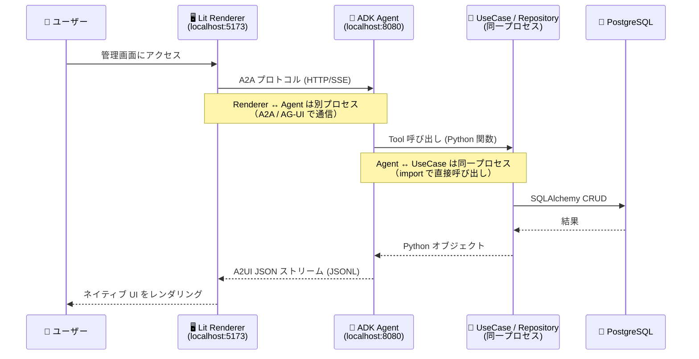

# Step 4: A2UI フロントエンド生成 — リッチ管理画面の自動構築（15:00 – 15:30）

> [!IMPORTANT]
> **「Backend の API を curl で叩く」だけで終わらせない。**
> Step 3 で構築した FastAPI の REST API を、AI が A2UI プロトコルで宣言的 UI に変換し、
> ブラウザで動くリッチな管理画面として参加者に「見せる」ことで、移行の完成度を体感する。

## 🎯 ゴール

Step 3 の FastAPI Backend に ADK Agent（A2UI 対応）をマージし、Lit Renderer で CRUD 操作可能なフロントエンドを自動生成する。

| 成果物 | 出力先 | 由来 |
|--------|--------|------|
| FastAPI Backend（コピー） | `04-frontend-a2ui/output/app/` | Step 3 からコピー |
| pytest テスト（コピー） | `04-frontend-a2ui/output/tests/` | Step 3 からコピー |
| ADK Agent コード | `04-frontend-a2ui/output/agent/` | 🆕 本 Step |
| FastAPI + ADK マージ main | `04-frontend-a2ui/output/main.py` | 🆕 本 Step |
| A2UI テンプレート定義 | `04-frontend-a2ui/output/agent/prompt_builder.py` | 🆕 本 Step |
| データアクセス Tool | `04-frontend-a2ui/output/agent/tools.py` | 🆕 本 Step |
| Lit Renderer | `04-frontend-a2ui/output/renderer/` | 🆕 本 Step |

> [!NOTE]
> **`04-frontend-a2ui/output/` が最終成果物ディレクトリ**。Step 3 の Backend + Step 4 の Frontend が統合され、
> このディレクトリだけで `docker compose up` 可能な自己完結型アーティファクトになる。
> Step 3 の `03-code-modernization/output/` は「Backend のみ」の原本として残る。

---

## 全体フロー



### 使用するコマンド・Agent・Skill



---

## A2UI とは

[A2UI](https://a2ui.org/)（Agent-to-UI）は Google が公開する OSS プロトコル。
AI エージェントが **宣言的な JSON** で UI を定義し、クライアントが **ネイティブコンポーネント** で描画する。

### データフロー



> [!IMPORTANT]
> **Agent の Tool は REST API を HTTP で呼ぶのではない。**
> `get_fast_api_app()` で Agent と FastAPI Backend が同一プロセスにいるため、
> Tool は Step 3 の UseCase/Repository 層を **Python 関数として直接 import して呼び出す**。
> つまり HTTP オーバーヘッドなしの in-process 呼び出し。

**SFDC 移行の文脈での位置づけ:**
| SFDC 技術 | Google Cloud 移行先 |
|----------|-------------------|
| Visualforce / LWC | **A2UI + Lit Renderer** ← 本 Step |
| Apex REST | FastAPI（Step 3） |
| SOQL | PostgreSQL + SQLAlchemy（Step 2-3） |

> [!TIP]
> SFDC の Lightning Web Components (LWC) は Web Components ベース。A2UI の Lit Renderer も Web Components ベース。
> つまり **概念的な移行コストが最も低い** 組み合わせであり、「LWC の自然な後継」として説明できる。

---

## Phase 0: Step 3 成果物のコピー（1min）

> **何をするか**: Step 3 の Backend 成果物を Step 4 のディレクトリにコピーし、最終成果物のベースを作る。

```bash
# Step 3 の成果物を 04 にコピー
cp -r 03-code-modernization/output/* 04-frontend-a2ui/output/
```

> [!IMPORTANT]
> `/generate-a2ui-frontend` コマンドがこのコピーを **自動実行** します。手動で行う必要はありません。
> Step 3 の原本 `03-code-modernization/output/` はそのまま残ります。

---

## Phase 1: ADK Agent 構築 + FastAPI マージ（15min）

> **何をするか**: コピーした FastAPI アプリに ADK Agent をマージし、A2UI 対応の管理画面エージェントを構築する。

```
/generate-a2ui-frontend
```

**AI が参照する入力**:
- **主入力**: Step 1 の `system_overview.md`（API 仕様・エンティティ一覧）
- **主入力**: Step 3 の `app/router/`（FastAPI Router 定義）
- **主入力**: Step 3 の `app/model/schemas.py`（Pydantic スキーマ）

**AI が自律的に実行する内容**:

### 1. ADK Agent 定義

```python
# agent/agent.py
from google.adk.agents.llm_agent import Agent
from a2ui.schema.constants import VERSION_0_8
from a2ui.schema.manager import A2uiSchemaManager
from a2ui.basic_catalog.provider import BasicCatalog

schema_manager = A2uiSchemaManager(
    version=VERSION_0_8,
    catalogs=[BasicCatalog.get_config(version=VERSION_0_8)],
)

A2UI_INSTRUCTION = schema_manager.generate_system_prompt(
    role_description="You are a SFDC migration management UI assistant.",
    ui_description=UI_DESCRIPTION,  # prompt_builder.py で定義
    include_schema=True,
    include_examples=True,
)

root_agent = Agent(
    model="gemini-2.5-flash",
    name="migration_ui_agent",
    description="Generates rich management UI for migrated SFDC data.",
    instruction=A2UI_INSTRUCTION,
    tools=[list_visits, get_visit, create_visit, update_visit_status],
)
```

### 2. Tool 定義（UseCase 層の直接呼び出し）

> [!IMPORTANT]
> Tool は REST API を HTTP で呼ぶのではなく、**Step 3 の UseCase / Repository 層を Python 関数として直接呼び出す**。
> `get_fast_api_app()` で同一プロセスにいるため、HTTP オーバーヘッドなしで import できる。

```python
# agent/tools.py
import json
from google.adk.tools.tool_context import ToolContext
from app.usecase.store_visit_usecase import StoreVisitUseCase
from app.dependencies import get_session  # DI

def list_visits(tool_context: ToolContext) -> str:
    """訪問記録の一覧を取得する。"""
    session = get_session()
    usecase = StoreVisitUseCase(session)
    visits = usecase.list_all()
    return json.dumps([v.dict() for v in visits])

def create_visit(store_id: str, visit_date: str, purpose: str,
                 rating: int, tool_context: ToolContext) -> str:
    """新しい訪問記録を作成する。"""
    session = get_session()
    usecase = StoreVisitUseCase(session)
    visit = usecase.create(store_id=store_id, visit_date=visit_date,
                           purpose=purpose, rating=rating)
    return json.dumps(visit.dict())
```

### 3. FastAPI マージ（`get_fast_api_app()`）

```python
# main.py — ADK 公式パターン
import os
from google.adk.cli.fast_api import get_fast_api_app

# ADK が FastAPI app を生成（A2A エンドポイントを自動マウント）
app = get_fast_api_app(
    agents_dir=os.path.join(os.path.dirname(__file__), "agent"),
    allow_origins=["*"],
    web=True,
)

# Step 3 の既存 Router を追加マウント（Swagger UI / curl での手動確認用）
# → Agent の Tool がこの REST API を呼ぶわけではない。Tool は UseCase を直接呼ぶ。
from app.router import store_visit_router  # Step 3 の成果物
app.include_router(store_visit_router, prefix="/api/v1")
```

> [!NOTE]
> **`include_router()` の目的**: Agent の Tool が REST API を呼ぶためではなく、
> **Swagger UI (`/docs`) や `curl` での手動動作確認用**。
> Agent は Python in-process で UseCase 層を直接呼ぶため、REST レイヤーを経由しない。

### 3. A2UI コンポーネント変換パターン

| FastAPI Router | A2UI コンポーネント | 用途 |
|---------------|-------------------|------|
| `GET /list` | Card + List + Text | エンティティ一覧表示 |
| `POST /create` | TextField + DateTimeInput + Button | 新規作成フォーム |
| `PATCH /update` | ChoicePicker + Button | ステータス遷移 |
| `DELETE /delete` | Button + Modal | 確認付き削除 |
| ダッシュボード | Row + Column + Card | サマリ表示 |

---

## Phase 1.5: Vertex AI 環境変数の設定

> [!IMPORTANT]
> ADK は **Vertex AI 経由 (`GOOGLE_GENAI_USE_VERTEXAI=TRUE`)** で Gemini を呼び出す。
> `GOOGLE_API_KEY` は使わない（ADC のみ）。実行時に以下 2 つの環境変数を **必ず** 注入すること。

| 変数 | 必須 | 例 | 備考 |
|------|-----|----|------|
| `GOOGLE_CLOUD_PROJECT` | ✅ | `my-gcp-project` | Vertex AI を有効化済みの GCP プロジェクト ID |
| `GOOGLE_CLOUD_LOCATION` | ✅ | `us-central1` | Gemini をデプロイした Vertex AI リージョン |
| `GOOGLE_APPLICATION_CREDENTIALS` | ローカル時のみ | `/path/to/sa.json` | `gcloud auth application-default login` 済みなら不要 |

### ローカル実行（venv 直接）

```bash
export GOOGLE_CLOUD_PROJECT=my-gcp-project
export GOOGLE_CLOUD_LOCATION=us-central1
gcloud auth application-default login   # 初回のみ
cd 04-frontend-a2ui/output && python main.py
```

### Docker 実行（ローカルから ADC をマウント）

```bash
docker build -t a2ui-frontend ./04-frontend-a2ui/output
docker run --rm -p 8080:8080 \
  -e GOOGLE_CLOUD_PROJECT=my-gcp-project \
  -e GOOGLE_CLOUD_LOCATION=us-central1 \
  -v ~/.config/gcloud:/home/app/.config/gcloud:ro \
  a2ui-frontend
```

### Cloud Run / GKE

```bash
# Cloud Run の場合（ADC は Runtime Service Account から自動）
gcloud run deploy a2ui-frontend \
  --source ./04-frontend-a2ui/output \
  --set-env-vars=GOOGLE_CLOUD_PROJECT=my-gcp-project,GOOGLE_CLOUD_LOCATION=us-central1,GOOGLE_GENAI_USE_VERTEXAI=TRUE \
  --service-account=adk-runtime@my-gcp-project.iam.gserviceaccount.com
```

> [!TIP]
> SA には最小限 `roles/aiplatform.user`（Vertex AI 呼び出し）と
> `roles/cloudsql.client`（ADK セッション永続化を Cloud SQL にする場合）を付与する。

---

## Phase 2: Lit Renderer + デモ（10min）

> **何をするか**: A2UI 公式の Lit Renderer をセットアップし、ブラウザで実際に CRUD 操作を実行する。

### Renderer 起動

```bash
# Lit Renderer を起動
cd 04-frontend-a2ui/output/renderer
npm install
npm run dev
# → http://localhost:5173 でアクセス
```

### CRUD デモ

```bash
# ブラウザで http://localhost:5173 にアクセスし、以下を実行:

# 1. 一覧表示: Agent に「全件表示して」→ Card + List で表示
# 2. 新規作成: Agent に「新しいレコードを作成して」→ TextField フォームが表示
# 3. ステータス更新: Agent に「Draft → Submitted に変更して」→ ChoicePicker で遷移
# 4. 削除: Agent に「このレコードを削除して」→ Modal 確認ダイアログ
```

### E2E データフロー確認

```bash
# Backend API が正しく動作していることを確認
curl -s http://localhost:8080/api/v1/store-visits | python3 -m json.tool

# Agent エンドポイントが動作していることを確認
curl -s http://localhost:8080/list-agents | python3 -m json.tool
```

---

## 品質ゲート（5min）

```bash
# Step 3 → Step 4 のデータ整合性チェック
./scripts/verify-consistency.sh 3-4
```

### 独立コンテキストレビュー（推奨）

```bash
/clear
/review-gate 4
/clear
```

### A2UI 統合チェックリスト

| # | 検証項目 | 結果 |
|---|---------|------|
| 1 | `get_fast_api_app()` で FastAPI + ADK Agent が同一プロセスで起動する | ☐ |
| 2 | 既存 REST API（`/api/v1/...`）が引き続き動作する | ☐ |
| 3 | Agent が A2UI JSON を正しく生成する（スキーマバリデーション通過） | ☐ |
| 4 | Lit Renderer がブラウザで UI を描画する | ☐ |
| 5 | CRUD 操作（Create/Read/Update/Delete）が E2E で動作する | ☐ |
| 6 | ステータス遷移が ChoicePicker で視覚的に実行できる | ☐ |

> [!TIP]
> A2UI により、**curl でしか確認できなかった CRUD 操作** が **ブラウザのリッチな UI** で実行可能になる。
> これは経営層へのデモとしてインパクトが大きく、「本番移行後の姿」を具体的にイメージさせる効果がある。
