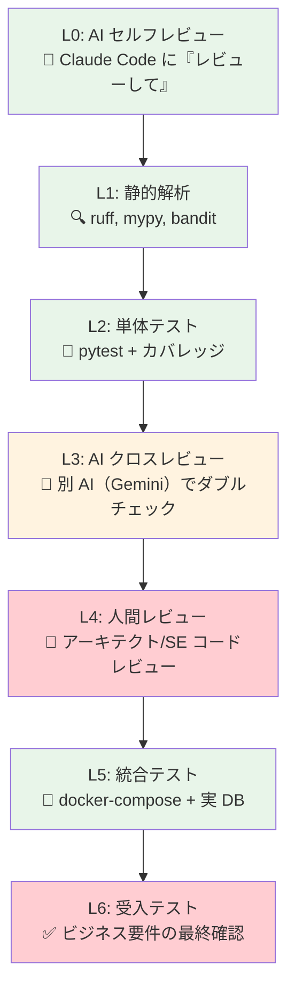
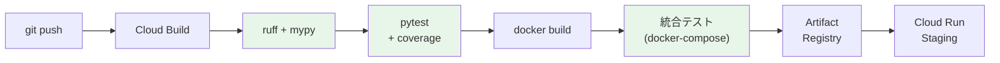

# Step 4: AI 成果物の品質評価＆デリバリー戦略（15:00 – 15:45）

> [!NOTE]
> コンテナ化は Step 3 で完了済み。本 Step では **AI 駆動開発の成果物をどう評価すべきか** にフォーカスする。

## 🎯 ゴール

- docker-compose 環境での統合テスト実施
- AI 駆動開発における品質保証フレームワークの策定
- CI パイプラインに組み込む品質ゲートの議論

---

## 4-1. docker-compose 統合テスト（15分）

Step 3 で構築した docker-compose 環境を使い、統合テストを実施。

### テスト実行

```bash
cd workshop-real

# docker-compose 上で統合テスト実行
docker compose run --rm app pytest tests/ -v --tb=short

# データ整合性検証 SQL を PostgreSQL コンテナで実行
docker compose exec db psql -U app_user -d migration_db \
  -f /workspace/02-schema-migration/output/data_validation.sql
```

### 静的解析

```bash
# docker-compose 上で ruff（リンター）実行
docker compose run --rm app ruff check app/

# 型チェック
docker compose run --rm app mypy app/ --ignore-missing-imports

# セキュリティスキャン
docker compose run --rm app bandit -r app/
```

---

## 4-2. AI 駆動開発の成果物品質評価フレームワーク（30分）— 議論中心

> [!IMPORTANT]
> AI がコードを生成する時代において、**どこに品質ゲートを設置すべきか**？
> この議論は、ワークショップ後の本番移行プロジェクトの品質方針を決定する重要なディスカッション。

### 品質ゲートの多層防御モデル



| レベル | 品質ゲート | ツール/手法 | 自動化 | 信頼度 |
|--------|-----------|------------|--------|--------|
| L0 | AI セルフレビュー | Claude Code に「レビューして」 | ✅ 自動 | 🔶 中 |
| L1 | 静的解析 | ruff, mypy, bandit | ✅ CI | ✅ 高 |
| L2 | 単体テスト | pytest + カバレッジ | ✅ CI | ✅ 高 |
| L3 | AI クロスレビュー | 別 AI（Gemini）でダブルチェック | 🔶 半自動 | 🔶 中 |
| L4 | 人間レビュー | アーキテクト/SE コードレビュー | ❌ 手動 | ✅ 高 |
| L5 | 統合テスト | docker-compose + 実 DB | ✅ CI | ✅ 高 |
| L6 | 受入テスト | ビジネス要件の最終確認 | ❌ 手動 | ✅ 最高 |

### 💬 議論ポイント

#### 1. AI の信頼境界

> AI が生成したコードの**信頼境界**はどこに設定すべきか？

- **L0〜L2 で十分**な場合: ユーティリティ関数、設定ファイル、Dockerfile 等
- **L4（人間レビュー）が必須**な場合: ビジネスロジック、セキュリティ関連、データアクセス層
- **L6（受入テスト）が必須**な場合: 金額計算、承認フロー、コンプライアンス要件

#### 2. AI バイアスの防止

> 「AI が書いたから完璧」というバイアスをどう防ぐか？

- **TDD を徹底**: テストを先に書くことで、AI の出力を「仕様」で縛る
- **AI クロスレビュー**: Claude が書いたコードを Gemini にレビューさせる（逆も可）
- **メトリクス**: カバレッジ率、静的解析スコアの定量基準を設定

#### 3. CI パイプライン設計



- L1 + L2 は CI で**必須ゲート**（Fail なら即中止）
- L5（統合テスト）は CI で**推奨ゲート**（Fail なら警告）
- L4（人間レビュー）は PR マージ前に**必須**

#### 4. 今日のワークショップでの品質実績

| ゲート | 実施結果 |
|--------|---------|
| TDD（テスト先行） | ☐ テストシナリオ X 件 |
| 単体テスト | ☐ X 件 PASS, カバレッジ X% |
| docker-compose 統合 | ☐ CRUD 全操作成功 |
| AI セルフレビュー | ☐ 各 Step で実施 |

---

## ✅ Step 4 完了チェック

- [ ] 統合テストが docker-compose 上で PASS
- [ ] 品質ゲートのレベル（L0〜L6）について合意
- [ ] CI パイプラインに組み込むゲートの方針が決定
