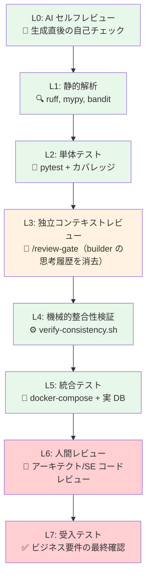
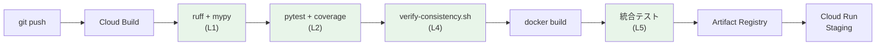

# Step 5: AI 成果物の品質評価＆デリバリー戦略（15:30 – 16:00）

> [!NOTE]
> コンテナ化は Step 3 で完了済み。本 Step では **AI 駆動開発の成果物をどう評価すべきか** にフォーカスする。
> このワークショップに組み込まれた品質インフラ（独立コンテキストレビュー、スコアリングルーブリック、機械的検証）を
> **本番移行プロジェクトの CI パイプラインにどう組み込むか** を議論する。

## 🎯 ゴール

- docker-compose 環境での統合テスト実施
- AI 駆動開発における品質保証フレームワークの評価
- CI パイプラインに組み込む品質ゲートの方針決定

---

## 5-1. docker-compose 統合テスト（15分）

### テスト実行

```bash
# docker-compose 上で統合テスト実行
docker compose run --rm app pytest tests/ -v --tb=short

# データ整合性検証 SQL を PostgreSQL コンテナで実行
docker compose exec db psql -U app_user -d migration_db \
  -f /workspace/02-schema-migration/output/data_validation.sql
```

### 静的解析

```bash
# docker-compose 上で ruff（リンター）実行
docker compose run --rm app ruff check app/

# 型チェック
docker compose run --rm app mypy app/ --ignore-missing-imports

# セキュリティスキャン
docker compose run --rm app bandit -r app/
```

---

## 5-2. ワークショップの品質実績確認（10分）

> ワークショップ中に実施した品質チェックの結果を、`workshop-state.json` から集計する。

```bash
# workshop-state.json から全 Step のスコアを確認
cat workshop-state.json | jq '.steps'
```

### 今日の品質実績

| ゲート | 実施方法 | 結果 |
|--------|---------|------|
| Step 1: 独立コンテキストレビュー | `/review-gate 1` | ☐ PASS / FAIL |
| Step 2: 機械的整合性検証 | `verify-consistency.sh 1-2` | ☐ PASS / FAIL |
| Step 2: 独立コンテキストレビュー | `/review-gate 2` | ☐ PASS / FAIL |
| Step 3: TDD（テスト先行） | `pytest -v` | ☐ X 件 PASS |
| Step 3: 独立コンテキストレビュー | `/review-gate 3` | ☐ PASS / FAIL |
| Step 4: A2UI フロントエンド検証 | `/review-gate 4` | ☐ PASS / FAIL |
| 統合テスト（docker-compose） | `pytest tests/` | ☐ CRUD 全操作成功 |

---

## 5-3. 品質ゲートのフレームワーク議論（20分）— ディスカッション

> [!IMPORTANT]
> AI がコードを生成する時代において、**どこに品質ゲートを設置すべきか**？
> この議論は、本番移行プロジェクトの品質方針を決定する重要なディスカッション。

### 品質ゲートの多層防御モデル



| レベル | 品質ゲート | ツール/手法 | 自動化 | 信頼度 |
|--------|-----------|------------|--------|--------|
| L0 | AI セルフレビュー | 各コマンド内蔵 | ✅ 自動 | 🔶 中 |
| L1 | 静的解析 | ruff, mypy, bandit | ✅ CI | ✅ 高 |
| L2 | 単体テスト | pytest + カバレッジ | ✅ CI | ✅ 高 |
| L3 | **独立コンテキストレビュー** | `/review-gate` + `quality-rubric` | ✅ 自動 | ✅ 高 |
| L4 | **機械的整合性検証** | `verify-consistency.sh` | ✅ CI | ✅ 高 |
| L5 | 統合テスト | docker-compose + 実 DB | ✅ CI | ✅ 高 |
| L6 | 人間レビュー | アーキテクト/SE コードレビュー | ❌ 手動 | ✅ 高 |
| L7 | 受入テスト | ビジネス要件の最終確認 | ❌ 手動 | ✅ 最高 |

> [!TIP]
> **L3 の独立コンテキストレビューが、このワークショップの品質インフラの核心。**
> Builder と Reviewer のコンテキストを分離することで、AI のセルフ・レニエンシー（甘い自己評価）を排除する。
> L0（セルフレビュー）だけでは「自分が書いたコードを自分でレビューする」バイアスが発生する。

### 💬 議論ポイント

#### 1. AI の信頼境界

> AI が生成したコードの**信頼境界**はどこに設定すべきか？

- **L0〜L2 で十分**な場合: ユーティリティ関数、設定ファイル、Dockerfile 等
- **L6（人間レビュー）が必須**な場合: ビジネスロジック、セキュリティ関連、データアクセス層
- **L7（受入テスト）が必須**な場合: 金額計算、承認フロー、コンプライアンス要件

#### 2. 定量的スコアリング（quality-rubric）

> ワークショップでは、`.claude/skills/quality-rubric/SKILL.md` に定義された **5軸 × 5段階** のスコアリングルーブリックを使用。

| 軸 | 評価基準 |
|----|---------|
| 設計の正確性 | 元の仕様との一致度 |
| コード品質 | レイヤー分離、命名、エラーハンドリング |
| テスト品質 | カバレッジ、境界値、パラメタライズ |
| ドキュメント | 設計書の完成度、Mermaid 図の正確性 |
| 運用考慮 | Dockerfile、ログ、ヘルスチェック |

#### 3. CI パイプライン設計



- L1 + L2 + L4 は CI で**必須ゲート**（Fail なら即中止）
- L5（統合テスト）は CI で**推奨ゲート**（Fail なら警告）
- L6（人間レビュー）は PR マージ前に**必須**

---

## ✅ Step 5 完了チェック

- [ ] 統合テストが docker-compose 上で PASS
- [ ] 品質ゲートのレベル（L0〜L7）について合意
- [ ] CI パイプラインに組み込むゲートの方針が決定
- [ ] `workshop-state.json` に Step 5 の結果が記録されている
