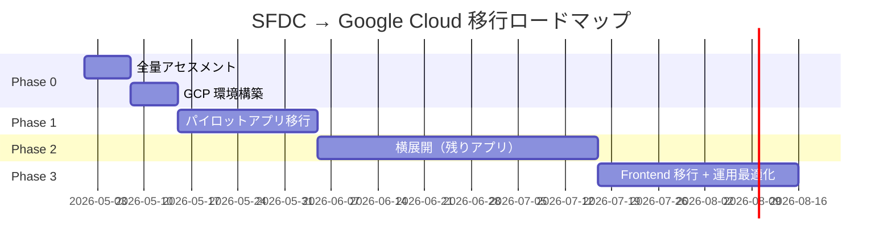

# Step 5: 移行ロードマップ策定（15:45 – 16:30）

## 🎯 ゴール

本日のワークショップの成果を踏まえ、全量移行に向けたロードマップを策定する。

| 成果物 | 出力先 |
|--------|--------|
| ADR（技術選定の意思決定記録） | `05-roadmap/output/adr.md` |
| 移行ロードマップ | `05-roadmap/output/roadmap.md` |
| アクションアイテム一覧 | `05-roadmap/output/action_items.md` |

---

## 5-1. ADR の自動生成（15分）

本日の議論と成果物を Claude Code に渡し、ADR を自動生成する。

### プロンプト

```markdown
# 指示
本日のワークショップで決定したアーキテクチャ方針について、ADR を生成してください。

# ADR フォーマット
## ADR-XXX: [タイトル]
- **ステータス**: 承認済
- **日付**: 2026-04-XX
- **コンテキスト**: なぜこの決定が必要だったか
- **決定**: 何を決定したか
- **理由**: なぜその選択肢を採用したか（代替案との比較）
- **結果**: この決定による影響・トレードオフ

# 生成すべき ADR
1. ADR-001: Backend 言語選定（Python / FastAPI）
   - 代替案: Go, TypeScript (NestJS)
2. ADR-002: DB エンジン選定（Cloud SQL PostgreSQL）
   - 代替案: AlloyDB, Cloud Spanner
3. ADR-003: コンテナ基盤選定（Cloud Run）
   - 代替案: GKE Autopilot
4. ADR-004: AI 駆動開発における品質保証方針
   - TDD の採用理由、品質ゲートの設計
5. ADR-005: コンテナ間通信の設計（docker-compose → Cloud Run + Cloud SQL）
   - ローカル開発と本番環境の構成差異の管理

# Mermaid 図の生成
ADR の末尾に以下を含めること:
- アーキテクチャ全体図（graph TD）
- SFDC → Google Cloud マッピング図（graph LR）

# 出力先
workshop-real/05-roadmap/output/adr.md
```

---

## 5-2. Phase 分割ロードマップ（15分）

### 提案ロードマップ



| Phase | 期間目安 | 内容 | 主な成果物 |
|-------|---------|------|-----------|
| **Phase 0** | 1-2週間 | 全量アセスメント + GCP 環境構築 | 全コンポーネント影響分析、Terraform 環境 |
| **Phase 1** | 2-4週間 | パイロットアプリ 1本の完全移行 | 本番動作する Python API + CI/CD + データ移行 |
| **Phase 2** | 4-8週間 | 残りアプリの横展開 | プロンプトテンプレート再利用で効率化 |
| **Phase 3** | 4週間〜 | Frontend 移行 + 運用最適化 | Next.js フロントエンド、Cloud Monitoring |

### Phase 0 の詳細（ワークショップ後すぐ着手）

| # | タスク | 担当 | 期間 |
|---|--------|------|------|
| 0-1 | 全 Apex クラス/Trigger/Batch の影響分析（AI 活用） | SE + AI | 3日 |
| 0-2 | 全カスタムオブジェクトの DDL 変換 | SE + AI | 2日 |
| 0-3 | 移行優先度の決定（ビジネスインパクト × 難易度） | PM + アーキテクト | 1日 |
| 0-4 | GCP 環境構築（Terraform） | インフラ SE | 3日 |
| 0-5 | CI/CD パイプライン構築（Cloud Build） | インフラ SE | 2日 |
| 0-6 | パイロットアプリの選定・承認 | PM | 1日 |

### Phase 1 で再利用できるワークショップ成果物

| 成果物 | Phase 1 での利用方法 |
|--------|-------------------|
| `templates/reverse-engineering-prompt.md` | 全アプリの設計逆起こしに再利用 |
| `templates/schema-conversion-prompt.md` | 全オブジェクトの DDL 変換に再利用 |
| `templates/code-modernization-prompt.md` | 全 Apex の Python 変換に再利用 |
| `docker-compose.yml` | ローカル開発環境のテンプレート |
| 品質ゲートフレームワーク | CI パイプラインの設計に反映 |

---

## 5-3. ネクストステップの確定（15分）

### 💬 議論ポイント

1. **パイロットアプリの選定**
   - Step 1 の影響分析結果を踏まえて、最適なパイロットアプリは？
   - 難易度 S or M のコンポーネントが望ましい

2. **体制と役割分担**
   - Google 側: アーキテクチャレビュー、AI プロンプト最適化、GCP 環境
   - お客様側: ビジネス要件の確認、テストデータ準備、受入テスト
   - パートナー: 実装、テスト、CI/CD 構築

3. **次回のマイルストーン**
   - Phase 0 完了報告会: ○月○日
   - Phase 1 キックオフ: ○月○日

### アクションアイテム

Claude Code に「本日の議論内容を踏まえたアクションアイテム一覧を生成してください」と指示。

| # | アクションアイテム | 担当 | 期限 | ステータス |
|---|------------------|------|------|-----------|
| 1 | 全量アセスメントの実施 | | | ☐ |
| 2 | パイロットアプリの最終選定 | | | ☐ |
| 3 | GCP プロジェクトの本番環境構築 | | | ☐ |
| 4 | データ移行計画の詳細化 | | | ☐ |
| 5 | プロンプトテンプレートのカスタマイズ | | | ☐ |

---

## Step 6: クロージング（16:30 – 17:00）

### 本日の振り返り

```bash
# 全 Step 成果物の最終確認
echo "==========================================="
echo "🎯 全 Step 成果物チェック"
echo "==========================================="

for dir in 01-reverse-engineering 02-schema-migration 03-code-modernization 04-quality-and-delivery 05-roadmap; do
  echo ""
  echo "--- $dir ---"
  if [ -d "$dir/output" ]; then
    ls -la "$dir/output/" | grep -v "^total" | grep -v "^d"
  else
    echo "  (output/ なし)"
  fi
done

echo ""
echo "--- docker-compose ---"
docker compose ps
echo ""
echo "==========================================="
```

### クリーンアップ

```bash
# コンテナの停止・削除
docker compose down -v

# Git コミット
git add workshop-real/
git commit -m "ワークショップ完了: 全 Step の成果物を格納"
```
