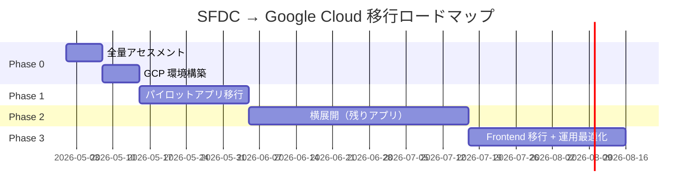

# Step 6: 移行ロードマップ策定（16:00 – 16:45）

## 🎯 ゴール

本日のワークショップの成果を踏まえ、全量移行に向けたロードマップを策定する。

| 成果物 | 出力先 |
|--------|--------|
| ADR（技術選定の意思決定記録） | `06-roadmap/output/adr.md` |
| 移行ロードマップ | `06-roadmap/output/roadmap.md` |
| アクションアイテム一覧 | `06-roadmap/output/action_items.md` |

---

## 6-1. ADR の自動生成（15分）

> **何をするか**: ワークショップで決定したアーキテクチャ方針を、ADR（Architecture Decision Record）として記録する。
> 全 Step の成果物を AI に渡し、議論と結果を構造化されたドキュメントに変換する。

```
/generate-adr
```

**AI が参照する入力**:
- `01-reverse-engineering/output/`（設計書、影響分析）
- `02-schema-migration/output/`（DDL、データ移行）
- `03-code-modernization/output/`（Python プロジェクト、テスト）
- `04-frontend-nextjs/output/`（Next.js 設計書 + 実装、BFF Route Handler）
- `05-quality-and-delivery/output/`（品質評価）

**生成される ADR 一覧**:

| # | ADR | 内容 |
|---|-----|------|
| 001 | Backend 言語選定 | Python / FastAPI を選択した理由（代替: Go, NestJS） |
| 002 | DB エンジン選定 | Cloud SQL PostgreSQL を選択した理由（代替: AlloyDB, Spanner） |
| 003 | コンテナ基盤選定 | Cloud Run を選択した理由（代替: GKE Autopilot） |
| 004 | 品質保証方針 | TDD + 独立コンテキストレビュー + 機械的検証の採用理由 |
| 005 | 構成差異管理 | docker-compose（ローカル）→ Cloud Run + Cloud SQL（本番）の移行設計 |

---

## 6-2. Phase 分割ロードマップ（15分）

### 提案ロードマップ



| Phase | 期間目安 | 内容 | 主な成果物 |
|-------|---------|------|-----------| 
| **Phase 0** | 1-2週間 | 全量アセスメント + GCP 環境構築 | 全コンポーネント影響分析、Terraform 環境 |
| **Phase 1** | 2-4週間 | パイロットアプリ 1本の完全移行 | 本番動作する Python API + CI/CD + データ移行 |
| **Phase 2** | 4-8週間 | 残りアプリの横展開 | プロンプトテンプレート再利用で効率化 |
| **Phase 3** | 4週間〜 | Frontend 移行 + 運用最適化 | Next.js フロントエンド、Cloud Monitoring |

### Phase 0 の詳細（ワークショップ後すぐ着手）

| # | タスク | 担当 | 期間 |
|---|--------|------|------|
| 0-1 | 全 Apex クラス/Trigger/Batch の影響分析（AI 活用） | SE + AI | 3日 |
| 0-2 | 全カスタムオブジェクトの DDL 変換 | SE + AI | 2日 |
| 0-3 | 移行優先度の決定（ビジネスインパクト × 難易度） | PM + アーキテクト | 1日 |
| 0-4 | GCP 環境構築（Terraform） | インフラ SE | 3日 |
| 0-5 | CI/CD パイプライン構築（Cloud Build） | インフラ SE | 2日 |
| 0-6 | パイロットアプリの選定・承認 | PM | 1日 |

### Phase 1 で再利用できるワークショップ成果物

| 成果物 | Phase 1 での利用方法 |
|--------|-------------------|
| `.claude/commands/` | 全アプリの設計逆起こし・スキーマ変換・コード変換に再利用 |
| `.claude/skills/` | SFDC → Python 変換ルール、TDD ワークフロー、スコアリング基準 |
| `.claude/agents/` | schema-converter, python-modernizer, migration-reviewer |
| `docker-compose.yml` | ローカル開発環境のテンプレート |
| `quality-rubric` SKILL | 品質スコアリング基準を CI に組み込み |
| `verify-consistency.sh` | ER 図 ⊆ DDL ⊆ モデルの整合性検証を CI ゲートに |
| `workshop-state.json` | 進捗管理のテンプレート |

---

## 6-3. ネクストステップの確定（15分）

### 💬 議論ポイント

1. **パイロットアプリの選定**
   - Step 1 の影響分析結果を踏まえて、最適なパイロットアプリは？
   - 難易度 S or M のコンポーネントが望ましい

2. **体制と役割分担**
   - Google 側: アーキテクチャレビュー、AI プロンプト最適化、GCP 環境
   - お客様側: ビジネス要件の確認、テストデータ準備、受入テスト
   - パートナー: 実装、テスト、CI/CD 構築

3. **次回のマイルストーン**
   - Phase 0 完了報告会: ○月○日
   - Phase 1 キックオフ: ○月○日

### アクションアイテム

| # | アクションアイテム | 担当 | 期限 | ステータス |
|---|------------------|------|------|-----------|
| 1 | 全量アセスメントの実施 | | | ☐ |
| 2 | パイロットアプリの最終選定 | | | ☐ |
| 3 | GCP プロジェクトの本番環境構築 | | | ☐ |
| 4 | データ移行計画の詳細化 | | | ☐ |
| 5 | `.claude/` 資産のカスタマイズ | | | ☐ |

---

## Step 7: クロージング（16:45 – 17:00）

### 本日の振り返り

```bash
# 全 Step 成果物の最終確認
echo "==========================================="
echo "🎯 全 Step 成果物チェック"
echo "==========================================="

for dir in 01-reverse-engineering 02-schema-migration 03-code-modernization 04-frontend-nextjs 05-quality-and-delivery 06-roadmap; do
  echo ""
  echo "--- $dir ---"
  if [ -d "$dir/output" ]; then
    ls -la "$dir/output/" | grep -v "^total" | grep -v "^d"
  else
    echo "  (output/ なし)"
  fi
done

echo ""
echo "--- docker-compose ---"
docker compose ps

echo ""
echo "--- workshop-state.json ---"
cat workshop-state.json | jq '.steps | to_entries[] | "\(.key): \(.value.status)"'

echo ""
echo "==========================================="
```

### 品質スコアサマリー

```bash
# quality-rubric に基づく最終スコアを表示
# 注: スコアは .steps.stepN.review.score に格納される（review オブジェクト配下）。
#     Step 4 は二段（設計 4-A と実装 4-B）で個別に review が走るため、
#     phases.{design,implement}.review.score から個別スコアも併記する。
#     未評価の Step (score: null) は平均から除外する。
cat workshop-state.json | jq '{
  step1: .steps.step1.review.score,
  step2: .steps.step2.review.score,
  step3: .steps.step3.review.score,
  step4_a: .steps.step4.phases.design.review.score,
  step4_b: .steps.step4.phases.implement.review.score,
  step4: .steps.step4.review.score,
  step6: .steps.step6.review.score,
  overall: ([.steps[].review.score | select(. != null)] | add / length)
}'

# JSON Schema に対するバリデーション（型崩れ・必須キー欠落の早期検知）
./scripts/validate-state.sh
```

### クリーンアップ

```bash
# コンテナの停止・削除
docker compose down -v

# Git コミット
git add .
git commit -m "ワークショップ完了: 全 Step の成果物を格納"
```
