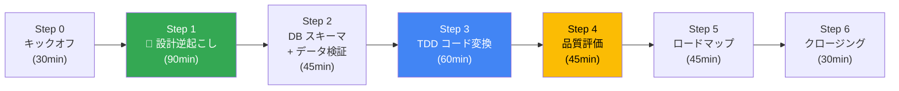
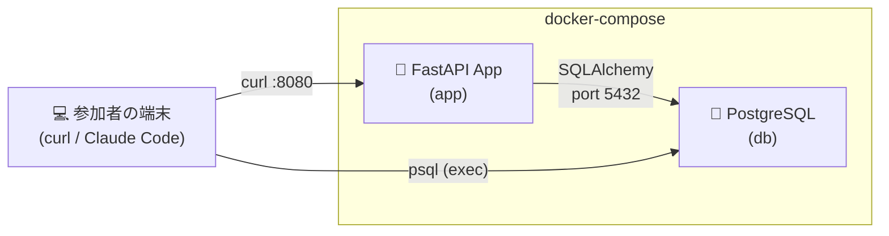
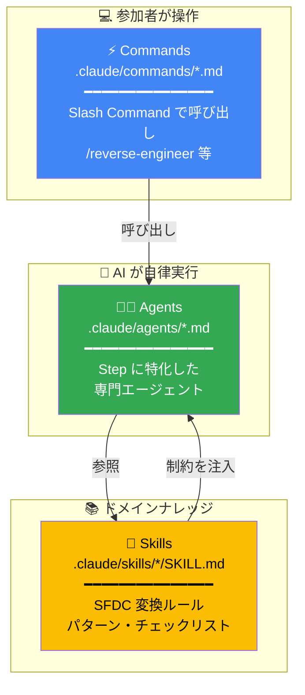
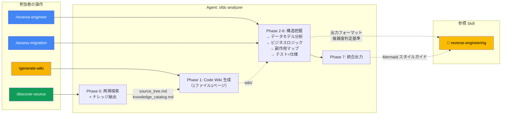
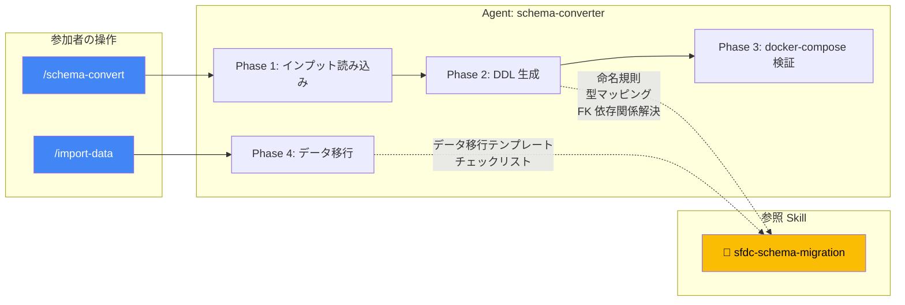
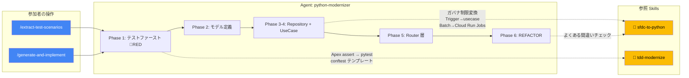
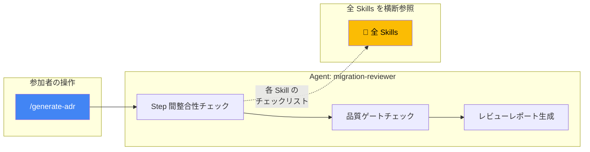
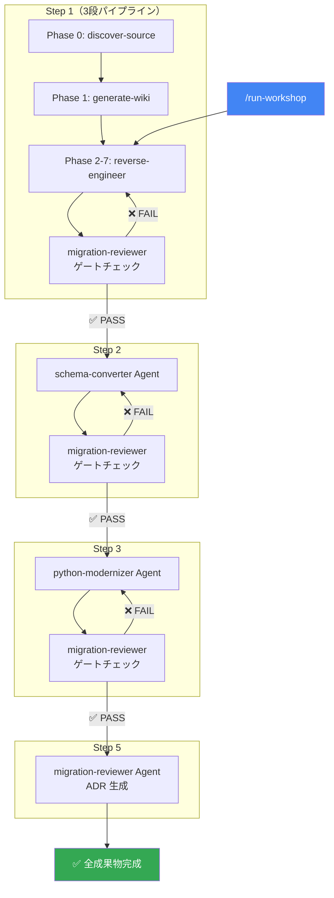
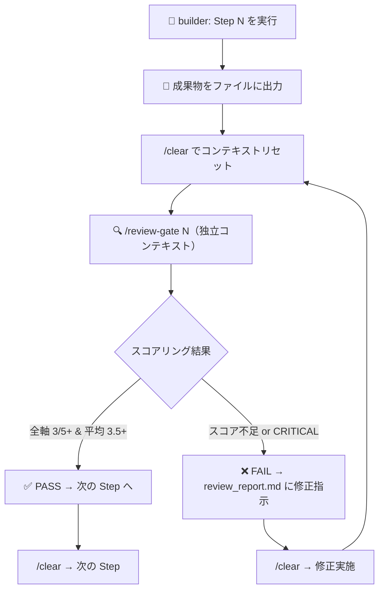

# 🚀 SFDC モダナイゼーション ワークショップ — 実践編

> **設計書なし × ソースコードのみ × AI 駆動で1日で移行パスを明確にする**
>
> 本ワークショップでは、お客様が実際に運用している SFDC アプリケーションのソースコードを入力として、
> **Claude Code（via Vertex AI）** を最大限活用し、設計の逆起こしからコードモダナイズまでを1日で体験します。

## 🧠 ワークショップのマインドセット

> [!IMPORTANT]
> **「設計書がないから移行できない」のではなく、「ソースコードこそが唯一の真実」**
>
> ベンダーの設計書は古い・不正確な可能性がある。AI にソースコードから設計を逆起こしさせることで：
> 1. 実際のコードに基づいた正確な設計書が手に入る
> 2. AI が生成した設計書は、移行後の新システムの正式ドキュメントになる
> 3. TDD で既存動作を先にテスト化するため、デグレのリスクを機械的に排除できる

---

## 📋 前提条件

| 項目 | 内容 |
|------|------|
| **AI ツール** | Claude Code via Vertex AI（Claude Opus model） |
| **参加者** | PM、アーキテクト、SE（パートナー含）11名以上 |
| **Backend 言語** | Python（FastAPI） |
| **Frontend** | TypeScript（Next.js）— 本ワークショップでは Backend に集中 |
| **DB** | Cloud SQL（PostgreSQL） |
| **実行環境** | 参加者のローカル環境 or Cloud Shell |
| **コンテナ管理** | docker-compose（PostgreSQL + App のコンテナ間通信） |

### お客様が持っていると想定するソースコード

| 種別 | パス例 | 想定 |
|------|--------|------|
| Apex クラス | `force-app/main/default/classes/*.cls` | ✅ |
| Apex トリガー | `force-app/main/default/triggers/*.trigger` | ✅ |
| カスタムオブジェクト定義 | `force-app/main/default/objects/*/*.object-meta.xml` | ✅ |
| カスタムフィールド定義 | `force-app/main/default/objects/*/fields/*.field-meta.xml` | ✅ |
| Visualforce ページ | `force-app/main/default/pages/*.page` | ✅ |
| Lightning Web Components | `force-app/main/default/lwc/*/` | 🔶 |

---

## 📋 タイムテーブル

| 時間 | Step | 内容 | 参加者の動き | 成果物 |
|------|------|------|-------------|--------|
| 10:00–10:30 | **Step 0** | キックオフ＆コンテキスト共有 | SFDCアプリの概要説明、ゴール合意 | ソースコード構造の共有 |
| 10:30–12:00 | **Step 1** | 🔑 **AI による設計ドキュメント逆起こし** | 各自 Claude Code で実コードを分析 | システム概要書、ER図、API仕様、影響分析 |
| 12:00–13:00 | | 🍱 昼休み | | |
| 13:00–13:45 | **Step 2** | DB スキーマ移行＋実データ投入 | DDL 変換 → SFDC CSV 変換・投入 → クエリ検証 | DDL、データ変換スクリプト、SOQL→SQL |
| 13:45–14:45 | **Step 3** | TDD コードモダナイズ PoC（Python） | テストシナリオ→🔴RED→🟢GREEN→🔵REFACTOR | テスト＋実装＋コンテナ間CRUD検証 |
| 14:45–15:00 | | ☕ 休憩 | | |
| 15:00–15:45 | **Step 4** | AI 成果物の品質評価＆デリバリー戦略 | 統合テスト＋品質フレームワーク議論 | 品質評価フレームワーク |
| 15:45–16:30 | **Step 5** | 移行ロードマップ策定 | ADR 自動生成＋Phase 計画 | 移行計画書、ADR |
| 16:30–17:00 | **Step 6** | クロージング＆ネクストステップ | アクションアイテム確定 | アクションアイテム一覧 |

### 全体の流れ



> 🟢 Step 1 がキモ — ここで生成した設計書が残りの Step すべてのインプットになる。

---

## 🐳 docker-compose による統合環境

ワークショップ全体を通じて、`docker-compose.yml` で PostgreSQL コンテナとアプリコンテナを管理します。



```bash
# Step 2: DB だけ起動して DDL 適用・データ投入
docker compose up -d db

# Step 3-4: アプリも含めて起動、コンテナ間 CRUD 検証
docker compose up -d --build

# クリーンアップ
docker compose down -v
```

---

## 📁 ディレクトリ構成

> [!IMPORTANT]
> **出力ルール**: 各 Step で AI が生成した成果物は、対応する Step ディレクトリの **`output/`** サブディレクトリに出力してください。

```
workshop-real/
├── README.md                          ← 📖 本ドキュメント
├── CLAUDE.md                          ← 🧠 Claude Code プロジェクトルール（自動読み込み）
├── docker-compose.yml                 ← 🐳 統合環境定義
├── .claude/
│   ├── commands/                      ← ⚡ カスタム Slash Commands
│   │   ├── run-workshop.md            ←   /run-workshop（全体オーケストレーション）
│   │   ├── discover-source.md         ←   /discover-source（Step 1 Phase 0）
│   │   ├── generate-wiki.md           ←   /generate-wiki（Step 1 Phase 1）
│   │   ├── reverse-engineer.md        ←   /reverse-engineer（Step 1 Phase 2+）
│   │   ├── assess-migration.md        ←   /assess-migration（Step 1）
│   │   ├── schema-convert.md          ←   /schema-convert（Step 2）
│   │   ├── import-data.md             ←   /import-data（Step 2）
│   │   ├── extract-test-scenarios.md  ←   /extract-test-scenarios（Step 3）
│   │   ├── generate-and-implement.md  ←   /generate-and-implement（Step 3）
│   │   └── generate-adr.md            ←   /generate-adr（Step 5）
│   ├── agents/                        ← 🤖 特化型エージェント
│   │   ├── sfdc-analyzer.md           ←   Step 1: SFDX 分析 → 設計書生成
│   │   ├── schema-converter.md        ←   Step 2: DDL 生成 + データ移行
│   │   ├── python-modernizer.md       ←   Step 3: TDD で Apex → Python 変換
│   │   ├── migration-reviewer.md      ←   Step 4-5: スコアリングレビュー + ゲートチェック
│   └── skills/                        ← 📖 ドメインナレッジモジュール
│       ├── reverse-engineering/SKILL.md   ← 逆起こしルール + 出力フォーマット
│       ├── sfdc-schema-migration/SKILL.md ← 型マッピング + 命名規則 + DDL テンプレート
│       ├── sfdc-to-python/SKILL.md        ← ガバナ制限/Trigger/Batch 変換パターン
│       ├── tdd-modernize/SKILL.md         ← Apex テスト → pytest + TDD ワークフロー
│       └── quality-rubric/SKILL.md        ← 🆕 成果物スコアリング基準（1-5 評価）
├── workshop-state.json                ← 🆕 進捗・メトリクス・レビュースコアの状態管理
├── scripts/
│   ├── check-progress.sh             ← 📊 進行チェックスクリプト
│   ├── update-state.sh               ← 🆕 workshop-state.json 更新スクリプト
│   └── verify-consistency.sh         ← 🆕 Step 間整合性チェックスクリプト
├── data/                              ← 📂 SFDC エクスポート CSV 置き場
├── 00-preparation/
│   └── README.md                      ← 事前準備チェックリスト
├── 01-reverse-engineering/
│   ├── README.md                      ← 🔑 AI 設計逆起こしガイド
│   └── output/
│       ├── source_tree.md             ← ソース Tree マップ
│       ├── knowledge_catalog.md       ← ナレッジ抽出カタログ
│       ├── wiki/                      ← Code Wiki（1ファイル1ページ）
│       ├── system_overview.md         ← 統合設計書
│       └── migration_assessment.md    ← 移行影響分析
├── 02-schema-migration/
│   ├── README.md                      ← DB スキーマ移行 + 実データ投入ガイド
│   └── output/                        ← DDL、データ変換スクリプト、検証 SQL
├── 03-code-modernization/
│   ├── README.md                      ← TDD コードモダナイズ PoC ガイド
│   └── output/                        ← Python プロジェクト + Dockerfile
├── 04-quality-and-delivery/
│   ├── README.md                      ← AI 成果物の品質評価＆デリバリー戦略
│   └── output/
├── 05-roadmap/
│   ├── README.md                      ← 移行ロードマップ策定
│   └── output/                        ← ADR、ロードマップ
├── examples/                          ← サンプル SFDX プロジェクト（検証用）
└── templates/                         ← AI プロンプトテンプレート集
```

---

## ⚡ カスタム Slash Commands

> [!TIP]
> 各 Step のプロンプトをコピペする代わりに、**ワンコマンドで実行**できます。
> Claude Code の対話モードで `/` に続けてコマンド名を入力してください。

すべてのコマンドは **引数として SFDX ソースディレクトリのパス** を受け取ります。
引数を省略した場合は `./examples`（サンプルアプリ）がデフォルトで使用されます。

```bash
# サンプルアプリ（examples/）を使う場合
/reverse-engineer ./examples

# お客様の SFDX プロジェクトを使う場合
/reverse-engineer ./sources

# 引数省略 → デフォルトで ./examples が使用される
/reverse-engineer
```

| Step | コマンド | 内容 |
|------|---------|------|
| 1 | `/discover-source <path>` | ソースの再帰探索 + Tree 構造生成 + ナレッジ抽出 |
| 1 | `/generate-wiki <path>` | 全ソースファイルを Code Wiki（1ファイル1ページ）として生成 |
| 1 | `/reverse-engineer <path>` | Code Wiki を参照して統合設計ドキュメントを生成 |
| 1 | `/assess-migration <path>` | 移行影響分析レポートを生成 |
| 2 | `/schema-convert <path>` | SFDC メタデータ → PostgreSQL DDL 変換 |
| 2 | `/import-data <path>` | SFDC CSV → PostgreSQL データ投入スクリプト生成 |
| 3 | `/extract-test-scenarios <path>` | Apex からテストシナリオを抽出 |
| 3 | `/generate-and-implement` | テストコード生成（RED）→ 実装（GREEN）を一気に実行 |
| 5 | `/generate-adr` | ADR（技術選定の意思決定記録）を自動生成 |
| 全体 | `/run-workshop <path>` | Step 1→2→3→5 を順序通りにチェーン実行（オーケストレーション） |
| 品質 | `/review-gate [N]` | 🆕 独立コンテキストでの品質ゲートチェック（`/clear` 後に実行） |

---

## 🏗️ AI ハーネスアーキテクチャ — Commands / Agents / Skills の関係性

> [!IMPORTANT]
> 本ワークショップでは、Claude Code の挙動を **3つのレイヤー** で制御しています。
> これにより、AI が各 Step で「どのドメインナレッジを参照すべきか」を自動的に判断し、一貫性の高い出力を生成します。

### レイヤー構造



| レイヤー | 場所 | 役割 | 誰が使う |
|---------|------|------|---------|
| **Commands** | `.claude/commands/` | 参加者がスラッシュコマンドで呼び出すエントリーポイント。タスクの入力・出力・検証条件を定義 | 参加者（人間） |
| **Agents** | `.claude/agents/` | 各 Step に特化した専門エージェント。分析フェーズ・生成手順・品質基準を定義 | AI が自律実行 |
| **Skills** | `.claude/skills/` | 再利用可能なドメインナレッジモジュール。変換ルール・型マッピング・パターン集 | AI が参照 |

---

### Step 別 呼び出しフロー

#### Step 1: 設計逆起こし（90分）— 3段パイプライン

> [!TIP]
> Step 1 は **discover-source → generate-wiki → reverse-engineer** の 3段パイプラインで構成されています。
> 各コマンドの出力が次のコマンドのインプットになります。



| コマンド | 起動 Agent | 参照 Skill | AI の挙動 | 出力 |
|---------|-----------|-----------|----------|------|
| `/discover-source` | `sfdc-analyzer` | `reverse-engineering` | `find` で SFDX ソースを再帰走査し Tree 構造を生成。`grep` で SFDC 依存 API（15カテゴリ）を検出。ビジネスロジックパターン + コーディング慣習を記録 | `source_tree.md`, `knowledge_catalog.md` |
| `/generate-wiki` | `sfdc-analyzer` | `reverse-engineering` | 全ソースファイルを読み込み、**1ファイル1ページの Code Wiki** を生成。各ページにメソッド一覧・依存関係（双方向）・SFDC 依存 API・ビジネスルール・移行メモを含む。横断ページとして architecture.md（レイヤー図）・data-model.md（統合 ER 図）も生成 | `wiki/` 配下（~15ページ） |
| `/reverse-engineer` | `sfdc-analyzer` | `reverse-engineering` | **Code Wiki を主要インプット** として参照（原文の再読み込み不要）。Wiki の各ページを統合し、Skill の出力フォーマットと複雑度判定基準に従い統合設計書を生成 | `system_overview.md` |
| `/assess-migration` | `sfdc-analyzer` | `reverse-engineering` | Code Wiki + knowledge_catalog.md を参照し、コンポーネント別の移行難易度スコアリング（S/M/L/XL）、SFDC 依存 API の洗い出し、リスク評価 | `migration_assessment.md` |

---

#### Step 2: DB スキーマ移行 + データ投入（45分）



| コマンド | 起動 Agent | 参照 Skill | AI の挙動 | 出力 |
|---------|-----------|-----------|----------|------|
| `/schema-convert` | `schema-converter` | `sfdc-schema-migration` | Step 1 の ER 図 + フィールド定義を参照 → Skill の命名規則（`__c` 除去→snake_case→複数形）と型マッピング（Id→VARCHAR(18) 等）に従い DDL 生成。トポロジカルソートで依存関係を解決 | `02-schema-migration/output/generated_ddl.sql`, `data_validation.sql` |
| `/import-data` | `schema-converter` | `sfdc-schema-migration` | SFDC CSV ファイルのヘッダーと DDL カラムを自動マッピング → バッチ INSERT スクリプト生成。Skill のデータ移行チェックリストで整合性検証 | `02-schema-migration/output/import_data.py` |

---

#### Step 3: TDD コードモダナイズ PoC（60分）



| コマンド | 起動 Agent | 参照 Skill | AI の挙動 | 出力 |
|---------|-----------|-----------|----------|------|
| `/extract-test-scenarios` | `python-modernizer` | `tdd-modernize` | Apex テストの `System.assertEquals` を仕様として抽出。Skill のテスト変換ルール（`@TestSetup`→`@pytest.fixture` 等）に従いシナリオ化 | `03-code-modernization/output/TEST_SCENARIOS.md` |
| `/generate-and-implement` | `python-modernizer` | `sfdc-to-python` + `tdd-modernize` | **🔴 RED**: Skill の conftest テンプレートでテスト生成 → **🟢 GREEN**: Skill のガバナ制限変換・Trigger→usecase パターンに従い実装。Apex→Python チートシート参照 | `03-code-modernization/output/app/`, `tests/`, `Dockerfile` |

---

#### Step 4-5: 品質評価 + ロードマップ（90分）



| コマンド | 起動 Agent | 参照 Skill | AI の挙動 | 出力 |
|---------|-----------|-----------|----------|------|
| `/generate-adr` | `migration-reviewer` | 全 Skills | Step 1-3 の成果物を横断レビュー → 技術選定の ADR 生成（言語/DB/基盤/品質保証/データ移行方式）。SFDC→GCP サービスマッピング図 | `05-roadmap/output/adr.md` |
| （自動実行） | `migration-reviewer` | 全 Skills | 各 Step 完了時にゲートチェック実行。Step 間のデータ連携整合性（オブジェクト⊆テーブル⊆モデル）を検証 | レビューレポート |

---

#### 全体オーケストレーション

| コマンド | 挙動 |
|---------|------|
| `/run-workshop` | Step 1→2→3→5 を自動チェーン実行。各 Step 完了後に `migration-reviewer` Agent でゲートチェックを行い、FAIL なら自動修正ループを回してから次の Step へ進む |



---

### Skills 一覧 — ドメインナレッジの詳細

| Skill 名 | ファイル | 主な知識 | 利用 Step |
|----------|---------|---------|----------|
| `reverse-engineering` | `.claude/skills/reverse-engineering/SKILL.md` | 分析対象の優先度、出力フォーマット（system_overview.md 構成）、複雑度判定基準（Low/Medium/High/Critical）、Mermaid スタイルガイド | Step 1 |
| `sfdc-schema-migration` | `.claude/skills/sfdc-schema-migration/SKILL.md` | 命名規則（`__c`除去→snake_case→複数形）、データ型マッピング（18種）、FK 依存関係のトポロジカルソート、標準フィールド処理、DDL テンプレート、データ移行スクリプトテンプレート | Step 2 |
| `sfdc-to-python` | `.claude/skills/sfdc-to-python/SKILL.md` | ガバナ制限→シンプル設計、共有モデル→認可設計、Trigger→usecase 明示呼び出し、Batch→Cloud Run Jobs、Formula→計算戦略、承認→状態マシン、Apex テスト→pytest、よくある間違い集 | Step 3 |
| `tdd-modernize` | `.claude/skills/tdd-modernize/SKILL.md` | RED→GREEN→REFACTOR サイクル、Apex テストデータ→`@pytest.fixture`、アサーション変換、例外テスト、conftest.py テンプレート、テスト品質チェックリスト | Step 3 |

### Agents 一覧 — 特化型エージェントの詳細

| Agent 名 | ファイル | 許可ツール | 専門領域 | 品質基準 |
|----------|---------|----------|---------|---------|
| `sfdc-analyzer` | `.claude/agents/sfdc-analyzer.md` | Read, Grep, Glob, Write | Phase 0: ソース再帰探索 + ナレッジ抽出、Phase 1: Code Wiki 生成、Phase 2-7: ER 図生成・ビジネスロジック抽出・統合設計書生成 | 全ファイル網羅、Wiki ページ数一致、Mermaid レンダリング可能 |
| `schema-converter` | `.claude/agents/schema-converter.md` | Read, Write, Bash, Grep | DDL 生成、データ移行、docker-compose 検証 | DDL が psql でエラーなし、FK 制約正確、行数一致 |
| `python-modernizer` | `.claude/agents/python-modernizer.md` | Read, Write, Edit, Bash, Grep | Apex→Python 変換、TDD 実装、3層アーキテクチャ | カバレッジ 80%+、ruff/mypy パス、全 API 応答 |
| `migration-reviewer` | `.claude/agents/migration-reviewer.md` | Read, Grep, Glob, Bash | スコアリングレビュー、Step 間整合性検証、独立コンテキストゲートチェック | 全軸 3/5 以上、平均 3.5/5 以上、CRITICAL 0 件 |

---

## 🔗 各 Step の詳細

| Step | ドキュメント | Slash Command | Agent | Skills |
|------|-------------|--------------|-------|--------|
| 0 | [事前準備＆キックオフ](./00-preparation/README.md) | — | — | — |
| 1 | [AI 設計逆起こし](./01-reverse-engineering/README.md) | `/reverse-engineer`<br/>`/assess-migration` | `sfdc-analyzer` | `reverse-engineering` |
| 2 | [DB スキーマ移行](./02-schema-migration/README.md) | `/schema-convert`<br/>`/import-data` | `schema-converter` | `sfdc-schema-migration` |
| 3 | [TDD コードモダナイズ](./03-code-modernization/README.md) | `/extract-test-scenarios`<br/>`/generate-and-implement` | `python-modernizer` | `sfdc-to-python`<br/>`tdd-modernize` |
| 4 | [品質評価＆デリバリー](./04-quality-and-delivery/README.md) | — | `migration-reviewer` | 全 Skills |
| 5 | [移行ロードマップ](./05-roadmap/README.md) | `/generate-adr` | `migration-reviewer` | 全 Skills |

---

## 🆚 既存 hands-on との違い

| 項目 | hands-on/（既存） | workshop-real/（今回） |
|------|-------------------|----------------------|
| **入力** | サンプルアプリ（業務日報） | お客様の実 SFDC コード |
| **設計書** | サンプル JSON あり | ❌ なし → AI で逆起こし |
| **言語** | Go | Python（FastAPI） |
| **テスト** | コード後にテスト | TDD（テスト先行） |
| **DB 検証** | `docker run` 単体 | `docker-compose` コンテナ間 |
| **スコープ** | 全 Step を体験 | 代表1コンポーネントの PoC |
| **ゴール** | 移行フローの理解 | 移行パスの明確化＋ロードマップ |

---

## 🤖 品質保証: 独立コンテキストレビュー

> [!NOTE]
> **Anthropic ハーネス設計パターン準拠**: builder（コード生成する AI）と evaluator（レビューする AI）を
> **独立したコンテキスト**で実行し、self-leniency（自己評価の甘さ）を構造的に排除します。

### 品質優先モード（推奨）

各 Step 完了後に `/clear` でコンテキストをリセットし、`/review-gate` でまっさらな視点からレビューします。



### 運用手順

```bash
# ① builder として Step 1 を実行
/reverse-engineer ./examples

# ② コンテキストをリセット（builder の思考履歴を消去）
/clear

# ③ 独立コンテキストで品質チェック
/review-gate 1

# ④ PASS したら次へ
/clear
/schema-convert ./examples
```

### 速度優先モード

時間に制約がある場合は、セルフレビュー（同一コンテキスト内）のみで次の Step に進みます。
`/run-workshop` のデフォルト動作です。

### 機械的検証スクリプト

どちらのモードでも、以下の検証スクリプトを **必ず** 実行してください:

```bash
# Step 間の成果物整合性を機械的にチェック
./scripts/verify-consistency.sh

# 進捗と成果物の存在確認
./scripts/check-progress.sh
```

---

## 🎒 ワークショップ後の持ち帰り

| カテゴリ | 内容 |
|---------|------|
| **設計書** | AI が逆起こしした システム概要書、ER図、API 仕様書 |
| **移行影響分析** | コンポーネント別の難易度スコアリング |
| **DDL + SQL** | PostgreSQL 用スキーマ＋変換クエリ |
| **PoC コード** | Python (FastAPI) プロジェクト一式 + テスト |
| **docker-compose** | ローカル再現可能な統合環境 |
| **ADR** | 技術選定の意思決定記録 |
| **ロードマップ** | Phase 分割した移行計画 |
| **プロンプト集** | 他アプリにも再利用可能なテンプレート |
