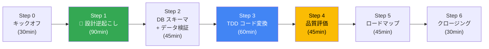
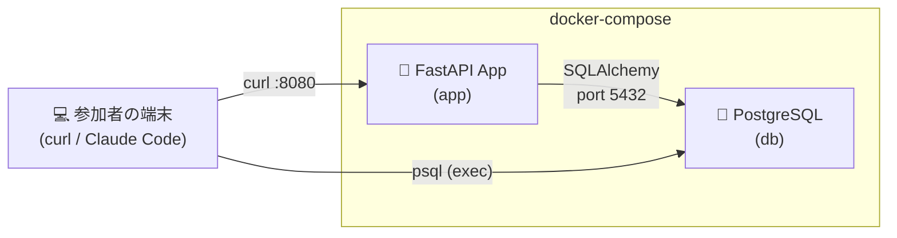
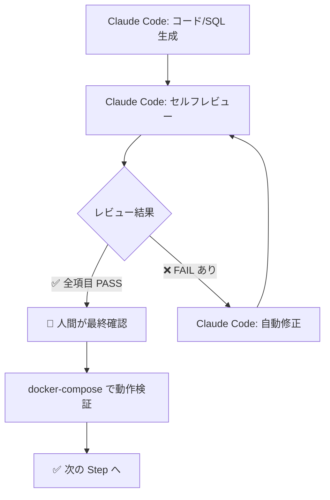

# 🚀 SFDC モダナイゼーション ワークショップ — 実践編

> **設計書なし × ソースコードのみ × AI 駆動で1日で移行パスを明確にする**
>
> 本ワークショップでは、お客様が実際に運用している SFDC アプリケーションのソースコードを入力として、
> **Claude Code（via Vertex AI）** を最大限活用し、設計の逆起こしからコードモダナイズまでを1日で体験します。

## 🧠 ワークショップのマインドセット

> [!IMPORTANT]
> **「設計書がないから移行できない」のではなく、「ソースコードこそが唯一の真実」**
>
> ベンダーの設計書は古い・不正確な可能性がある。AI にソースコードから設計を逆起こしさせることで：
> 1. 実際のコードに基づいた正確な設計書が手に入る
> 2. AI が生成した設計書は、移行後の新システムの正式ドキュメントになる
> 3. TDD で既存動作を先にテスト化するため、デグレのリスクを機械的に排除できる

---

## 📋 前提条件

| 項目 | 内容 |
|------|------|
| **AI ツール** | Claude Code via Vertex AI（Claude Opus model） |
| **参加者** | PM、アーキテクト、SE（パートナー含）11名以上 |
| **Backend 言語** | Python（FastAPI） |
| **Frontend** | TypeScript（Next.js）— 本ワークショップでは Backend に集中 |
| **DB** | Cloud SQL（PostgreSQL） |
| **実行環境** | 参加者のローカル環境 or Cloud Shell |
| **コンテナ管理** | docker-compose（PostgreSQL + App のコンテナ間通信） |

### お客様が持っていると想定するソースコード

| 種別 | パス例 | 想定 |
|------|--------|------|
| Apex クラス | `force-app/main/default/classes/*.cls` | ✅ |
| Apex トリガー | `force-app/main/default/triggers/*.trigger` | ✅ |
| カスタムオブジェクト定義 | `force-app/main/default/objects/*/*.object-meta.xml` | ✅ |
| カスタムフィールド定義 | `force-app/main/default/objects/*/fields/*.field-meta.xml` | ✅ |
| Visualforce ページ | `force-app/main/default/pages/*.page` | ✅ |
| Lightning Web Components | `force-app/main/default/lwc/*/` | 🔶 |

---

## 📋 タイムテーブル

| 時間 | Step | 内容 | 参加者の動き | 成果物 |
|------|------|------|-------------|--------|
| 10:00–10:30 | **Step 0** | キックオフ＆コンテキスト共有 | SFDCアプリの概要説明、ゴール合意 | ソースコード構造の共有 |
| 10:30–12:00 | **Step 1** | 🔑 **AI による設計ドキュメント逆起こし** | 各自 Claude Code で実コードを分析 | システム概要書、ER図、API仕様、影響分析 |
| 12:00–13:00 | | 🍱 昼休み | | |
| 13:00–13:45 | **Step 2** | DB スキーマ移行＋実データ投入 | DDL 変換 → SFDC CSV 変換・投入 → クエリ検証 | DDL、データ変換スクリプト、SOQL→SQL |
| 13:45–14:45 | **Step 3** | TDD コードモダナイズ PoC（Python） | テストシナリオ→🔴RED→🟢GREEN→🔵REFACTOR | テスト＋実装＋コンテナ間CRUD検証 |
| 14:45–15:00 | | ☕ 休憩 | | |
| 15:00–15:45 | **Step 4** | AI 成果物の品質評価＆デリバリー戦略 | 統合テスト＋品質フレームワーク議論 | 品質評価フレームワーク |
| 15:45–16:30 | **Step 5** | 移行ロードマップ策定 | ADR 自動生成＋Phase 計画 | 移行計画書、ADR |
| 16:30–17:00 | **Step 6** | クロージング＆ネクストステップ | アクションアイテム確定 | アクションアイテム一覧 |

### 全体の流れ



> 🟢 Step 1 がキモ — ここで生成した設計書が残りの Step すべてのインプットになる。

---

## 🐳 docker-compose による統合環境

ワークショップ全体を通じて、`docker-compose.yml` で PostgreSQL コンテナとアプリコンテナを管理します。



```bash
# Step 2: DB だけ起動して DDL 適用・データ投入
docker compose up -d db

# Step 3-4: アプリも含めて起動、コンテナ間 CRUD 検証
docker compose up -d --build

# クリーンアップ
docker compose down -v
```

---

## 📁 ディレクトリ構成

> [!IMPORTANT]
> **出力ルール**: 各 Step で AI が生成した成果物は、対応する Step ディレクトリの **`output/`** サブディレクトリに出力してください。

```
workshop-real/
├── README.md                          ← 📖 本ドキュメント
├── CLAUDE.md                          ← 🧠 Claude Code プロジェクトルール（自動読み込み）
├── docker-compose.yml                 ← 🐳 統合環境定義
├── .claude/commands/                  ← ⚡ カスタム Slash Commands
│   ├── reverse-engineer.md            ←   /reverse-engineer（Step 1）
│   ├── assess-migration.md            ←   /assess-migration（Step 1）
│   ├── schema-convert.md              ←   /schema-convert（Step 2）
│   ├── import-data.md                 ←   /import-data（Step 2）
│   ├── extract-test-scenarios.md      ←   /extract-test-scenarios（Step 3）
│   ├── generate-and-implement.md      ←   /generate-and-implement（Step 3）
│   └── generate-adr.md               ←   /generate-adr（Step 5）
├── scripts/
│   └── check-progress.sh             ← 📊 進行チェックスクリプト
├── data/                              ← 📂 SFDC エクスポート CSV 置き場
├── 00-preparation/
│   └── README.md                      ← 事前準備チェックリスト
├── 01-reverse-engineering/
│   ├── README.md                      ← 🔑 AI 設計逆起こしガイド
│   └── output/                        ← システム概要書、ER図、API仕様、影響分析
├── 02-schema-migration/
│   ├── README.md                      ← DB スキーマ移行 + 実データ投入ガイド
│   └── output/                        ← DDL、データ変換スクリプト、検証 SQL
├── 03-code-modernization/
│   ├── README.md                      ← TDD コードモダナイズ PoC ガイド
│   └── output/                        ← Python プロジェクト + Dockerfile
├── 04-quality-and-delivery/
│   ├── README.md                      ← AI 成果物の品質評価＆デリバリー戦略
│   └── output/
├── 05-roadmap/
│   ├── README.md                      ← 移行ロードマップ策定
│   └── output/                        ← ADR、ロードマップ
├── examples/                          ← サンプル SFDX プロジェクト（検証用）
└── templates/                         ← AI プロンプトテンプレート集
```

---

## ⚡ カスタム Slash Commands

> [!TIP]
> 各 Step のプロンプトをコピペする代わりに、**ワンコマンドで実行**できます。
> Claude Code の対話モードで `/project:` に続けてコマンド名を入力してください。

| Step | コマンド | 内容 |
|------|---------|------|
| 1 | `/project:reverse-engineer` | ソースコードから設計ドキュメントを逆起こし |
| 1 | `/project:assess-migration` | 移行影響分析レポートを生成 |
| 2 | `/project:schema-convert` | SFDC メタデータ → PostgreSQL DDL 変換 |
| 2 | `/project:import-data` | SFDC CSV → PostgreSQL データ投入スクリプト生成 |
| 3 | `/project:extract-test-scenarios` | Apex からテストシナリオを抽出 |
| 3 | `/project:generate-and-implement` | テストコード生成（RED）→ 実装（GREEN）を一気に実行 |
| 5 | `/project:generate-adr` | ADR（技術選定の意思決定記録）を自動生成 |

---

## 🔗 各 Step の詳細

| Step | ドキュメント | Slash Command | 主なテンプレート |
|------|-------------|--------------|----------------|
| 0 | [事前準備＆キックオフ](./00-preparation/README.md) | — | — |
| 1 | [AI 設計逆起こし](./01-reverse-engineering/README.md) | `/project:reverse-engineer` | [逆起こし](./templates/reverse-engineering-prompt.md) |
| 2 | [DB スキーマ移行](./02-schema-migration/README.md) | `/project:schema-convert` | [DDL 変換](./templates/schema-conversion-prompt.md) |
| 3 | [TDD コードモダナイズ](./03-code-modernization/README.md) | `/project:generate-and-implement` | [コード変換](./templates/code-modernization-prompt.md) |
| 4 | [品質評価＆デリバリー](./04-quality-and-delivery/README.md) | — | — |
| 5 | [移行ロードマップ](./05-roadmap/README.md) | `/project:generate-adr` | — |

---

## 🆚 既存 hands-on との違い

| 項目 | hands-on/（既存） | workshop-real/（今回） |
|------|-------------------|----------------------|
| **入力** | サンプルアプリ（業務日報） | お客様の実 SFDC コード |
| **設計書** | サンプル JSON あり | ❌ なし → AI で逆起こし |
| **言語** | Go | Python（FastAPI） |
| **テスト** | コード後にテスト | TDD（テスト先行） |
| **DB 検証** | `docker run` 単体 | `docker-compose` コンテナ間 |
| **スコープ** | 全 Step を体験 | 代表1コンポーネントの PoC |
| **ゴール** | 移行フローの理解 | 移行パスの明確化＋ロードマップ |

---

## 🤖 AI セルフレビューの仕組み

> [!NOTE]
> 各 Step で AI が生成した成果物は、**AI 自身にレビューさせる「セルフレビュー」パターン**を採用。



---

## 🎒 ワークショップ後の持ち帰り

| カテゴリ | 内容 |
|---------|------|
| **設計書** | AI が逆起こしした システム概要書、ER図、API 仕様書 |
| **移行影響分析** | コンポーネント別の難易度スコアリング |
| **DDL + SQL** | PostgreSQL 用スキーマ＋変換クエリ |
| **PoC コード** | Python (FastAPI) プロジェクト一式 + テスト |
| **docker-compose** | ローカル再現可能な統合環境 |
| **ADR** | 技術選定の意思決定記録 |
| **ロードマップ** | Phase 分割した移行計画 |
| **プロンプト集** | 他アプリにも再利用可能なテンプレート |
