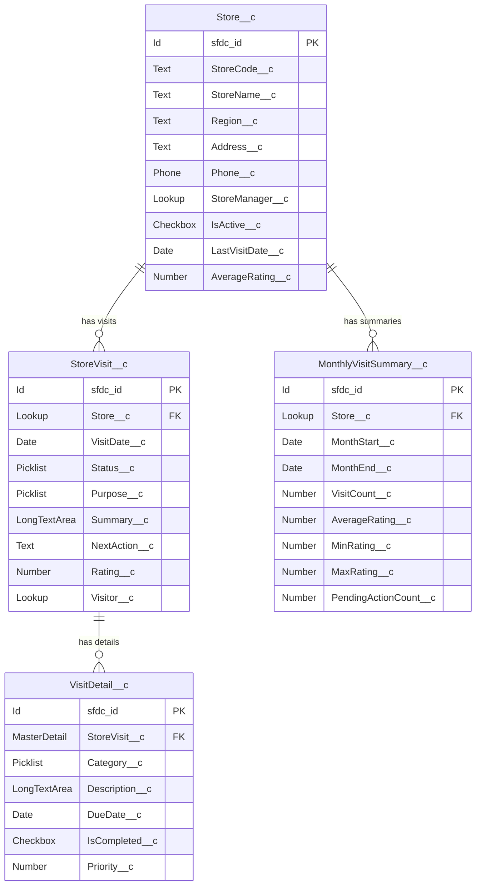
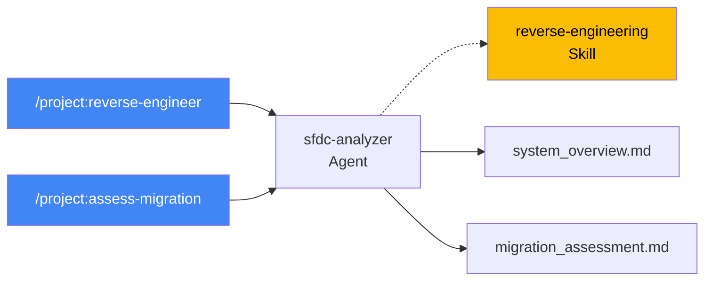
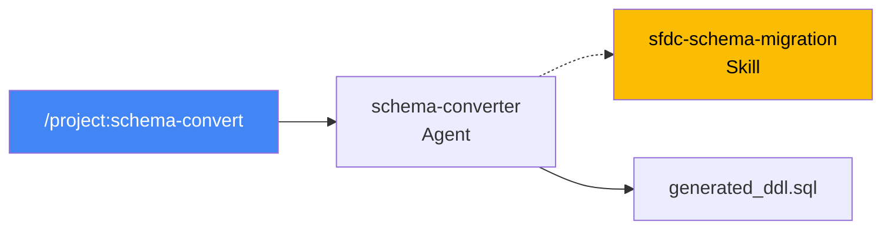
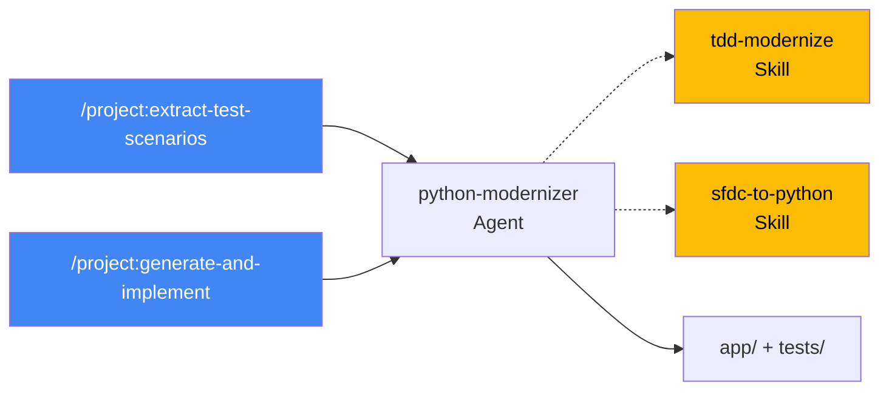
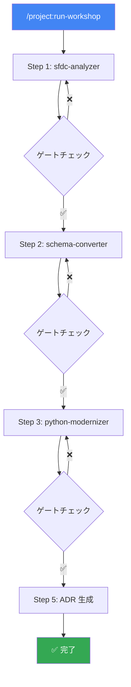

# 🏪 店舗訪問管理アプリ — AI 駆動モダナイゼーション ハンズオン

> **サンプルアプリ「店舗訪問管理（StoreVisit）」を題材に、SFDC → Google Cloud（Python/FastAPI/PostgreSQL）への移行を AI 駆動で体験する**
>
> このハンズオンでは、`examples/force-app/` に含まれる実際の Apex コード・オブジェクト定義を入力として使用します。

---

## 📋 ハンズオン概要

| 項目 | 内容 |
|------|------|
| **題材** | 店舗訪問管理アプリ（StoreVisit） |
| **ソースコード** | `examples/force-app/main/default/` |
| **AI ツール** | Claude Code（`/project:` スラッシュコマンドで実行） |
| **所要時間** | 約 4〜5 時間 |
| **前提** | Docker Desktop がインストール済み、Claude Code が利用可能 |

### サンプルアプリの構成



### ソースコード一覧

| ファイル | 種別 | 行数 | 概要 |
|---------|------|------|------|
| `StoreVisitController.cls` | REST API | 269行 | CRUD エンドポイント（GET/POST/PATCH/DELETE） |
| `StoreVisitService.cls` | Service | 244行 | ビジネスロジック（ステータス遷移、バリデーション） |
| `StoreVisitTriggerHandler.cls` | Trigger Handler | 166行 | 副作用管理（最終訪問日更新、通知、平均評価再計算） |
| `StoreVisitTrigger.trigger` | Trigger | 23行 | after insert/update, before delete |
| `StoreVisitMonthlyBatch.cls` | Batch | 147行 | 月次集計バッチ（MonthlyVisitSummary 作成） |
| `StoreVisitScheduler.cls` | Scheduler | 16行 | バッチスケジューラー（毎月1日 AM 2:00） |
| `StoreVisitControllerTest.cls` | Test | 322行 | Controller テスト（13テストメソッド） |
| `StoreVisitServiceTest.cls` | Test | 189行 | Service テスト（10テストメソッド） |
| `storeVisitForm/` | LWC | 350行 | 訪問記録入力フォーム |
| `StoreVisitSearch.page` | Visualforce | 59行 | 検索画面 |

---

## 🛠️ 事前準備

### 1. Docker Desktop を起動

```bash
# Docker が動いていることを確認
docker --version
docker compose version
```

### 2. Claude Code のプロジェクト設定

```bash
# workshop-real ディレクトリに移動
cd workshop-real

# Claude Code を起動（CLAUDE.md が自動読み込みされる）
claude
```

> [!TIP]
> `CLAUDE.md` が自動的に読み込まれ、変換ルール・アーキテクチャ定義が AI に注入されます。
> さらに `.claude/skills/` と `.claude/agents/` のドメインナレッジがコンテキストとして利用可能です。

### 3. PostgreSQL を起動

```bash
docker compose up -d db

# 起動確認
docker compose exec db psql -U app_user -d migration_db -c "SELECT 1;"
```

---

## Step 1: 🔑 AI による設計ドキュメント逆起こし（90分）

> **ゴール**: ソースコードから設計書を自動生成し、移行対象の全体像を把握する

### 使用するコマンド・Agent・Skill



### 1.1 設計ドキュメント逆起こし

Claude Code で以下を実行：

```
/project:reverse-engineer
```

**AI の挙動**:
1. `examples/force-app/` 配下の全ファイルを読み込み
2. Agent `sfdc-analyzer` が 6 Phase で分析を実行:
   - Phase 1: ディレクトリ構造を把握（オブジェクト 4個、クラス 6個、Trigger 1個）
   - Phase 2: `.object-meta.xml` / `.field-meta.xml` から ER 図を生成
   - Phase 3: Apex クラスのクラス責務・依存関係を抽出
   - Phase 4: `StoreVisitTriggerHandler` の副作用マップを作成
   - Phase 5: テストクラスの assert を仕様として記録
   - Phase 6: 統合された `system_overview.md` を生成
3. Skill `reverse-engineering` の出力フォーマットと Mermaid スタイルガイドに従い出力

**期待される出力** (`01-reverse-engineering/output/system_overview.md`):
- ER 図（4 オブジェクトのリレーション）
- クラス責務一覧（REST/Service/TriggerHandler/Batch/Scheduler/Test）
- API 仕様（5 エンドポイント: GET一覧/GET詳細/POST/PATCH/DELETE）
- ステータス遷移図（Draft → Submitted → Approved/Rejected）
- 副作用マップ（Trigger → 最終訪問日更新、通知、平均評価再計算）
- テストケース一覧（23テストメソッドの assert）

### 1.2 移行影響分析

```
/project:assess-migration
```

**期待される出力** (`01-reverse-engineering/output/migration_assessment.md`):
- コンポーネント別難易度スコアリング

| コンポーネント | 種別 | 行数 | SFDC依存度 | 難易度 |
|-------------|------|------|----------|-------|
| StoreVisitController | REST | 269 | 高 | M |
| StoreVisitService | Service | 244 | 中 | M |
| StoreVisitTriggerHandler | Trigger | 166 | 高 | L |
| StoreVisitMonthlyBatch | Batch | 147 | 高 | L |
| storeVisitForm | LWC | 350 | 高 | XL（スコープ外） |

### 1.3 セルフチェック

生成された設計書を確認し、以下をチェック：

- [ ] 4 オブジェクト（Store, StoreVisit, VisitDetail, MonthlyVisitSummary）が網羅されている
- [ ] ER 図のリレーションが正しい（Lookup / MasterDetail の区別）
- [ ] ステータス遷移が `Draft → Submitted → Approved/Rejected` になっている
- [ ] テストクラスの全 assert がテストシナリオとして抽出されている

---

## Step 2: 🗃️ DB スキーマ移行（45分）

> **ゴール**: SFDC オブジェクト定義を PostgreSQL DDL に変換し、docker-compose 上で動作検証する

### 使用するコマンド・Agent・Skill



### 2.1 DDL 生成

```
/project:schema-convert
```

**AI の挙動**:
1. Step 1 の `system_overview.md` から ER 図・フィールド定義を参照
2. Agent `schema-converter` が DDL 生成を実行:
   - Skill `sfdc-schema-migration` の命名規則を適用
     - `Store__c` → `stores`
     - `StoreVisit__c` → `store_visits`
     - `VisitDetail__c` → `visit_details`
     - `MonthlyVisitSummary__c` → `monthly_visit_summaries`
   - Skill のデータ型マッピングを適用（Id→VARCHAR(18), DateTime→TIMESTAMPTZ 等）
   - FK 依存関係をトポロジカルソートで解決（stores → store_visits → visit_details の順）
3. docker-compose の PostgreSQL で DDL を検証

**期待される変換例**:

| SFDC フィールド | PostgreSQL カラム |
|---------------|-----------------|
| `StoreCode__c` (Text 10) | `store_code VARCHAR(10) NOT NULL UNIQUE` |
| `Status__c` (Picklist) | `status VARCHAR(255) CHECK (status IN ('Draft','Submitted','Approved','Rejected'))` |
| `Store__c` (Lookup) | `store_id VARCHAR(18) REFERENCES stores(sfdc_id) ON DELETE SET NULL` |
| `StoreVisit__c` (MasterDetail) | `store_visit_id VARCHAR(18) NOT NULL REFERENCES store_visits(sfdc_id) ON DELETE CASCADE` |
| `Rating__c` (Number 2,1) | `rating NUMERIC(2,1) CHECK (rating >= 1 AND rating <= 5)` |
| `AverageRating__c` (Formula) | DDL に含めない（コメントで記録、計算戦略を別途決定） |

### 2.2 DDL 適用・検証

```bash
# DDL を PostgreSQL に適用
docker compose exec db psql -U app_user -d migration_db \
  -f /workspace/02-schema-migration/output/generated_ddl.sql

# テーブル一覧を確認
docker compose exec db psql -U app_user -d migration_db -c "\dt"
```

**期待される結果**:

```
              List of relations
 Schema |           Name            | Type  |  Owner
--------+---------------------------+-------+----------
 public | stores                    | table | app_user
 public | store_visits              | table | app_user
 public | visit_details             | table | app_user
 public | monthly_visit_summaries   | table | app_user
```

### 2.3 外部キー制約の確認

```bash
docker compose exec db psql -U app_user -d migration_db -c "
SELECT tc.table_name, kcu.column_name, ccu.table_name AS foreign_table
FROM information_schema.table_constraints tc
JOIN information_schema.key_column_usage kcu
    ON tc.constraint_name = kcu.constraint_name
JOIN information_schema.constraint_column_usage ccu
    ON ccu.constraint_name = tc.constraint_name
WHERE tc.constraint_type = 'FOREIGN KEY'
ORDER BY tc.table_name;
"
```

### 2.4 セルフチェック

- [ ] DDL がエラーなく適用できた
- [ ] 4 テーブルが作成された
- [ ] FK 制約: `store_visits.store_id` → `stores.sfdc_id`（SET NULL）
- [ ] FK 制約: `visit_details.store_visit_id` → `store_visits.sfdc_id`（CASCADE）
- [ ] FK 制約: `monthly_visit_summaries.store_id` → `stores.sfdc_id`（SET NULL）
- [ ] Picklist の CHECK 制約が設定されている

---

## Step 3: 🧪 TDD コードモダナイズ PoC（60分）

> **ゴール**: Apex テストクラスの assert を仕様として、TDD で Python/FastAPI コードを生成する

### 使用するコマンド・Agent・Skills



### 3.1 テストシナリオ抽出

```
/project:extract-test-scenarios
```

**AI の挙動**:
1. Apex テストクラスの全 `System.assertEquals` / `System.assert` を解析
2. Skill `tdd-modernize` の変換ルールに従いシナリオ化

**期待される出力例** (`03-code-modernization/output/TEST_SCENARIOS.md`):

| # | カテゴリ | シナリオ | 期待結果 | Apex assert |
|---|---------|---------|---------|------------|
| 1 | GET 一覧 | 全件取得 | 3件返却 | `assertEquals(3, result.size())` |
| 2 | GET 一覧 | Status フィルタ | Draft 1件 | `assertEquals(1, result.size())` |
| 3 | GET 詳細 | 正常取得 | 子レコード2件含む | `assertEquals(2, result.VisitDetails__r.size())` |
| 4 | GET 詳細 | 存在しないID | 404 | `assert(false, '例外がスローされるべき')` |
| 5 | POST | 正常作成 | Draft で作成 | `assertEquals('Draft', result.Status__c)` |
| 6 | POST | 必須項目欠落 | 400 | `assert(e.getMessage().contains('必須'))` |
| 7 | POST | Rating 範囲外 | 400 | `assert(e.getMessage().contains('評価'))` |
| 8 | PATCH 遷移 | Draft→Submitted | ✅ | `assertEquals('Submitted', result.Status__c)` |
| 9 | PATCH 遷移 | Approved→Draft | ❌ | `assert(e.getMessage().contains('遷移'))` |
| 10 | DELETE | Draft 削除可 | 204 + CASCADE | `assertEquals(0, remaining.size())` |
| 11 | DELETE | Approved 削除不可 | 400 | `assert(e.getMessage().contains('削除'))` |

### 3.2 テスト生成 → 実装（TDD）

```
/project:generate-and-implement
```

**AI の挙動**:
1. **🔴 RED**: Skill `tdd-modernize` に従い pytest テストを生成
   - `@TestSetup` → `@pytest.fixture`
   - `System.assertEquals` → `assert actual == expected`
   - `try/catch AuraHandled` → `pytest.raises(HTTPException)`
   - `conftest.py` テンプレートを適用
2. **🟢 GREEN**: Skill `sfdc-to-python` に従い実装コードを生成
   - ガバナ制限回避コード → シンプルな SQLAlchemy クエリに書き直し
   - `StoreVisitTriggerHandler` の副作用 → `usecase` 層で明示的に管理
   - `StoreVisitMonthlyBatch` → Cloud Run Jobs 用スクリプトのテンプレート
   - ステータス遷移テーブル → `VALID_TRANSITIONS` dict
3. **🔵 REFACTOR**: ruff / mypy でコード品質を向上

**期待されるプロジェクト構造**:

```
03-code-modernization/output/
├── app/
│   ├── __init__.py
│   ├── main.py                  ← FastAPI アプリ
│   ├── config.py                ← pydantic-settings
│   ├── db.py                    ← SQLAlchemy エンジン
│   ├── models/
│   │   ├── __init__.py
│   │   ├── store.py             ← Store モデル
│   │   ├── store_visit.py       ← StoreVisit モデル
│   │   ├── visit_detail.py      ← VisitDetail モデル
│   │   └── monthly_summary.py   ← MonthlyVisitSummary モデル
│   ├── schemas/
│   │   └── store_visit.py       ← Pydantic スキーマ
│   ├── router/
│   │   └── store_visit_router.py
│   ├── usecase/
│   │   └── store_visit_usecase.py  ← ビジネスロジック
│   └── repository/
│       ├── base.py              ← ABC
│       └── store_visit_repository.py
├── tests/
│   ├── conftest.py
│   ├── test_models.py
│   ├── test_usecase.py
│   └── test_router.py
├── Dockerfile
├── pyproject.toml
└── requirements.txt
```

### 3.3 テスト実行

```bash
cd 03-code-modernization/output
python3 -m venv .venv && source .venv/bin/activate
pip install -r requirements.txt

# テスト実行
pytest tests/ -v --tb=short

# カバレッジ付き
pytest tests/ --cov=app --cov-report=term-missing
```

### 3.4 コンテナ間 CRUD 検証

```bash
# アプリ + DB を起動
cd ..  # workshop-real/ に戻る
docker compose up -d --build

# ヘルスチェック
curl http://localhost:8080/

# 店舗を作成（テスト用データ）
docker compose exec db psql -U app_user -d migration_db -c "
INSERT INTO stores (sfdc_id, store_code, store_name, region, address, is_active)
VALUES ('a001000000TEST01', 'TEST-001', 'テスト渋谷店', '関東', '東京都渋谷区テスト1-2-3', true);
"

# POST: 訪問記録を作成
curl -X POST http://localhost:8080/store-visits \
  -H "Content-Type: application/json" \
  -d '{
    "store_id": "a001000000TEST01",
    "visit_date": "2026-04-22",
    "purpose": "定期巡回",
    "summary": "テスト訪問です",
    "rating": 4
  }'

# GET: 一覧取得
curl http://localhost:8080/store-visits

# PATCH: ステータス遷移（Draft → Submitted）
curl -X PATCH http://localhost:8080/store-visits/{id} \
  -H "Content-Type: application/json" \
  -d '{"status": "Submitted"}'
```

### 3.5 Apex → Python 変換のハイライト

> [!IMPORTANT]
> Skill `sfdc-to-python` が以下の変換を制御しています。AI がこれらのパターンに従って正しく変換しているか確認してください。

| Apex パターン | Python 変換 | 確認ポイント |
|-------------|------------|-----------|
| `with sharing class StoreVisitService` | Router 層で認証チェック（デフォルト） | Sharing モデルの変換 |
| `Map<String, Set<String>> VALID_TRANSITIONS` | `dict[str, list[str]]` | ステータス遷移テーブル |
| `Database.setSavepoint()` / `rollback()` | SQLAlchemy Session のトランザクション | 親子一括作成 |
| `StoreVisitTriggerHandler.onAfterUpdate()` | `usecase.update_visit()` 内で明示呼び出し | 暗黙→明示の副作用管理 |
| `Database.Batchable` | Cloud Run Jobs テンプレート | `BATCH_SIZE` 環境変数 |
| SOQL の動的クエリ構築 | SQLAlchemy の `select().where()` チェーン | N+1 対策 |

### 3.6 セルフチェック

- [ ] テストが全件 PASS
- [ ] カバレッジ 80% 以上
- [ ] `curl` で CRUD 操作が成功
- [ ] ステータス遷移が Apex テストと同じ挙動
- [ ] 3層アーキテクチャ（router → usecase → repository）が守られている

---

## Step 4: 📊 品質評価（45分）

> **ゴール**: AI が生成した成果物の品質を評価し、改善ポイントを特定する

### 使用する Agent

Agent `migration-reviewer` が以下のゲートチェックを実行：

### 4.1 Step 間整合性チェック

| チェック | 内容 | 確認方法 |
|---------|------|---------|
| Step 1 → Step 2 | system_overview のオブジェクト ⊆ DDL のテーブル | テーブル数の比較 |
| Step 2 → Step 3 | DDL のテーブル ⊆ SQLAlchemy モデル | モデルクラス数の比較 |
| Step 1 → Step 3 | Apex テストの assert ⊆ pytest テスト | テストメソッド数の比較 |

### 4.2 静的解析

```bash
cd 03-code-modernization/output

# リンター
ruff check app/ tests/

# 型チェック
mypy app/

# セキュリティスキャン
bandit -r app/
```

### 4.3 テストカバレッジ確認

```bash
pytest tests/ --cov=app --cov-report=html
open htmlcov/index.html  # ブラウザで確認
```

---

## Step 5: 🗺️ 移行ロードマップ策定（45分）

> **ゴール**: 技術選定の意思決定記録（ADR）と移行計画を作成する

### 使用するコマンド

```
/project:generate-adr
```

**AI の挙動**:
1. Agent `migration-reviewer` が全 Step の成果物を横断参照
2. 以下の ADR を生成:
   - ADR-001: Backend 言語選定（Python / FastAPI）
   - ADR-002: DB エンジン選定（Cloud SQL PostgreSQL）
   - ADR-003: コンテナ基盤選定（Cloud Run）
   - ADR-004: AI 駆動開発の品質保証方針
   - ADR-005: データ移行方式
3. SFDC → Google Cloud サービスマッピング図を生成

---

## 🚀 全自動実行（オプション）

> [!TIP]
> 各 Step を個別に実行する代わりに、全体をチェーン実行することもできます。

```
/project:run-workshop
```

これにより Step 1 → 2 → 3 → 5 が順序通りに実行され、各 Step 完了後に `migration-reviewer` Agent がゲートチェックを実行します。
FAIL が発生した場合は自動修正ループが回ります。



---

## 📦 クリーンアップ

```bash
# コンテナ停止 + ボリューム削除
docker compose down -v

# Python 仮想環境の削除
rm -rf 03-code-modernization/output/.venv
```

---

## 🎒 ハンズオン成果物一覧

| 成果物 | パス | Step |
|-------|------|------|
| システム概要書 | `01-reverse-engineering/output/system_overview.md` | 1 |
| 移行影響分析 | `01-reverse-engineering/output/migration_assessment.md` | 1 |
| PostgreSQL DDL | `02-schema-migration/output/generated_ddl.sql` | 2 |
| データ検証 SQL | `02-schema-migration/output/data_validation.sql` | 2 |
| テストシナリオ | `03-code-modernization/output/TEST_SCENARIOS.md` | 3 |
| Python プロジェクト | `03-code-modernization/output/app/` | 3 |
| pytest テスト | `03-code-modernization/output/tests/` | 3 |
| Dockerfile | `03-code-modernization/output/Dockerfile` | 3 |
| ADR | `05-roadmap/output/adr.md` | 5 |

---

## 💡 Tips: AI ハーネスの仕組み

このハンズオンでは、AI の挙動を 3 つのレイヤーで制御しています：

| レイヤー | ファイル | 役割 |
|---------|---------|------|
| **Commands** | `.claude/commands/*.md` | 参加者が `/project:xxx` で呼び出すエントリーポイント |
| **Agents** | `.claude/agents/*.md` | Step 特化の専門エージェント（分析手順・品質基準を定義） |
| **Skills** | `.claude/skills/*/SKILL.md` | 再利用可能なドメインナレッジ（変換ルール・パターン集） |

詳細は [README.md](../README.md) の「🏗️ AI ハーネスアーキテクチャ」セクションを参照してください。
